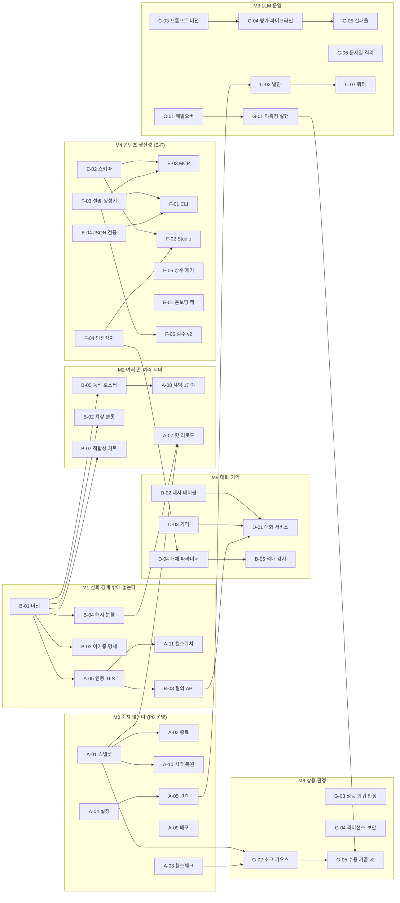

# PRODUCTION_ROADMAP.md — 상용 온라인 게임 서버 투입 로드맵

> **작성 2026-09-09.** 근거는 이 날짜의 `main`(`a43ca15`) 코드·문서·실측이다.
> 이 문서는 `CLAUDE.md` §0 이 말하는 "레퍼런스"가 아니라 **작업 지시서**다.
> 태스크 하나가 끝나면 §1 의 체크박스를 `[x]` 로 바꾸고 뒤에 커밋 해시를 적는다.
> 전부 끝나면 이 문서는 `docs/reference_*.html` 로 흡수하고 삭제한다.

---

## 0. 이 문서를 읽는 법

**결론 먼저.** 이 저장소는 R&D 구현체로서는 완성도가 높다 — 틱 p99 0.801ms · 틱당 할당 0 B ·
리플레이 바이트 동일 · LLM 4단 폴백 · 일일 예산 캡 · 테스트 986개. **게임 로직과 LLM 통합의
위험은 코드와 테스트로 눌려 있다.** 반면 다음 세 층이 통째로 비어 있다.

| 층 | 없는 것 | 상용에서 일어나는 일 |
|---|---|---|
| **프로세스를 운영하는 층** | NPC 상태 영속성 · SIGTERM · 헬스체크 · 링크 인증/TLS · 핫 리로드 · 샤딩 · 배포 파이프라인 · 구조화 로깅 | 재기동마다 5,000 NPC 가 집으로 순간이동하고 하던 일을 잊는다. 링크가 죽어도 `/status` 는 200 이다 |
| **LLM 을 운영하는 층** | 제공사 페일오버 · 알람 채널 · 프롬프트 버저닝/롤백 · 단일 평가 파이프라인 | 제공사 하나가 죽으면 60초 뒤 전부 로컬 GPU(0.195 req/s)로 몰린다. 예산 소진을 대시보드를 새로고침하기 전에는 아무도 모른다 |
| **콘텐츠를 만드는 층** | 오써링 GUI · 스키마 발행 · 자동 code 할당 · 파생물 재생성 감지 · LLM 온보딩 팩 · 검수 도구 | 아키타입 하나에 파일 5~7개 + C# 상수 + 생성기 2개 + 빌드. 검수는 "허용 22종"이라는 개수만 보고 판정한다 |

문서 구성:

| 절 | 내용 |
|---|---|
| **§1** | **태스크 리스트 (체크박스)** — 트랙 A~G, 50건 |
| §2 | 마일스톤과 의존 그래프 |
| §3 | 현재 상태 진단 요약 — 영역별 있음/부분/없음 + 근거 |
| §4 | 트랙 A — 운영·인프라 (상세 구현 방법) |
| §5 | 트랙 B — 게임서버 연동 계약 |
| §6 | 트랙 C — LLM 운영 |
| §7 | 트랙 D — 대화·기억·개체 파라미터 |
| **§8** | **트랙 E — LLM 이 이 서버를 잘 이해하고 쓰게 만드는 방법** (온보딩 팩 · 스키마 · MCP · 피드백 루프 · 요청 템플릿 · 벤치마크) |
| **§9** | **트랙 F — NPC 정의 툴** (CLI · Studio · 설명 생성기 · 검수 · 안전장치) |
| §10 | 트랙 G — 품질·측정·상용 판정 |
| §11 | 모든 태스크에 공통인 완료 조건과 규칙 충돌 검사 |
| 부록 | 근거 파일 인덱스 · 용어 |

각 태스크 상세는 같은 틀로 적는다: **왜 → 현재(근거 `파일:줄`) → 설계 → 구현 절차(파일 단위) →
계약·스키마·문서 변경 → 테스트 → 완료 조건 → `CLAUDE.md` §2 절대 규칙과의 충돌 확인 → 크기·의존.**

표기: 우선순위 **P0**(없으면 투입 불가) / **P1**(투입 후 1개월 내 반드시) / **P2**(품질·생산성).
크기 **S**(1~2일) / **M**(3~5일) / **L**(1~2주) / **XL**(2주 이상). 1인 기준이다.

---

## 1. 태스크 리스트

체크 규칙: 완료 = `dotnet test` 통과 + `dotnet format --verify-no-changes` 통과 + 해당 레퍼런스
HTML 갱신 + 이 절의 항목을 `[x]` 로 바꾸고 커밋 해시를 적는다. **부분 완료는 체크하지 않는다.**

### 트랙 A — 운영·인프라 (프로세스가 죽지 않고, 죽어도 되살아난다)

- [x] **A-01** NPC 상태 스냅샷·복구 (영속성) — P0 · L · 의존 없음
- [x] **A-02** SIGTERM·정상 종료·`Bye(Shutdown)`·서비스 프로파일 — P0 · S · 의존 A-01
- [x] **A-03** 헬스체크(`/healthz/*`)·`LinkState` 노출·`Faulted` 좀비 제거 — P0 · S · 의존 없음
- [x] **A-04** 설정 소스 통합 (CLI → 환경변수 → 파일) · 바인드 주소 · 프로파일 — P0 · M · 의존 없음
- [x] **A-05** 관측성: OpenTelemetry 익스포터 · Prometheus 엔드포인트 · 구조화 로깅 · 알람 싱크 — P0 · M · 의존 A-04
- [x] **A-06** 링크 보안: 핸드셰이크 인증(HMAC+nonce) · TLS/mTLS · 관리 API 인증 — P0 · M · 의존 B-01
- [x] **A-07** 핫 리로드: 플랜 스토어 · 인터럽트 · 폴백 · ~~few-shot~~ (구조 변경은 재기동) — P1 · L · 의존 A-01, B-04 — **완료. few-shot 은 콜드로 정정했다**(프리픽스에 실려 SHA 가 바뀐다 — C-03). 리플레이에 리로드 시점을 기록하는 것은 미구현
- [x] **A-08** 전역 `NpcId` · 샤드 식별 · ~~다중 링크 세션~~ (샤딩 1단계) — P1 · L · 의존 B-01, B-05 — **1단계 완료.** 게임서버 대역이 세션 N개를 받는 것은 미착수 — **1 프로세스 = 1 샤드 = 1 링크**를 대역에도 적용해 데모가 프로세스 쌍 2개가 된다. 존 간 핸드오프(2단계)는 미구현
- [x] **A-09** 배포: Dockerfile · compose(테스트베드 포함) · ~~CI 파이프라인~~ · 중앙 패키지 관리 · 릴리스 버저닝 — P0 · M · 의존 없음
  - **CI 워크플로 파일은 만들지 않기로 했다** (2026-09-10 결정). 제공자를 고르지 않았고, 파이프라인의 내용은
    `build.ps1` · `npc validate` · `npc regen --check` 세 명령으로 이미 정의되어 있다.
- [x] **A-10** 게임 시각 복원(`StartTick`) · `TickSync` 워치독 — P0 · S · 의존 A-01
- [x] **A-11** 킬스위치 가역화 · `/admin/*` 네임스페이스 · 감사 로그 — P1 · S · 의존 A-06

### 트랙 B — 게임서버 연동 계약 (남의 서버에 붙는다)

- [x] **B-01** 계약 버전(`ContractVersion`) · 와이어 버전 협상 · 기능 비트 — P0 · M · 의존 없음
- [x] **B-02** 패킷 확장 슬롯 (v2 레이아웃: `InstanceId` · `Ext` 예약) — P1 · M · 의존 B-01 — **완료. 계약 필드는 `Instance`·`Faction`(계약의 `NpcId Npc` 이름 규칙), 크기는 72B·80B**
- [x] **B-03** 이기종 런타임 명세: 바이트 오프셋 표 자동 생성 · 참조 코덱(C++/Python) · 골든 바이트 벡터 — P1 · M · 의존 B-01 — **명세·벡터·코덱 완료. C++ 컴파일 확인과 C++ 미니 게임서버 실습은 미실시**(이 저장소에 컴파일러가 없다)
- [x] **B-04** 핸드셰이크 해시 분할 (구조 해시 / 내용 해시) · 부분 호환 정책 — P1 · S · 의존 B-01
- [x] **B-05** 동적 로스터: 런타임 스폰·디스폰 · 용량 예약 — P1 · M · 의존 B-01, A-01 — **1단계 완료. 인스턴스 테이블에 있는 id 만 · 템플릿 스폰(2단계)은 미착수**
- [x] **B-06** 적대 플레이어 감지: `PlayerHostility` 이벤트 · `HostilePlayerNearby` 플래그 · `$nearest_hostile_player` 바인딩 — P1 · M · 의존 B-01, D-04 — **완료. D-04(세력 테이블) 없이 돌아간다** — 적대 판정이 게임서버 몫이라 `Faction` 은 통과만 한다
- [x] **B-07** 게임서버 적합성 테스트 키트 (`Npc.Conformance`) — P1 · M · 의존 B-01 — **완료. 대역 보고서 통과 6 · 불합격 0 · 미판정 1(전투 없음)**
- [x] **B-08** 읽기 전용 질의 API (벌크·검색·스트림) — 링크가 아니라 HTTP — P1 · M · 의존 A-06 — **완료. 응답 스키마의 OpenAPI 발행은 E-05 에 남는다**

### 트랙 C — LLM 운영 (제공사가 죽어도, 예산이 바닥나도, 프롬프트를 바꿔도)

- [x] **C-01** 제공사 페일오버 체인 · 런타임 재시도/백오프 · 엔진별 브레이커 — P0 · M · 의존 없음
- [x] **C-02** 예산 알람 채널 · 임계 경보(80/95/100%) · 청구 주기 정합 — P0 · S · 의존 A-05
- [x] **C-03** 프롬프트 버저닝·프리픽스 아티팩트 보관·플랜 스토어 롤백 — P1 · M · 의존 없음 — **완료. 옛 평면 배치도 그대로 읽는다**
- [x] **C-04** 단일 평가 파이프라인 (`Npc.Eval`): ~~골든~~·다양성·실패 집계·비용·다중 모델 대조·게이트 — P1 · L · 의존 C-03 — **파이프라인 완료. 실측 회차는 미실시**(엔진 키·예산이 필요하다). 골든은 도구가 다시 돌리지 않고 테스트 스위트의 결과를 `--golden-rate` 로 받는다
- [x] **C-05** 검증 실패율 개선 프로그램 (22~32% → ≤10%): 결정론 자동 수선 · few-shot 확장 — P1 · L · 의존 C-04 — **수선기·few-shot 완료. 개선 폭 측정은 미실시**(C-04 회차가 있어야 잰다). 모델 선택은 그 대조표에 달렸다
- [x] **C-06** 문자열 격리의 테스트 강제 · `reasoning` 정화 · 모더레이션 훅 — P1 · S · 의존 없음
- [x] **C-07** 스필오버 서브 쿼터 · 버킷/개체 예산 분리 · 프리베이크 전량 운영 절차 — P1 · S · 의존 C-02
- [x] **C-08** 로컬 추론 프로세스 감독(헬스·~~재시작~~) · GPU 메트릭 · 모델 파일 해시 고정 — P2 · M · 의존 A-05 — **완료. 재시작은 오케스트레이터 몫으로 뒀다**(`restart: unless-stopped`) — NPC 서버가 남의 프로세스를 되살리면 누가 주인인지 흐려진다. GPU 는 `dcgm-exporter` 사이드카이고 **실측은 미실시**

### 트랙 D — 대화·기억·개체 파라미터 (플레이어가 체감하는 반쪽)

- [ ] **D-01** 대화 서비스 (`Npc.Dialogue`, 별도 프로세스) · 응답 계약 · 폴백 · 인젝션 방어 — P2 · XL · 의존 D-02, D-03, B-08
- [ ] **D-02** 대사 테이블(`dialogue_lines.json`) · 로컬라이즈 테이블 · 검증 V14 — P1 · M · 의존 없음
- [ ] **D-03** NPC 기억·관계 저장소 (구조체 · 보존·삭제 정책) — P2 · L · 의존 A-01
- [ ] **D-04** 개체별 행동 파라미터 (`patrol_route` · `aggro_radius` · `faction` · `dialogue_profile`) — P1 · M · 의존 F-04

### 트랙 E — LLM 이 이 서버를 잘 이해하고 쓰게 만든다

- [x] **E-01** LLM 온보딩 팩 `docs/llm/` (SKILL · CONTEXT · RECIPES · ANTIPATTERNS · GLOSSARY) — P1 · M · 의존 없음
- [x] **E-02** JSON Schema 발행 (마스터데이터 10종 · 플랜 · 시나리오 · 스냅샷) — 코드에서 생성 — P1 · M · 의존 없음
- [ ] **E-03** MCP 서버 `tools/Npc.Mcp` (검증·설명·스캐폴드·플랜 검증·서버 질의) — P1 · L · 의존 E-02, F-01, F-03
- [x] **E-04** 기계가 읽는 검증 출력 (`--format json` + `fix_hint` 사전) — P1 · S · 의존 없음
- [x] **E-05** OpenAPI 명세 + 툴 정의 (관리·질의 API) — P2 · S · 의존 B-08 — **완료. `Microsoft.AspNetCore.OpenApi` 를 쓰지 않았다 — 근거는 아래**
- [ ] **E-06** LLM 에이전트 벤치마크 (과제 10종 · 자동 채점) — P2 · M · 의존 E-01, E-03

### 트랙 F — NPC 정의 툴 (사람이 쉽게 만들고, LLM 이 만든 것을 사람이 쉽게 읽는다)

- [x] **F-01** `npc` CLI (`tools/Npc.Cli`): validate/explain/next-code/scaffold/diff/card/timeline/plan/regen — P1 · L · 의존 E-04, F-03
- [ ] **F-02** NPC Studio (웹): 스키마 폼 · 인라인 검증 · 아키타입 카드 · 버킷 그리드 · 플랜 시각화 · LLM 제안 리뷰 — P1 · XL · 의존 E-02, F-03, F-04
- [x] **F-03** 설명 생성기 `src/Npc.Narrative` (결정론 · LLM 미사용): 아키타입/플랜/인터럽트/인스턴스 → 한국어 카드 — P1 · M · 의존 없음
- [x] **F-04** 편집 안전장치: 자동 code/bit 할당 · 가중치 재배분 · 파생물 신선도 잠금 · 서식 보존 JSON 편집 · 검증 V12/V13 — P1 · M · 의존 없음
- [x] **F-05** `ArchetypeCount` 컴파일 상수 제거 (데이터 주도 버킷 공간) — P1 · M · 의존 없음
- [ ] **F-06** 검수 워크플로 v2: 전체 문맥 표시 · 제자리 수정 → pinned · 폴백 대체분 표본 포함 · 다양성 대조 — P1 · M · 의존 F-03
- [ ] **F-07** LLM 보조 오써링 (초안 생성 → 스키마 검증 → Studio 리뷰 → 승인) — P2 · M · 의존 E-03, F-02
- [x] **F-08** 에디터 지원: `$schema` 연결 · VS Code 설정 · 스니펫 — P2 · S · 의존 E-02

### 트랙 G — 품질·측정·상용 판정

- [ ] **G-01** 미측정 항목 실행: 프리베이크 전량 2,880 · GPU 부하 · 런타임 재계획 수 · 외부 동시성 32/64 — P0 · M(운영) · 의존 C-01
- [ ] **G-02** 소크·카오스: 72시간 연속 · TCP 프록시 장애 주입(`tools/Npc.Chaos`) · 재기동 복구 시험 — P0 · M · 의존 A-01, A-03
- [ ] **G-03** 성능 회귀 판정 (야간 Load · `bytesPerTick`=0 · p99 게이트 · 아티팩트 diff) — P1 · S · 의존 없음
  - 워크플로 파일이 아니라 **판정 스크립트**로 만든다 (A-09 의 CI 제외 결정). 어느 CI 든 그것을 부르면 된다.
- [x] **G-04** 라이선스·보안 리뷰 (dotLLM GPLv3 법무 · 모델 약관 · SBOM · 위협 모델 문서) — P0 · S(문서) · 의존 없음 — **문서·스크립트 완료. 법무 확인·리뷰 회의·침투 시험은 사람 몫으로 남는다**
- [ ] **G-05** 상용 수용 기준 v2 (가용성 SLO · RTO · 상태 손실 창 · 보안 항목) + go/no-go 체크리스트 — P0 · S · 의존 전부

---

## 2. 마일스톤과 의존



**병렬 원칙.** M0·M1 은 순서대로 간다(운영 기반 없이 아무것도 배포할 수 없다). **M4(E·F 트랙)는 첫날부터
병렬로 시작한다** — 코어 코드를 거의 건드리지 않는 도구·문서 작업이고, 나머지 트랙의 작업 속도를 올린다.
M3 은 M0 의 A-05(관측) 뒤에 붙인다. M5 는 제품 요구가 확정된 뒤에만 착수한다.

**착수 순서 권장** (1인 기준 총 약 5개월. 2인이면 A/B 트랙과 E/F 트랙을 나눠 3개월):

| 주차 | 트랙 | 태스크 |
|---|---|---|
| 1~2 | A | A-03 → A-09 → A-04 → A-02(임시: `--days 0` 강제) |
| 3~4 | A · E | A-01 → A-10 ‖ E-02 → E-04 → F-03 |
| 5~6 | A · F | A-05 → C-02 ‖ F-04 → F-01 |
| 7~8 | B · F | B-01 → A-06 → B-04 ‖ F-05 → E-01 |
| 9~10 | B · E | B-05 → A-08 → B-07 ‖ E-03 → F-06 |
| 11~13 | C · F | C-01 → C-03 → C-04 ‖ F-02 |
| 14~15 | G | G-01 → G-02 → G-03 → G-04 → G-05 |
| 16~ | D · 나머지 | D-02 → D-04 → B-06 → D-03 → D-01 · A-07 · B-02 · B-03 · C-05~08 · E-05~06 · F-07~08 |

---

## 3. 현재 상태 진단 요약

판정: **있음** = 상용 그대로 / **부분** = 기제는 있으나 상용 요건 미달 / **없음** = 코드가 없다.
근거는 2026-09-09 `main` 기준이다.

### 3.1 운영·인프라

| 영역 | 판정 | 근거 | 태스크 |
|---|---|---|---|
| NPC 상태 영속성 | **없음** | `src/Npc.Runtime/NpcStore.cs` 에 직렬화 없음. 재기동 시 `Program.cs:411-420` 이 전원을 집(Home)+폴백 플랜으로 시드 | A-01 |
| 정상 종료 | 부분 | `Program.cs:58-62` SIGINT 만. `PosixSignalRegistration`·`ProcessExit` 0건. `LinkByeCode.Shutdown` 은 정의만 있고 송신처 0건 | A-02 |
| 자동 종료 함정 | 부분 | `HostOptions.cs:71` 기본 `--days 1` → 배속 60 이면 실시간 24분 뒤 exit 0 | A-02, A-04 |
| 헬스체크 | **없음** | `/health`·`/ready` 없음. `/status` 는 링크와 무관하게 200. `LinkState` 가 어떤 응답에도 없음 | A-03 |
| `Faulted` 처리 | **없음** | `TcpGameServerLink.cs:191` 조용히 `return`. 틱 루프는 `NpcServerLoop.cs:143` 에서 영구 블록. `StateChanged` 구독 0건 | A-03 |
| 설정 소스 | 부분 | `HostOptions.cs:52-55` 의도적으로 CLI 만. `appsettings.json` 은 `Program.cs:83` 이 덮어씀. 환경변수는 API 키만 | A-04 |
| 바인드 | 부분 | `Program.cs:82` `localhost` 고정. 컨테이너에서 외부 도달 불가 | A-04, A-06 |
| 메트릭 익스포트 | 부분 | `Meter "Npc.Server"` 13종 계측기는 있으나 OpenTelemetry 패키지 0건. `/metrics` 는 자체 JSON | A-05 |
| 로깅 | **없음** | `ILogger` 주입 0건. `Console.Out` 평문 한국어 | A-05 |
| 알람 | **없음** | `ReplanBudget.Alarm` 싱크가 콘솔 한 줄. `RateLimited` 는 로그도 없음(`TierWiring.cs:241-244`) | A-05, C-02 |
| 링크 인증 | **없음** | 핸드셰이크는 버전·배속·마스터데이터 해시·로스터 해시 4종만 대조(`TcpGameServerLink.cs:383-412`) | A-06 |
| 링크 암호화 | **없음** | 평문 `TcpClient`. 단, `Func<CancellationToken, Task<Stream>>` 주입 이음매는 있음(`:97-106`) | A-06 |
| 관리 API 인증 | **없음** | `/control/killswitch` 는 조건부 라우트 등록(`Program.cs:115`)만 | A-06, A-11 |
| 핫 리로드 | **없음** | `Reload`·`FileSystemWatcher` 0건. `WarnIfStale`(`Program.cs:737-763`)은 경고 후 계속 | A-07 |
| 샤딩 | **없음** | `--zone` 은 필터. `NpcId` = 로스터 첨자(`NpcRoster.cs:66-88`) → 두 샤드의 `NpcId=7` 충돌. `LinkListener.cs:18` 세션 1개 | A-08 |
| 배포 | **없음** | Dockerfile 0건. `Directory.Packages.props` 없음(xunit 2.9.2/2.9.3 혼재)<br>CI 워크플로 파일은 만들지 않기로 했다 — 판정 명령으로 대신한다 | A-09 |
| 게임 시각 복원 | **없음** | `GameClock.cs:30` `startGameHour=6` 고정. `WireHello.StartTick` 미사용 | A-10 |
| 킬스위치 | 부분 | `KillSwitch.cs:44-47` 되돌릴 수 없음. 복구 = 재기동 = 상태 전손 | A-11 |

### 3.2 계약·연동

| 영역 | 판정 | 근거 | 태스크 |
|---|---|---|---|
| 계약 버전 | **없음** | `src/Npc.Contracts/*.cs` 에 `Version` 0건. 버전은 프레임 `Ver` 1바이트와 `WireHello.ProtocolVersion` 뿐. 불일치 = 협상 없이 `Bye` | B-01 |
| 확장 슬롯 | **없음** | `NpcCommand` 56B·`GameEvent` 64B 고정(`Wire_LayoutIsFrozen`). 필드 추가 = 브레이킹 | B-02 |
| 이기종 런타임 | **없음** | `docs/reference_link.html` §13 "구현 필요". 바이트 오프셋 표 없음 | B-03 |
| 해시 정책 | 부분 | 완전 일치만. 우회 옵션 의도적으로 없음(`TcpLinkOptions.cs:14-18`) | B-04 |
| 동적 로스터 | **없음** | 로스터 해시 완전 일치 → 런타임 스폰/디스폰 불가 | B-05 |
| 적대 감지 | 부분 | `PlayerProximity` 는 중립 인지만. 반격은 되고 선제공격은 안 됨(`docs/FAQ.html` Q6) | B-06 |
| 적합성 키트 | **없음** | 발행 규약(§11)을 강제하는 것은 저장소 안 대역뿐 | B-07 |
| 질의 채널 | 부분 | `GET /npc/{id}` 단건만. 벌크·검색·구독 없음. localhost·무인증 | B-08 |

### 3.3 LLM 운영

| 영역 | 판정 | 근거 | 태스크 |
|---|---|---|---|
| 제공사 페일오버 | **없음** | `TierWiring.cs:117-118` 이 `default` 엔진 고정. SDK 재시도 0(`ChatClientFactory.cs:248`). 키 없으면 티어를 끔(`TierWiring.cs:286-290`) | C-01 |
| 티어 강등·브레이커 | **있음** | `TieredPlanCompiler.cs:186-194` T2→T1→거절. 연속 5회 실패 → 60초 개방(`CircuitBreaker.cs:38-41`) | — |
| 예산 캡 | **있음** | 일일 15M tok · $2.00(`ReplanBudget.cs:51-67`). 우회 경로 없음 | — |
| 알람 채널 | **없음** | 위 3.1 | C-02 |
| 프롬프트 버저닝 | **없음** | SHA 만 계산(`PromptPrefix.cs:60`). 롤백 좌표 없음 | C-03 |
| 평가 파이프라인 | 부분 | 골든 러너·다양성·실패 집계·블라인드가 각각 별개 CLI. 다중 모델 대조 러너 없음 | C-04 |
| 검증 실패율 | **미달** | 22~32% (기준 ≤3%). `V3.PRECONDITION_UNMET` 47.9% | C-05 |
| 문자열 격리 | 부분 | 타입으로 강제(`PlanRequestSuffix.cs:38-45`). 전용 회귀 테스트 없음. 안전 필터 없음 | C-06 |
| 프리베이크 | 부분 | `planstore/plans/` 718/2,880. `pinned/` 0건 | C-07, G-01 |

### 3.4 대화·기억

| 영역 | 판정 | 근거 | 태스크 |
|---|---|---|---|
| 대사 텍스트 | **없음** | `Speak(DialogueId)` 만. 대사 테이블 파일 없음. `DialogueId` 는 `actions.json` 의 `emits.map.Dialogue` 심볼 `SortedSet` 첨자(`ActionCatalog.cs:218-219`) | D-02 |
| 자유 대화 | **없음** | 설계도만 `docs/FAQ.html` Q8 | D-01 |
| 기억·관계 | **없음** | `Memory\|History\|Relationship\|Reputation` grep 0건. 있는 것은 서픽스용 휘발성 `NpcSnapshot`(인벤 8·recent 3·직전 결말) | D-03 |
| 로컬라이즈 | **없음** | `name_key` 만 있고 문구 테이블 없음. `Lexicon.cs` 하드코딩 한국어 | D-02 |
| 개체 파라미터 | **없음** | `npc_instances.json` 8필드. FAQ Q4 가 권장 확장 형태만 제시 | D-04 |

### 3.5 오써링·도구

| 영역 | 판정 | 근거 | 태스크 |
|---|---|---|---|
| 편집 GUI | **없음** | `dashboard.html` 은 읽기 전용. `InspectorPanel` 은 보기만 | F-02 |
| CLI 보조 | 부분 | 서브커맨드는 `validate` 하나(`Commands/ValidateCommand.cs`). `generate/lint/diff/scaffold` 없음 | F-01 |
| 스키마 발행 | **없음** | JSON Schema 는 플랜용 하나(`SchemaProvider`)뿐. 마스터데이터 스키마 없음 | E-02 |
| code/bit 할당 | **없음** | 손으로. 다음 번호는 파일 끝을 봐야 안다 | F-04 |
| 파생물 신선도 | 부분 | `poi_distances.bin` 불일치는 로더가 잡음. `npc_instances.json` 낡음은 아무도 안 잡음 | F-04 |
| 아키타입 수 | **하드코딩** | `BucketKey.cs:51` `ArchetypeCount = 40`. 41이면 테스트 18개 파손 | F-05 |
| 검수 도구 | 부분 | `review.ps1` 좌측이 "허용 22종" 개수만. `[e] 수정` 이 플랜을 고치지 않음. `pinned/` 0건 | F-06 |
| 설명 생성 | 부분 | `Npc.Narrate` 는 **명령 로그** → 일지. 정의(아키타입·플랜)를 설명하지는 않음 | F-03 |
| LLM 온보딩 | 부분 | `CLAUDE.md`·`CODEMAP.md` 는 저장소 작업자용. 사용자(게임팀) 관점 팩·MCP·스키마 없음 | E-01~E-06 |

### 3.6 수용 기준 (docs/reference_metrics.html §13) 중 미달

| 항목 | 실측 | 판정 | 태스크 |
|---|---|---|---|
| 프리베이크 2,880 ≤ 5분 | 외삽 19분 · 전량 미실행 | 미달 | G-01, C-07 |
| 검증 실패율 ≤ 3% | 22~32% | 미달 | C-05 |
| 프롬프트 캐시 ≥ 95% | 42.6% (암시적 캐싱 한계) | 미달 → 기준 재정의 | G-05 |
| 일일 캡 자동 강등(런타임) | 미확인 | 부분 | G-01 |
| 블라인드 정량 | 참가자 0 | 미달 | G-01 |

---
## 4. 트랙 A — 운영·인프라

### A-01 NPC 상태 스냅샷·복구

**왜.** 재기동·크래시·배포 롤아웃마다 5,000 NPC 전원이 집 좌표로 돌아가 아키타입 폴백 플랜을 처음부터
돈다. 위치·인벤토리·HP·플래그·플랜 진행·LOD·최근 사건·개별 재계획 결과가 전부 소실되고, 게임 시계도
새벽 6시로 돌아간다. 플레이어 눈에 그대로 보이는 결함이며 다른 모든 운영 결손(핫 리로드 없음·킬스위치 비가역)의
비용을 곱한다.

**현재.** `src/Npc.Runtime/NpcStore.cs` 는 순수 인메모리 SoA 배열이다 — `Flags` `PlanId` `StepIndex`
`StepStatus` `StepIssuedTick` `Lod` `Pos` `Hp` `Stamina` `Inventory` `Recent`(RingBuffer8) `PendingPlanId`
`ZoneCode` `CurrentPoi`. 직렬화 메서드가 없다. 재기동 시 `src/Npc.Host/Program.cs:411-420` 이
`applier.Seed(...)` + `StepStatus = Ready` + `AssignPlan(fallback)` 으로 전원을 시드한다. `StateHash()`
(`NpcStore.cs:216-250`, FNV-1a 64)가 이미 "상태의 정의"를 알고 있다 — 스냅샷은 그 집합에 `Recent` 와 시계·존
상태·상관 ID 카운터를 더한 것이다.

**설계.**

1. **틱 루프는 복사만 한다.** 스냅샷 요청이 서 있으면 틱 끝(스텝 경계)에 `Array.Copy` 로 SoA 배열을
   **미리 할당한 그림자 버퍼**에 복사하고 `Volatile.Write(ref _readyTick, tick)` 한다. 힙 할당 0, 락 0.
   복사량은 핫 배열 ~100KB + 인벤토리(5,000 × 82 × 2B ≈ 820KB) + `Recent`(5,000 × 8 × 16B ≈ 640KB) ≈ 1.6MB.
   memcpy 1.6MB 는 0.1~0.2ms 로 20ms 예산 안이다. 그래도 **복사 틱은 `bytesPerTick`·p99 계측에 표시**한다.
2. **직렬화는 별도 스레드.** `SnapshotWriter : BackgroundService`(`Npc.Host`)가 그림자 버퍼를 파일로 쓴다.
   틱 루프는 `_readyTick != 0` 인 동안 다시 복사하지 않는다(단일 생산자·단일 소비자).
3. **형식은 자체 바이너리.** `Npc.Runtime` 은 `Npc.Wire`(MemoryPack)를 참조할 수 없으므로(§3 의존 규칙) 형식은
   `Npc.Host/Persistence/SnapshotFile.cs` 에 `BinaryWriter` 로 둔다. 헤더: 매직 `"NPCS"` · 형식 버전(u16) ·
   `ContractVersion`(B-01) · 마스터데이터 `content_hash`(SHA-256) · 로스터 해시 · 플랜 스토어 `manifest.prefix_hash`
   · 스냅샷 틱 · NPC 수 · 섹션 테이블(이름·오프셋·길이). 본문: 섹션별 SoA 원시 블롭 + 개별 플랜 섹션. 꼬리: CRC32.
   쓰기는 `snapshot.tmp` → `File.Move(overwrite)` 원자 교체. 최근 K개(기본 3) 보존 `snapshot-<tick>.bin`.
4. **개별 플랜은 `SourceJson` 으로.** 버킷 플랜의 `PlanId` 는 스토어 첨자라 플랜 스토어가 같으면(manifest 해시 일치) 그대로
   복원한다. 개별 풀 슬롯(음수 `PlanId`)은 `CompiledPlan.SourceJson` + `Bucket` 을 저장하고 복원 시 재컴파일해
   `IndividualPlanPool` 에 넣는다. 프리픽스 해시가 다르면(프롬프트가 바뀌었으면) 개별 플랜은 버리고 버킷 플랜으로
   내린다 — 스텝 경계에서 `PlanSwapper` 가 처리한다.
5. **진행 중 명령의 처리.** 크래시 시점에 `Waiting` 이던 스텝은 응답 이벤트를 영영 못 받는다. 복원 시
   `StepStatus == Waiting` → `Ready` 로 바꿔 현재 스텝을 **재발행**한다(`MoveTo` 재발행은 게임서버 관점에서 멱등이다).
   `CorrelationTable` 의 다음 ID 는 스냅샷 값 + 65,536 으로 점프시켜 크래시 전 진행 중이던 상관 ID 와 충돌하지 않게 한다.
6. **게임서버가 위치의 권위다.** 핸드셰이크 뒤 게임서버가 `NpcSpawned × N` 을 다시 보내므로(`docs/reference_link.html`
   §09) 복원된 `Pos` 는 그 이벤트로 덮인다(N7 멱등). **플랜 진행·플래그·인벤토리는 NPC 서버가 권위다.** 충돌 정책을
   `reference_link.html` §09 에 한 줄 추가한다.
7. **복원 조건.** `--restore auto`(기본): 스냅샷 디렉터리의 최신 파일이 (a) 형식 버전 일치 (b) 마스터데이터 `content_hash`
   일치 (c) 로스터 해시 일치 — 셋 다 맞을 때만 복원하고, 아니면 이유를 로그에 남기고 시드한다. 로더는 CRC 실패 시
   이전 스냅샷으로 물러난다. `--restore none` / `--restore <path>` 도 둔다.
8. **주기.** `--snapshot-interval-s 60`(기본). A-02 의 정상 종료 시 마지막 스냅샷을 반드시 쓴다. 상태 손실 창의 상한이
   이 값이며 G-05 의 수용 기준(≤ 60초)에 들어간다.
9. **저장하지 않는 것.** `ReplanQueue`(인지 스캔이 재구성한다) · `PendingPlanId`(워커가 다시 건다) · 킬스위치 상태
   (운영자가 다시 켠다 — A-11 의 감사 로그에 남는다) · LOD 밴드 멤버십(`Lod` 값으로 재구성).

**구현 절차.**

1. `src/Npc.Runtime/NpcStoreSnapshot.cs` — `ShadowBuffer` 클래스(같은 모양의 배열 묶음, 기동 시 1회 할당),
   `NpcStore.CopyTo(ShadowBuffer)` / `NpcStore.LoadFrom(ShadowBuffer)`. 둘 다 `Array.Copy` 만. `GameClock`
   (`Tick`·게임 시각) · `ZoneStateTable`(존별 RegionState/Climate) · `CorrelationTable.Next` 도 `ShadowBuffer` 에 포함.
2. `src/Npc.Runtime/NpcServerLoop.cs` — 틱 끝에 `if (Volatile.Read(ref _snapshotRequested) == 1 && _readyTick == 0) { store.CopyTo(shadow); Volatile.Write(ref _readyTick, tick); }`.
   `ISnapshotPort` 인터페이스(요청·완료 신호)를 `Npc.Runtime` 에 두고 호스트가 구현한다.
3. `src/Npc.Host/Persistence/SnapshotFile.cs` — 형식 정의·쓰기·읽기·CRC. `SnapshotHeader` record.
4. `src/Npc.Host/Persistence/SnapshotWriter.cs` — `BackgroundService`. 주기마다 요청 → `_readyTick` 폴링(50ms) →
   파일 쓰기 → `_readyTick = 0`. 실패 시 경보(A-05 `IAlarmSink`) 후 다음 주기 재시도.
5. `src/Npc.Host/Persistence/SnapshotRestorer.cs` — 기동 시 조건 검사 → `store.LoadFrom` → 개별 플랜 재컴파일
   (`PlanCompiler.Compile`) → `Waiting→Ready` → `CorrelationTable` 점프. `Program.cs:411-420` 의 시드 블록을
   `if (!restored) Seed(...)` 로 감싼다.
6. `src/Npc.Host/HostOptions.cs` — `--snapshot-dir`(기본 `./state`) · `--snapshot-interval-s` · `--snapshot-keep` · `--restore`.
7. `src/Npc.Host/Metrics/NpcMeter.cs` — `npc.snapshot.last_tick` · `npc.snapshot.write_ms` · `npc.snapshot.bytes` ·
   `npc.snapshot.failures`. `/status` 에 `lastSnapshotTick`·`restoredFromTick`.
8. `.gitignore` 에 `state/` 추가.

**계약·스키마·문서 변경.** 계약 변경 없음. `docs/reference_link.html` §09 에 "복원 후 재동기화 — 위치는 게임서버, 진행은
NPC 서버" 한 줄. `README.md` 옵션 표에 4개 옵션. `CODEMAP.md` 호스트·운영 표에 "상태를 저장·복구한다 → `Persistence/`".

**테스트.**

- `tests/Npc.Tests/Persistence/SnapshotRoundTripTests.cs` — NPC 500 · 1,000틱 → 스냅샷 → `LoadFrom` → `StateHash` 동일.
  `Recent` 링·개별 플랜·시계·존 상태 각각 단언.
- `Determinism_RestoreMatchesContinuous` (`[Trait("Category","Determinism")]`) — 루프백으로 A 회차를 기록하며 N 틱에
  스냅샷, N+M 틱 해시 H1. 새 프로세스(=새 `NpcHost`)가 스냅샷에서 복원해 같은 기록을 재생하며 M 틱 → H2. **H1 == H2.**
- `TickAllocationTests` — 스냅샷 복사 틱을 포함해 `bytesPerTick == 0`.
- `SnapshotFile_RejectsCorruptCrc` · `Restore_FallsBackWhenHashMismatch` · `Restore_ReissuesWaitingSteps`.
- Load(야간): NPC 5,000 · 60초 주기 · 게임 7일 → 복사 틱의 p99 가 20ms 안, 파일 크기 ≤ 4MB.

**완료 조건.** 위 테스트 통과 + `--link tcp` 데모에서 NPC 서버를 `kill` 하고 재기동했을 때 뷰어에서 NPC 가
**같은 자리에서 같은 스텝을 이어 간다**(G-02 의 복구 시험 항목). 상태 손실 창 ≤ 60초를 `/status` 로 증명.

**규칙 충돌 확인.** §2.1 틱 루프: 힙 할당 0(그림자 버퍼는 기동 시 1회) · `await` 없음 · 락 없음(Volatile 만) — 충족.
§2.3 결정론: 스냅샷 파일에 벽시계를 넣지 않는다(`DateTime` 금지). 파일명의 `<tick>` 도 게임 틱이다. 복원 후 리플레이가
같은 해시를 내야 한다(위 테스트). §3 의존: `Npc.Runtime` 에 NuGet 추가 없음(형식은 Host).

**크기·의존.** L. 의존 없음. A-02·A-10·A-07·B-05·D-03 이 이것에 의존한다.

---

### A-02 SIGTERM · 정상 종료 · `Bye(Shutdown)` · 서비스 프로파일

**왜.** `docker stop`·k8s 종료·Windows 서비스 정지는 SIGTERM/CTRL_SHUTDOWN 이다. 지금은 SIGINT 만 처리해 컨테이너에서는
드레인 없이 즉사한다. 게임서버는 NPC 서버가 왜 사라졌는지 모른다(`Bye` 를 안 보낸다). 기본 `--days 1` 은 운영 프로세스가
24분 뒤 exit 0 으로 조용히 사라지는 함정이다.

**현재.** `Program.cs:58-62` `Console.CancelKeyPress` 만. `PosixSignalRegistration`·`IHostApplicationLifetime`·`ProcessExit`
사용 0건. 정지 순서 자체는 올바르다(`Program.cs:551-573` 틱 루프 → 워커 → 소켓). `LinkByeCode.Shutdown` 은
`src/Npc.Wire/LinkMessages.cs` 에 정의만 있고 `TcpGameServerLink.DisposeAsync`(`:631-645`)는 스트림만 닫는다.

**설계.**

- `PosixSignalRegistration.Create(PosixSignal.SIGTERM, ctx => { ctx.Cancel = true; cts.Cancel(); })` + `SIGINT` + `SIGQUIT`.
  Windows 에서도 .NET 이 콘솔 종료 이벤트를 같은 API 로 준다.
- 종료 시퀀스(타임아웃 기본 15초, `--shutdown-timeout-s`):
  1. 틱 루프에 "다음 스텝 경계에서 멈춰라" 신호 → 마지막 틱 완료
  2. A-01 최종 스냅샷(동기, 타임아웃 절반까지)
  3. 워커 취소 · 진행 중 LLM 호출은 결과를 버린다(반영 불가)
  4. 링크: 큐에 남은 명령 `FlushAsync` → `Bye(Shutdown)` 프레임 송신 → 소켓 닫기
  5. 웹호스트 `StopAsync`
  6. exit 0. 타임아웃 초과면 exit 2 + 로그
- `--profile service`: `--days 0` 강제 · `--no-dashboard` 는 아님(헬스체크가 필요) · `--restore auto` · `--snapshot-interval-s 60`.
  프로파일 없이 `--days` 를 안 주면 **기동 로그 첫 줄에 경고**: "`--days 1` 기본값은 실험용이다. 서비스는 `--profile service`."

**구현 절차.**

1. `src/Npc.Host/Program.cs` — 신호 등록을 `Console.CancelKeyPress` 와 나란히. `HostShutdown` 클래스로 시퀀스 분리
   (`src/Npc.Host/HostShutdown.cs`).
2. `src/Npc.Gateway/TcpGameServerLink.cs` — `SendByeAsync(LinkByeCode.Shutdown, timeout)` 추가. `DisposeAsync` 가 상태
   `Connected` 이면 호출.
3. `src/Npc.Host/HostOptions.cs` — `--profile dev|service` · `--shutdown-timeout-s`.
4. `testbed/Npc.TestGameServer/Link/LinkSession.cs` — `Bye(Shutdown)` 수신 시 "정상 종료" 로그 + 재접속 대기 상태.

**테스트.** `Host/HostShutdownTests.cs` — 취소 토큰 → 시퀀스 순서 단언(틱 루프 정지 → 스냅샷 → 워커 → Bye → 웹).
`Gateway/TcpLinkTests` 에 `Dispose_SendsByeShutdown`. `HostOptionsTests` 에 프로파일 강제 항목.

**완료 조건.** 컨테이너(A-09)에서 `docker stop` 후 로그에 시퀀스 6단계가 순서대로 남고, 게임서버 대역이 `Bye(Shutdown)`
을 받았다고 기록하며, 재기동 시 A-01 복원이 종료 직전 틱에서 이어진다.

**규칙 충돌 확인.** §2.1: 정지 신호는 `Volatile` 플래그로 틱 루프에 전달. 충족. N1: `Bye` 는 링크 메시지이지 명령이 아니다 — 계약 무변경.

**크기·의존.** S. 의존 A-01(최종 스냅샷). A-01 전에는 스냅샷 단계를 건너뛰는 형태로 먼저 넣어도 된다.

---

### A-03 헬스체크 · `LinkState` 노출 · `Faulted` 좀비 제거

**왜.** 오케스트레이터가 재시작시킬 근거가 없다. 핸드셰이크가 거절되면(`Faulted`) 소켓 태스크가 조용히 끝나고, 틱 루프는
이벤트를 기다리며 영원히 블록되고, `/status` 는 200 을 돌려주며, 로그에도 exit code 에도 아무것도 없다.

**현재.** `TcpGameServerLink.cs:191` `Faulted` → `return`. `NpcServerLoop.cs:143` `WaitToReadAsync` 영구 블록.
`Program.cs` 에 `StateChanged` 구독 0건. `LinkStats`(`IGameServerLink.cs:16-22`)에 상태 필드 없음. `/health`·`/ready` 0건.

**설계.**

| 엔드포인트 | 200 조건 | 용도 |
|---|---|---|
| `GET /healthz/live` | 프로세스가 요청에 응답하고 틱 루프 스레드가 살아 있다(마지막 루프 반복이 `--live-stall-s`(기본 30초) 이내 — 이벤트 대기 중이면 "대기 중" 도 살아 있음으로 센다) | liveness |
| `GET /healthz/ready` | 마스터데이터·플랜 스토어 로드 완료 **and** 링크 `Connected` **and** 마지막 `TickSync` 로부터 `--ready-tick-stall-s`(기본 10초) 이내 | readiness |
| `GET /healthz/startup` | 로드 완료 + 스냅샷 복원 판정 완료 | startup probe |

응답은 `{ "status": "ok|degraded|fail", "checks": { "link": "Connected", "tickSync": {...}, "planstore": "loaded" } }`.
실패는 503. `--no-dashboard` 여도 헬스 엔드포인트는 뜬다(웹호스트를 "대시보드 없이 최소 라우트"로 띄운다).

`Faulted` 정책 `--on-link-fault exit|wait`(기본 `exit`): `Faulted` 진입 후 `--fault-grace-s`(기본 5초) 뒤 **exit code 3** 으로 종료한다.
오케스트레이터가 재시작하고, 핸드셰이크 거절 사유(`LinkRejectCode`)는 종료 직전 로그와 `/healthz/ready` 본문에 남는다.
`wait` 는 개발용(같은 프로세스를 두고 게임서버를 고치는 경우).

`LinkState` 를 세 곳에 싣는다: `/status.link.state`, `/metrics.link.state`, OTel 게이지 `npc.link.state`(enum ordinal).
`StateChanged` 를 호스트가 구독해 구조화 로그로 남긴다.

**구현 절차.**

1. `src/Npc.Host/Api/HealthEndpoints.cs` — 세 라우트. `HealthProbe` 클래스가 루프 하트비트(`Volatile` long, 틱 루프가
   반복마다 `Environment.TickCount64` 를 쓴다 — 게임 로직이 아니라 호스트 계측이므로 §2.3 예외에 해당. 기존 페이싱이 이미
   같은 위치에서 벽시계를 쓴다 `Program.cs:777-824`)를 읽는다.
2. `src/Npc.Runtime/NpcServerLoop.cs` — `WaitToReadAsync` 를 타임아웃 있는 대기로 바꾸지 **않는다**(설계상 옳다). 대신 루프
   진입 직전 `_probe.Beat()` 호출(`ILoopProbe` 인터페이스, Volatile 쓰기 1회).
3. `src/Npc.Host/Program.cs` — `link.StateChanged += ...` 구독 → 로그 + `Faulted` 정책 실행.
4. `src/Npc.Host/Metrics/NpcMeter.cs` — `LinkPanel` 에 `State` 추가.
5. `HostOptions` — `--on-link-fault` · `--fault-grace-s` · `--live-stall-s` · `--ready-tick-stall-s`.

**테스트.** `Host/HealthEndpointTests.cs` — 링크 `Null`/`Faulted` 가짜로 각 프로브 상태 코드. `Host/LinkFaultPolicyTests.cs` —
`Faulted` → 종료 코드 3 (프로세스 대신 `HostExit` 콜백을 단언). `TcpLinkTests` — 핸드셰이크 거절 4종에서 `StateChanged(Faulted)` 발화.

**완료 조건.** k8s 매니페스트 예시(A-09)에서 세 프로브가 연결되고, 게임서버를 고의로 다른 `--time-scale` 로 띄웠을 때
NPC 서버가 5초 뒤 exit 3 으로 죽고 재시작 루프에 들어간다.

**규칙 충돌 확인.** §2.1: 루프에 `Volatile.Write` 1회 추가. 할당 0. §2.3: 하트비트 벽시계는 게임 로직이 아니다 — `ClockAuditTests`
의 허용 목록에 `ILoopProbe` 구현체를 명시한다.

**크기·의존.** S. 의존 없음. **첫 주에 한다.**

---

### A-04 설정 소스 통합 · 바인드 주소 · 프로파일

**왜.** 옵션 30개를 배포 시스템(환경변수·ConfigMap·시크릿)으로 넘길 길이 없다. `localhost` 고정 바인드는 컨테이너에서 외부
도달이 안 된다. `appsettings.Llm.json` 은 현재 디렉터리 기준, `appsettings.json` 은 실행 파일 기준으로 로드 경로가 다르다.

**현재.** `HostOptions.cs:52-55` "인자 파싱은 여기서만". `Program.cs:82` `UseUrls("http://localhost:{port}")`.
`TierWiring.cs:95` `Directory.GetCurrentDirectory()`. 환경변수는 `ChatClientFactory.cs:274-286` API 키만.

**설계.** 우선순위 **CLI > 환경변수 > 설정 파일 > 기본값**. `HostOptions.TryParse` 를 단일 파서로 유지하되 입력을 세 겹으로
합친다 — `HostOptionsSource.FromEnv(prefix "NPC_")`(예: `NPC_LINK=tcp`, `NPC_GS_HOST=10.0.0.5`, `NPC_DAYS=0`) 와
`HostOptionsSource.FromFile(npc.settings.json)`(같은 키를 `kebab-case` 로). 환경변수 이름 규칙: 옵션 `--gs-host` → `NPC_GS_HOST`.
`--config <path>` 로 파일 지정. 프로파일(A-02)은 파일 안 `profiles.service` 절로도 표현.

바인드: `--bind <addr>`(기본 `127.0.0.1`). `0.0.0.0` 은 **A-06 의 관리 토큰이 설정돼 있을 때만 허용**하고, 아니면 기동 실패
("외부 바인드는 `NPC_ADMIN_TOKEN` 없이는 열지 않는다"). 헬스 엔드포인트만 무인증으로 노출하는 별도 포트 `--health-port` 를 둔다.

설정 파일 경로 기준을 통일한다: `AppContext.BaseDirectory` → 현재 디렉터리 순으로 탐색하고 어느 것을 읽었는지 기동 로그에 적는다.

**구현 절차.**

1. `src/Npc.Host/Config/HostOptionsSource.cs` — 세 소스를 `IReadOnlyDictionary<string,string>` 로 정규화해 `TryParse(args, env, file)` 에 넘긴다.
   기존 `TryParse(string[])` 시그니처는 유지(테스트 79개가 그것을 쓴다).
2. `HostOptions.cs` — `--bind` · `--health-port` · `--config` · `--profile` 추가. 옵션마다 환경변수 이름을 도출하는 규칙 함수 하나.
3. `Program.cs:82` — `UseUrls($"http://{bind}:{port}")` + 헬스 전용 리스너.
4. `TierWiring.cs:95` — 경로 탐색을 `ConfigPaths.Resolve("appsettings.Llm.json")` 로 통일.
5. `README.md` 옵션 표에 환경변수 열 추가. `docs/tutorial/appendix.html` A 표도.

**테스트.** `HostOptionsTests` — 우선순위 3단(CLI 가 env 를, env 가 파일을 덮는다) · 환경변수 이름 도출 규칙 전수(옵션 표를 리플렉션으로 순회) ·
`0.0.0.0` 바인드가 토큰 없이 실패.

**완료 조건.** 옵션 없이 환경변수만으로 `--link tcp --profile service` 회차가 뜬다.

**규칙 충돌 확인.** 없음(호스트 경계).

**크기·의존.** M. 의존 없음.

---

### A-05 관측성: OpenTelemetry · Prometheus · 구조화 로깅 · 알람 싱크

**왜.** 계측기 13종이 `Meter` 에 만들어져 있지만 아무도 수집하지 않는다. 로그는 평문 한국어 한 줄이라 수집기에서 파싱할 수 없다.
경보는 대시보드 색깔로만 존재한다.

**현재.** `NpcMeter.cs:298` `Meter("Npc.Server")`, `:406-452` 계측기. OpenTelemetry 패키지 0건. `ILogger` 주입 0건.
`Program.cs:83` ASP.NET 로그 `Warning` 으로 억제. `ReplanBudget.Alarm`(`ReplanBudget.cs:186`) → `TierWiring.cs:238-249` 콘솔.
`CompileMeter` 는 이미 OTel 스타일 이름(`npc.llm.*`, `CompileStats.cs:187-219`).

**설계.**

- **메트릭.** `OpenTelemetry.Exporter.Prometheus.AspNetCore`(`/metrics/prometheus`) + `OpenTelemetry.Exporter.OpenTelemetryProtocol`
  (`--otlp-endpoint`). 기존 `/metrics` JSON 은 대시보드용으로 유지. 히스토그램 버킷은 틱 예산에 맞춰 `[0.1,0.5,1,2,5,10,20,50]ms`.
  새 게이지: `npc.link.state` · `npc.clock.ticks_since_sync` · `npc.snapshot.*`(A-01) · `npc.llm.failovers`(C-01).
- **로그.** `Microsoft.Extensions.Logging` + `JsonConsoleFormatter`(운영) / 기존 평문(개발, `--log-format text`). 틱 루프 안의 로그는
  **소스 생성 로거만**(`CLAUDE.md` §2.1) — 지금 `Console.Out` 을 넘겨 다니는 `log` 파라미터(`Program.cs:64,363,...`)를
  `ILogger` 로 바꾸되 틱 루프 경로에는 `[LoggerMessage]` 정적 메서드만 둔다. 공통 필드: `instance_id`(A-08 샤드 id) · `tick` ·
  `npc`(있으면) · `correlation`(있으면) · `prefix_sha`(LLM 경로).
- **트레이싱.** `ActivitySource("Npc.Replan")` 를 재계획 워커 경로에만(틱 루프에는 절대 넣지 않는다). LLM 호출 하나가 하나의 span.
- **알람 싱크.** `IAlarmSink { void Raise(AlarmKind kind, AlarmSeverity sev, in AlarmPayload p); }` — 구현체 `LogAlarmSink`(기본) ·
  `WebhookAlarmSink`(`--alarm-webhook <url>`, Slack/Teams 호환 JSON, 비동기 큐, 실패 시 로그) · `CompositeAlarmSink`.
  발화 지점: 예산 80/95/100%(C-02) · 브레이커 개방 · 페일오버(C-01) · 링크 상태 전이 · `eventGaps > 0` · `bytesPerTick != 0` ·
  `tick.p99 > 20ms` 연속 3창 · 스냅샷 실패 · `ticks_since_sync > 임계`. **중복 억제**: 같은 (kind, key) 는 `--alarm-cooldown-s`(기본 300)
  안에 한 번만.

**구현 절차.**

1. `src/Npc.Host/Npc.Host.csproj` — `OpenTelemetry`, `OpenTelemetry.Exporter.Prometheus.AspNetCore`, `OpenTelemetry.Exporter.OpenTelemetryProtocol`,
   `OpenTelemetry.Extensions.Hosting`. (Host 는 NuGet 제한이 없다 — §3 의존 규칙은 Contracts·Core 만 막는다.)
2. `src/Npc.Host/Observability/Telemetry.cs` — 리소스 속성(`service.name=npc-server`, `service.instance.id`, `npc.contract_version`) · 익스포터 배선.
3. `src/Npc.Host/Observability/Alarms.cs` — 인터페이스·구현체·쿨다운.
4. `TierWiring.cs:238-249` `LogAlarm` → `IAlarmSink.Raise`. `RateLimited` 도 반드시 남긴다.
5. `Program.cs` — `ILoggerFactory` 생성 → 각 컴포넌트에 `ILogger<T>` 주입(생성자 시그니처 변경은 최소로 — `TextWriter log` 를 받는 곳에
   `ILogger` 어댑터를 넘기는 방식으로 1차 통과 후 2차에 정리).
6. `docs/reference_metrics.html` 에 "메트릭 이름 사전" 절 추가(이름·타입·단위·경보 기준). 기존 `samples/ch02_watch/read-metrics.md` 와 대조.
7. Grafana 대시보드 JSON 을 `deploy/grafana/npc-server.json` 에(A-09 와 같이).

**테스트.** `Host/TelemetryTests.cs` — `/metrics/prometheus` 가 `npc_tick_duration_ms_bucket` 을 노출. `AlarmSinkTests` — 쿨다운·
컴포지트·웹훅 실패 시 로그 폴백. `TickAllocationTests` — 로거 교체 뒤에도 0 B. `ClockAuditTests` 허용 목록에 `Observability/*`.

**완료 조건.** Prometheus 가 스크레이프하고 Grafana 대시보드에 틱 p99·링크 상태·예산 소진율·브레이커 상태가 그려진다. 예산
95% 에서 웹훅이 한 번 온다.

**규칙 충돌 확인.** §2.1: 틱 루프 로깅은 소스 생성 로거만 — `[LoggerMessage]` 외 `ILogger` 확장 메서드 호출을 `Npc.Runtime` 에서
금지하는 분석기 규칙(`banned symbols`)을 `Directory.Build.props` 에 추가한다. §2.3: OTel 타임스탬프는 게임 로직 밖.

**크기·의존.** M. 의존 A-04(옵션·프로파일).

---

### A-06 링크 보안: 핸드셰이크 인증 · TLS · 관리 API 인증

**왜.** 링크 포트에 붙기만 하면 누구나 NPC 명령 스트림을 관측하고 이벤트를 위조할 수 있다. 문서 스스로 "신뢰 경계 밖에 놓으려면
TLS 와 토큰이 필요하다"(`docs/reference_link.html` §13)고 적었다. 관리 API 도 인증이 없어 `0.0.0.0` 바인드가 불가능하다.

**현재.** 핸드셰이크 검증 4종(`TcpGameServerLink.cs:383-412`, `LinkMessages.cs:146-168`). `SslStream`·`X509` 0건.
연결 생성기 `Func<CancellationToken, Task<Stream>>` 주입 지점(`TcpGameServerLink.cs:97-106`). `/control/*` 조건부 등록.

**설계.**

- **인증 (프로토콜 v2, B-01).** `WireHello` 에 `Nonce`(16B, 게임서버가 OS 난수로 생성) + `Auth`(32B) 추가. `Auth = HMAC-SHA256(secret,
  ProtocolVersion‖TickRate‖TimeScale‖NpcCount‖StartTick‖MasterData‖Roster‖Nonce)`. `WireHelloAck` 에 `Auth = HMAC(secret, ack 필드‖Nonce)`.
  양쪽이 서로를 검증한다(상호 인증). 비밀은 환경변수 `NPC_LINK_SECRET`(32B hex) — 파일·인자에 두지 않는다. 검증 실패 →
  `LinkRejectCode.AuthFailed`(신규, 뒤에 추가) → `Faulted` → A-03 정책. **N3 준수**: 고정 길이 바이트 배열이지 문자열이 아니다.
  기존 `WireHash` 처럼 `fixed byte[32]` 구조체로 둔다.
- **암호화.** `--link-tls off|tls|mtls`. `tls`: `SslStream.AuthenticateAsClientAsync`(게임서버가 서버 인증서). `mtls`: 클라이언트 인증서
  `--link-cert <pfx path>`·`NPC_LINK_CERT_PASSWORD`. 연결 생성기에 `SslStream` 래핑을 끼운다 — `TcpGameServerLink` 본문 무변경.
  테스트베드 `LinkListener` 에 대칭 옵션. 재접속 백오프는 그대로.
- **관리 API.** `Authorization: Bearer <NPC_ADMIN_TOKEN>` 미들웨어를 `/control/*`·`/admin/*`(A-11)·`/npc/*`·`/npcs*`(B-08)·`/heatmap.csv`
  에 건다. `/healthz/*` 와 `/metrics/prometheus` 는 무인증(별도 포트 `--health-port`). 토큰 비교는 `CryptographicOperations.FixedTimeEquals`.
  실패는 401, 5회/분 초과 429. 대시보드 HTML 은 토큰을 `localStorage` 에 넣어 헤더로 보낸다.

**구현 절차.**

1. `src/Npc.Wire/LinkMessages.cs` — v2 `WireHello`/`WireHelloAck` 에 `Nonce`·`Auth`. v1 구조체는 남긴다(B-01 협상).
2. `src/Npc.Wire/LinkAuth.cs` — HMAC 계산·검증(`System.Security.Cryptography`, Wire 는 NuGet 제한 없음).
3. `src/Npc.Gateway/TcpGameServerLink.cs:383-412` — 검증 5종으로. `TcpLinkOptions` 에 `Secret`(byte[])·`Tls`·`ClientCertificate`.
4. `src/Npc.Gateway/TlsStreamFactory.cs` — 연결 생성기 구현체.
5. `src/Npc.Host/Api/AdminAuth.cs` — 미들웨어. `Program.cs` 라우트 그룹에 적용.
6. `testbed/Npc.TestGameServer/Link/LinkListener.cs`·`LinkSession.cs` — 대칭 구현(서버 인증서·비밀).
7. `deploy/` 에 자체 서명 인증서 생성 스크립트(개발용).

**계약·문서 변경.** `Npc.Contracts` 무변경. `docs/reference_link.html` §09 핸드셰이크 표에 `Nonce`·`Auth`, §13 의 "구현 필요 — 인증·암호화"
를 "구현됨(v2)" 로. `LinkRejectCode.AuthFailed` 추가. 위협 모델 문서(G-04)가 이 설계를 인용한다.

**테스트.** `Wire/LinkAuthTests` — HMAC 벡터 고정(골든 바이트) · 잘못된 비밀 → 거절 · nonce 재사용 → 거절(세션당 nonce 캐시 256개).
`Gateway/TcpLinkTlsTests` — 인메모리 인증서로 `tls`·`mtls` 왕복. `Host/AdminAuthTests` — 401/429. `Wire_LayoutIsFrozen` v2 크기 갱신.

**완료 조건.** 게임서버 대역과 NPC 서버를 서로 다른 호스트에 두고 `mtls` + 비밀로 붙는다. 비밀이 다르면 `AuthFailed` 로 exit 3.
관리 API 는 토큰 없이 401.

**규칙 충돌 확인.** N2/N3/N4: 고정 바이트 배열·`long` 만. §2.3: nonce 는 게임 로직이 아니라 링크 계층 — 리플레이 기록에는 링크 메시지가
들어가지 않으므로(명령·이벤트만) 결정론 무관.

**크기·의존.** M. 의존 B-01(v2 협상).

---

### A-07 핫 리로드: 플랜 스토어 · 인터럽트 · 폴백 · few-shot

**왜.** 밸런스 패치·신규 플랜 반영·인터럽트 튜닝이 전부 재기동이다. 재기동은 A-01 이 있어도 상태 손실 창과 게임서버 재동기화를
동반한다. 게다가 마스터데이터 해시가 핸드셰이크 대조 대상이라 게임서버와 **동시 교체**가 필요해 롤링 배포가 구조적으로 막힌다.

**현재.** `Program.cs:332,705` 기동 1회 로드. `Reload`·`FileSystemWatcher` 0건. 런타임 중 플랜이 바뀌는 유일한 경로는 `PlanSwapper`(스텝 경계).
`PlanStoreValidator.cs:82-85` 가 파일별 무효화 범위(`InvalidationScope`)를 이미 안다.

**설계.** 세 등급으로 나눈다.

| 등급 | 대상 | 방법 | 게임서버 영향 |
|---|---|---|---|
| **핫** | `planstore/<sha8>/plans/*`·`planstore/pinned/*` | 새 `PlanStore` 를 호출자 스레드에서 로드 → 검증 → 바뀐 버킷만 등록하고 `_byBucket` 을 `Volatile.Write` → 각 NPC 는 다음 스텝 경계에 `PlanSwapper` 로 새 플랜 | 없음 |
| **온** | `interrupts.json` · `fallback_plans.json` | 위와 같되 `InterruptRules` 도 교체. **구조 해시**(B-04)가 바뀌지 않는 범위만 허용 | 없음(내용 해시만 변함) |
| **콜드** | `code`/`bit` 추가·`allowed_actions`·`pois`/`zones`/`items` 구조 · `context_buckets` · **`archetypes.json` 의 `desc`/`traits`** · **`prompt/`(`system_rules.md`·`fewshot/`)** | 재기동. A-01 복원 + 게임서버 재핸드셰이크 | 구조 해시 변경 → 게임서버도 재배포 |

트리거: `POST /admin/reload?scope=planstore|content`(A-11) 또는 `--watch`(개발용 `FileSystemWatcher`). 리로드는 **트랜잭션**이다 —
로드·검증 전부 성공해야 교체하고, 실패하면 현 상태 유지 + 알람. 교체 후 `manifest` 해시를 `/status` 에 반영.

**구현 절차.** (실제로 한 것. 1·2 는 아래 "정정" 대로 바꿨다)

1. `src/Npc.Planning/PlanStore.cs` — `Adopt(PlanStore fresh)`. **스토어를 통째로 바꾸지 않는다** — 바꾸면 NPC 가 들고 있는 `PlanId` 가 전부 다른 스토어의 첨자가 된다. 대신 바뀐 버킷만 라이브 레지스트리에 등록하고 `_byBucket` 을 돌린다. **옛 플랜은 지우지 않는다**(스텝 중간인 NPC 가 있다). `CompiledPlan.SameContentAs` 로 안 바뀐 것을 걸러낸다 — 레지스트리가 65,536칸이고 회수가 없어, 매번 2,880개를 등록하면 리로드 22회에 찬다.
2. `src/Npc.Runtime/InterruptMatcher.cs` — `Rules` 를 `Volatile` 프로퍼티로. `StoreSet` 을 새로 만들지 않은 이유는 교체 대상이 둘(`PlanStore` 내부 배열 · `InterruptRules`)뿐이고 둘 다 이미 원자 교체 가능하기 때문이다.
3. `src/Npc.Host/Reload/ReloadService.cs` — 로드 → 검증 → 교체. **트랜잭션**이다.
4. `src/Npc.Host/Api/AdminEndpoints.cs`(A-11) — `POST /admin/reload?scope=planstore|content`. 감사 로그에 남는다.
5. `src/Npc.Host/Reload/ReloadWatcher.cs` — `--watch`. 1.5초 디바운스.
6. `docs/reference_masterdata.html` §13 "리로드 등급" 표. `CODEMAP.md` 에 "실행 중에 플랜을 바꾼다 → `Reload/`".

**정정 — few-shot 과 아키타입 `desc`/`traits` 는 콜드다.** 이 표를 쓴 시점에는 C-03(프리픽스 SHA 별 플랜 스토어)이 없었다. 지금은 둘 다 **프롬프트 프리픽스에 실리고**, 프리픽스가 바뀌면 SHA 가 바뀌어 플랜 스토어가 다른 회차의 것이 된다. 플랜을 살린 채 프리픽스만 바꾸면 "이 플랜이 어떤 프롬프트로 만들어졌나" 가 거짓이 되므로 리로드로 덮지 않는다.

**테스트.** `Host/ReloadTests.cs` 8건 — 기동 뒤 쓴 플랜이 올라온다 · 같은 버킷이 바뀌면 새 `PlanId`(옛 플랜은 살아 있다) · 깨진 플랜 하나면 아무것도 안 바뀐다 · 안 바뀐 것은 등록하지 않는다(5회 리로드 후 `Plans.Count` 동일) · 온 등급이 인터럽트를 올린다 · 모르는 `scope` 는 거절 · **리로드 중에도 `bytesPerTick` 0** · 워처가 두 트리를 보고 디바운스한다.

**미구현 — 리플레이에 리로드 시점을 기록하지 않는다.** 기록 회차 중간에 리로드하면 리플레이가 같은 시점에 같은 스토어로 바뀌지 않아 해시가 갈린다. 결정론이 필요한 회차에서는 리로드를 걸지 않는 것이 지금의 운용이다.

**완료 조건.** 게임서버를 내리지 않고 `pinned/` 에 플랜 하나를 넣고 리로드하면 해당 버킷 NPC 가 다음 스텝 경계에서 바뀐다.

**규칙 충돌 확인.** §2.4 "프리베이크 플랜은 `ContentHash` 가 바뀌면 전량 무효" — 온 등급은 `InvalidationScope` 로 판정해 무효 범위 밖만 허용. §2.6 플랜 스왑은 스텝 경계에서만 — 준수.

**크기·의존.** L. 의존 A-01(콜드 경로 복원), B-04(구조/내용 해시 분리).

---

### A-08 전역 `NpcId` · 샤드 식별 · 다중 링크 세션 (샤딩 1단계)

**왜.** `NpcId` 가 로스터 첨자라 두 NPC 서버의 `NpcId=7` 이 서로 다른 NPC 다. 게임서버 대역은 링크 세션을 1개만 받는다. 상용 MMORPG 는
채널·샤드·인스턴스가 기본이다.

**현재.** `NpcRoster.cs:66-88` 존 필터 후 첨자 0부터. `Program.cs:955` `NpcId(i)`. `WireHello` 에 샤드 식별자 없음. `LinkListener.cs:18` 세션 1개.
`README.md` "범위 밖 — 멀티 월드/샤딩".

**설계 (1단계 = 정적 샤딩).**

- **전역 ID.** 와이어의 `NpcId` 는 `npc_instances.json` 의 `id`(1..N, 밀집)다. 런타임 첨자는 로컬. `NpcStore` 에 `int[] GlobalId`(로컬→전역)와
  `int[] LocalOf`(전역→로컬, 크기 max id+1, 없으면 -1)를 둔다. 명령 발행(`CommandEmitter`)과 이벤트 적용(`EventApplier`)이 경계에서 변환한다.
  배열 첨자 두 번이라 할당 0.
- **샤드 식별.** `WireHello` v2 에 `ShardId`(u16) + `ZoneMask`(u64 비트마스크, 존 code ≤ 63; 넘으면 B-02 확장 슬롯) 추가. 로스터 해시는
  **해당 샤드의 로스터**로 계산한다. 게임서버는 `ShardId` 별로 세션을 받고, 이벤트를 존 기준으로 라우팅한다(NPC 가 속한 존의 샤드로만).
- **1 프로세스 = 1 샤드 = 1 링크**를 유지한다. 프로세스 안에서 다중 링크를 만들지 않는다 — 틱 루프의 `await` 하나 규칙을 지키기 쉽고 장애 격리가 된다.
- **존 간 이동 없음.** 1단계에서 NPC 는 자기 샤드의 존 안에서만 산다. 플랜의 `$nearest_*`·`$market` 등 심볼 바인딩(`PoiBinder`)이 샤드 존 밖 POI 를 고르지
  않도록 후보 집합을 샤드로 제한하고, 검증기 DryRun 도 같은 제한으로 돈다. 존 그래프가 샤드 안에서 연결돼 있어야 한다(V15 — 샤드 정의 검증).
- **샤드 정의 파일.** `deploy/shards.json`: `[{ "shard": 1, "zones": ["town_center","town_north"] }, ...]`. `--shard 1` 로 선택.
  `--zone` 옵션은 유지(호환)하되 `--shard` 가 있으면 무시.
- **2단계(범위 밖, 문서만).** 존 간 핸드오프 — `NpcHandoff` 이벤트로 소유권 이관 + 상태 직렬화(A-01 형식 재사용). 이 문서에는 설계 메모만 남긴다.

**구현 절차.** (실제로 한 것)

1. `src/Npc.Core/GlobalIdMap.cs` — 전역 id → 슬롯. **역방향만 들고 있다** — 슬롯 → 전역은 `NpcStore.Occupant`(B-05)와 `SimWorld.DefinitionOf` 가 이미 갖고 있고, 두 벌을 들면 어긋나는 날이 온다. 기동 시 한 번 잡고 자라지 않는다(§2.1).
2. `src/Npc.Runtime/NpcStore.cs` — `Bind`·`SlotOf`·`GlobalOf`·`FreeSlot`·`RebuildIds`. `Occupant` 가 그대로 전역 id 라 새 배열이 없다. 복원은 파생물인 역방향 표를 다시 세운다.
3. 경계는 **셋뿐이다** — `EventApplier.Apply`(전역→슬롯, 모르면 `UnknownNpcEvents`) · `InterruptMatcher.TryMatch`·`Handle` · `PlanExecutor.ContextOf`(슬롯→전역). `CommandEmitter` 는 `EmitContext.Npc` 가 이미 전역이라 안 바뀐다.
4. `src/Npc.Runtime/DynamicRoster.cs` — **슬롯 배정이 뒤집혔다.** 게임서버가 전역 id 만 말하고 슬롯은 우리가 고른다(`FreeSlot`). B-05 가 `NpcSpawned.ExtA` 로 싣던 인스턴스 id 는 같은 값을 두 번 싣는 것이 되어 `ExtensionSlots` 등록을 지웠다.
5. `WireHelloV2.ShardId`·`ZoneMask` 는 B-01 이 미리 뚫어 뒀다. `TcpGameServerLink.ValidateV2` 가 완전 일치를 요구하고, 어긋나면 새 `LinkRejectCode.ShardMismatch` 다.
6. `deploy/shards.json` + `src/Npc.MasterData/ShardTable.cs` — **V15**(겹침·모르는 존·code 63 초과·번호 중복은 로드 실패). `--shard N` · `--shards <path>`.
7. `src/Npc.Runtime/PoiBinder.cs` — `ZoneMask` 로 후보를 거른다. 비트 연산 하나라 할당 0. **0 = 전체**라 단일 샤드는 오늘과 같다.
8. `src/Npc.Sim/SimWorld.cs` — 대역도 경계에서 한 번 바꾼다. **안쪽은 전부 슬롯 공간**이다(`ApplyLocal`) — 두 공간이 섞이면 "어떤 명령은 맞고 어떤 명령은 배열 밖" 이 된다.
9. `/npc/{id}`·`/npc/{id}/context`·`/stream/npcs?ids=` 는 전역 id 를 받는다. `NpcSummary` 에 `Slot` 을 같이 싣는다 — 페이지네이션 커서가 슬롯 공간이라 둘을 잇는 값이 필요하다.
10. `testbed/run_demo.ps1 -Shards 2` — 샤드마다 게임서버 + NPC 서버 한 쌍, 포트 +10.

**정정 — 게임서버 대역의 다중 세션은 안 만들었다.** `SimWorld.Events` 가 단일 독자 채널이라 팬아웃이 아니고, 세션마다 존으로 거른 큐를 주려면 시퀀스 스트림도 세션별로 갈라야 한다. 그보다 **"1 프로세스 = 1 샤드 = 1 링크" 를 대역에도 그대로 적용**하는 쪽이 이 설계와 일관되고, 실제 배치(게임서버 1 + NPC 서버 N)와 다른 점은 대역이 하나 더 뜨는 것뿐이다.

**계약·문서 변경.** `Npc.Contracts` 무변경(`NpcId` 의미가 "인스턴스 id" 로 명확해질 뿐 — `Ids.cs:8` 주석은 이미 그렇게 적혀 있다).
`docs/reference_link.html` §09 에 `ShardId`·`ZoneMask`, §13 "샤딩 — 1단계 구현됨/2단계 핸드오프 미구현".

**테스트.** `Runtime/GlobalIdTests` 6건 — 왕복 · 0/용량 밖 거절 · 조회 할당 0 · 두 방향이 같이 움직임 · 빈 슬롯 선택의 결정론 · 복원 시 역방향 재구성 · **로스터 id 가 듬성듬성하다**(용량 산정의 근거).
`MasterData/ShardTableTests` 6건 — 저장소의 `shards.json` 이 존을 빠짐없이·겹치지 않게 나눈다 · 겹침/모르는 존/샤드 0/중복/빈 샤드는 로드 실패 · `Covers(0, …)` 는 전체.
기존 1,600여 건이 전부 전역 id 경로로 다시 돈다 — 슬롯을 그대로 실으면 **깨진다**는 것이 이 회차에서 확인됐다(33건 → 0건).

**미실시.** 샤드 2개로 NPC 5,000 을 **실제로 두 프로세스에 올려** 뷰어로 확인하는 회차는 돌리지 않았다 — `-Shards 2` 가 그 경로를 만들지만 이 저장소에서 GUI 뷰어 회차를 자동으로 돌릴 수 없다.

**완료 조건.** 존 12개를 2샤드로 나눠 두 프로세스로 돌린다. 전역 id 충돌 0. <b>샤드별 단일 프로세스 회차는 확인했다</b>(`--shard 1` 존 7개 mask 0xfe · `--shard 2` 존 5개 mask 0x1f00 · 둘 다 `bytesPerTick` 0 · 오버런 0).

**규칙 충돌 확인.** §2.1 할당 0(배열 변환). §2.3 샤드 내부 결정론 유지.

**크기·의존.** L. 의존 B-01, B-05.

---

### A-09 배포: Dockerfile · compose · 중앙 패키지 · 릴리스 버저닝

**왜.** 986개 테스트를 자동으로 돌리는 곳이 없다. 이미지·파이프라인·시크릿 주입·롤아웃이 전부 없다.

**현재(착수 시점).** `.github/` 없음. `*.yml` 0건. `build.ps1` 로컬 3단계. `Directory.Packages.props` 없음(xunit 2.9.2/2.9.3, Test.Sdk 17.11.1/17.14.1 혼재).
`LangVersion=preview`.

> **CI 워크플로 파일은 만들지 않는다** (2026-09-10 결정). 이 저장소는 CI 제공자를 고르지 않았고,
> 고르지 않은 채 `.github/workflows/*.yml` 을 두면 **"CI 가 있다" 는 거짓 신호**가 된다 —
> 아무도 돌리지 않는 파이프라인이 녹색으로 보이는 것이 없는 것보다 나쁘다.
> 대신 파이프라인이 **무엇을 해야 하는가**를 명령으로 고정해 둔다: `build.ps1`(빌드·스타일·테스트) ·
> `npc validate`(V1~V13 + 로더) · `npc regen --check`(파생물 신선도, 낡으면 비0).
> 사내 CI 든 GitHub Actions 든 이 셋을 부르면 된다.

**설계.**

- `deploy/Dockerfile` — 멀티스테이지(`mcr.microsoft.com/dotnet/sdk:10.0` → `aspnet:10.0`), `Npc.Host` publish(`-p:PublishReadyToRun=true`),
  `masterdata/`·`planstore/pinned/`·`planstore/manifest.json` 포함, `planstore/plans/` 는 볼륨, `state/`(A-01) 볼륨, 비루트 사용자,
  `HEALTHCHECK` → `/healthz/live`. 별도 `deploy/Dockerfile.testgameserver`.
- `deploy/compose.yaml` — 게임서버 대역 + NPC 서버 + Prometheus + Grafana. `run_demo.ps1` 의 컨테이너판.
- `deploy/k8s/` — Deployment(프로브 3종·리소스·시크릿 `NPC_LINK_SECRET`/`NPC_ADMIN_TOKEN`/API 키) · Service · ConfigMap(옵션 A-04).
- **파이프라인이 부를 명령** (워크플로 파일은 두지 않는다):
  1. `.\build.ps1` — `build -c Release`(경고=오류) · `dotnet format --verify-no-changes` ·
     `dotnet test --filter "Category!=Golden&Category!=Gate&Category!=Load"`
  2. `dotnet run --project tools/Npc.Cli -- validate` — V1~V13 + 로더 + 파생물 신선도. 종료 코드로 판정
  3. `dotnet run --project tools/Npc.Cli -- regen --check` — 파생물이 낡았으면 비0
  4. 이미지 빌드 → 레지스트리 푸시(태그 = `git describe`)
  5. 야간: Load(G-03) · FaultInjection
  6. 릴리스: 태그 → 이미지 + `planstore` 아티팩트 + `docs/` 정적 사이트
- `Directory.Packages.props` 중앙 버전 관리. `LangVersion=preview` → `latest` 로 내리고 컴파일되는지 확인(안 되면 사용 기능을 적는다).
- 릴리스 버전 = `MAJOR.MINOR.PATCH` + 빌드 메타로 `ContractVersion`(B-01)·`prefix_hash` 앞 8자리. `/status.version` 에 노출.

**구현 절차.** 위 파일 생성. `build.ps1` 이 파이프라인 1단계 그대로다(로컬 = CI). `README.md` "배포" 절 신설.

**테스트.** CI 자체가 테스트다. 추가로 `tests/Npc.Tests/Deploy/ComposeSmokeTests`(Docker 있을 때만, `[Trait("Category","Deploy")]`) — compose 기동 → `/healthz/ready` 200 → 종료.

**완료 조건.** `docker compose up` 한 줄로 데모가 뜬다. 릴리스 태그로 이미지가 나온다.
파이프라인이 부를 명령 셋이 로컬에서 종료 코드로 판정된다.

**규칙 충돌 확인.** §6 버전 관리 규칙 — `planstore/plans/` 는 커밋하지 않으므로 이미지에도 넣지 않는다(볼륨). G-04 라이선스 — dotLLM 은 이미지에 넣지 않는다.

**크기·의존.** M. 의존 없음. **첫 주에 한다.**

---

### A-10 게임 시각 복원 · `TickSync` 워치독

**왜.** 재기동 시 게임 시각이 새벽 6시로 돌아가 NPC 스케줄 전체가 게임서버와 어긋난다. 게임서버가 `TickSync` 를 멈추면 NPC 서버가
조용히 얼어붙는데 그것을 알리는 장치가 없다.

**현재.** `GameClock.cs:30` `startGameHour=6`. `WireHello.StartTick` 을 받지만 `Program.cs:371` `new GameClock(data.Buckets, options.TimeScale)`.
하트비트 타임아웃은 링크 상태만 바꾼다.

**설계.** (1) 핸드셰이크 뒤 첫 `GameTimeChanged`(`Code` = TimeOfDay) 와 `WireHello.StartTick` 으로 `GameClock` 을 초기화한다 —
`GameClock.InitializeFrom(startTick, timeOfDay)`; 게임서버가 정확한 시각(시·분)을 줄 수 있도록 **v2 `WireHello` 에 `StartGameMinuteOfDay`(u16)**
를 추가한다(B-01). A-01 스냅샷의 시계와 충돌하면 **게임서버 값이 이긴다**. (2) `ticks_since_sync` 게이지 + 알람(기본 5초). (3) 배속 불일치는
이미 핸드셰이크가 잡는다.

**구현 절차.** `GameClock.cs` 초기화 메서드 · `EventApplier` 첫 `GameTimeChanged` 처리 · `Program.cs:371` 배선 · `NpcMeter` 게이지 · 알람.

**테스트.** `Runtime/GameClockTests` — 초기화 후 `TimeOfDay` 일치 · 과거로 되돌리지 않음(N7) 유지. `TestBed` — 게임서버를 정오에 띄우면 NPC 서버 시각도 정오.

**완료 조건.** 재기동 후 첫 틱의 `timeOfDay` 가 게임서버와 같다. `TickSync` 를 멈추면 5초 뒤 알람.

**규칙 충돌 확인.** §2.3 — 시각의 출처는 여전히 `Tick`·이벤트. 벽시계 미사용.

**크기·의존.** S. 의존 A-01(스냅샷 시계와의 우선순위), B-01(v2 필드).

---

### A-11 킬스위치 가역화 · `/admin/*` · 감사 로그

**왜.** 오조작 복구가 재기동뿐이다. 운영 제어 API 가 `/control/killswitch` 하나이고 네임스페이스·인증·감사가 없다.

**현재.** `KillSwitch.cs:44-47` `Reset` 테스트 전용. `Program.cs:115-132` 조건부 등록.

**설계.** `KillSwitchState.Clear(target)`(`Interlocked.And`) 추가. `/admin/killswitch` `POST {target, state: on|off, reason}` — A-06 토큰 필수.
모든 `/admin/*` 호출은 감사 로그(누가·언제·무엇·이유) — 구조화 로그 `audit=true` + 파일 `state/audit.jsonl`. `--dev-control` 은 제거하고
"토큰이 설정되면 `/admin/*` 이 열린다" 로 단순화. `/admin/reload`(A-07) · `/admin/snapshot`(A-01 즉시 스냅샷) · `/admin/loglevel` 도 여기.

**구현 절차.** `KillSwitch.cs` · `src/Npc.Host/Api/AdminEndpoints.cs` · `TierWiring` 이 `IsDisabled` 를 매 호출 읽으므로 해제가 즉시 반영됨을 확인.

**테스트.** `Core/KillSwitchTests` — on/off 멱등 · `Clear` 뒤 T2 호출 재개. `Host/AdminEndpointTests` — 401·감사 로그 한 줄.

**완료 조건.** 대시보드에서 T2 를 끊었다 다시 켜면 `cost.breakerState`·티어 처리율이 복귀한다.

**규칙 충돌 확인.** §2.7 캡 우회 아님(킬스위치는 예산과 별개). 시나리오 jsonl 의 `KillSwitch` 는 그대로(켜기만).

**크기·의존.** S. 의존 A-06.

---
## 5. 트랙 B — 게임서버 연동 계약

> 이 트랙은 `docs/reference_link.html` 을 **먼저 고치고** 코드를 고친다(`CLAUDE.md` §0 "사양에 없는 구조를 새로 도입하지 않는다").
> 모든 항목이 N1~N8 을 지킨다 — 반환값 있는 메서드 없음 · 값 타입만 · 문자열 없음 · `Tick` 만 · 상관 ID · 시퀀스 · 멱등 · 배치.

### B-01 계약 버전 · 와이어 버전 협상 · 기능 비트

**왜.** 계약(의미)에 버전이 없고 와이어(표현)의 `Ver` 1바이트는 협상 없이 즉시 절단이다. `NpcCommandKind` 에 항목 하나를 뒤에 추가해도 알릴 방법이
없고, 알리면 양쪽을 동시에 내려야 한다. 라이브 서비스의 롤링 배포와 정면 충돌한다.

**현재.** `src/Npc.Contracts/*.cs` `Version` 0건. `FrameCodec.cs:34` `Version=1`. `LinkMessages.cs:148,175` `ProtocolVersion`. 불일치 → `Bye(ProtocolViolation)`.

**설계.**

- `Npc.Contracts/ContractVersion.cs` — `public static class ContractVersion { public const ushort Major = 1; public const ushort Minor = 1; }`.
  규칙: **뒤에 추가만 하면 Minor**, 기존 필드 의미·크기 변경은 Major. `NpcCommandKind`/`GameEventKind`/`ActionFailReason` 에 값을 추가하면 Minor 를
  올리고 테스트가 이를 강제한다(열거형 멤버 수의 스냅샷을 테스트 픽스처에 두고, 바뀌면 `Minor` 도 바뀌었는지 검사).
- 와이어 v2 `WireHello`: `ProtocolVersion`(요청) + `MinProtocolVersion`(게임서버가 받아 줄 최소) + `ContractMajor/Minor` + `Features`(u64 비트).
  NPC 서버는 `[SupportedMin, SupportedMax]` 범위와 교집합의 **최댓값**을 골라 `WireHelloAck.ProtocolVersion` 으로 돌려주고, 이후 모든 프레임의 `Ver` 가 그 값이다.
  교집합이 비면 `Bye(ProtocolViolation)`. `ContractMajor` 불일치 → `LinkRejectCode.ContractMismatch`(신규). `Minor` 는 낮은 쪽 기준으로 동작(높은 쪽이 새 Kind 를 보내지 않는다 —
  `CommandEmitter` 가 `negotiatedMinor` 를 보고 새 Kind 는 `Cosmetic` 드롭 + 카운터).
- `Features` 비트 정의: `bit0 Auth`(A-06) · `bit1 GlobalIds`(A-08) · `bit2 ExtSlots`(B-02) · `bit3 DynamicRoster`(B-05) · `bit4 Hostility`(B-06). 게임서버가 지원하는 비트만 켠다.
  NPC 서버는 켜진 비트에 맞춰 동작을 바꾼다(예: `Auth` 없으면 v1 처럼 — 단 `--link-require-auth` 면 거절).
- 코덱은 버전별로 둔다: `Npc.Wire/V1/*`(동결) · `Npc.Wire/V2/*`. `FrameCodec` 은 `Ver` 로 분기. **v1 DTO 파일은 절대 수정하지 않는다** — `Wire_LayoutIsFrozen` 을 버전별 픽스처로.

**구현 절차.**

1. `src/Npc.Contracts/ContractVersion.cs`. 2. `src/Npc.Wire/V1/`(기존 파일 이동, 네임스페이스 `Npc.Wire.V1`) · `src/Npc.Wire/V2/`. 3. `FrameCodec` 분기.
4. `TcpGameServerLink` 핸드셰이크에 협상 로직 + `NegotiatedVersion`·`NegotiatedFeatures` 를 `LinkStats` 옆 읽기 전용 속성으로(계약 `IGameServerLink` 는 건드리지 않고 `TcpGameServerLink` 의 공개 속성으로만 — `/status` 가 읽는다).
5. `testbed` 대칭. 6. `docs/reference_link.html` §08·§09 갱신 + "호환성 매트릭스" 표.

**테스트.** `Wire/VersionNegotiationTests` — (GS v1, NPC v1..2) → v1 · (GS v2, NPC v1) → v1 · 교집합 없음 → 거절. `Contracts_VersionBumpedWhenEnumsGrow`.
`Wire_LayoutIsFrozen_V1`(56/64 고정 유지) · `Wire_LayoutIsFrozen_V2`. `TestBed` — v1 게임서버 대역과 v2 NPC 서버 종단.

**완료 조건.** v1 게임서버 대역이 v2 NPC 서버에 붙어 데모가 돈다. 호환성 매트릭스가 문서에 있다.

**규칙 충돌 확인.** N1~N8 무변경. `Npc.Contracts` 에 NuGet 0 유지.

**크기·의존.** M. 의존 없음. A-06·A-08·A-10·B-02~B-07 이 이것에 의존한다.

---

### B-02 패킷 확장 슬롯 (v2 레이아웃)

**왜.** 상용 MMORPG 에는 인스턴스 던전·채널·세력·버프 같은 축이 반드시 붙는데 `NpcCommand` 56B·`GameEvent` 64B 에 자리가 없다. 모든 확장이 브레이킹이다.

**현재.** `NpcCommand` 페이로드 12필드 + `Flags` 1B. `GameEvent` 12필드 + `Code` 1B. `Wire_LayoutIsFrozen`.

**설계.** v2 DTO 에 다음을 **뒤에** 추가하고 크기를 새로 동결한다(권장: `WireCommand` 64B, `WireEvent` 80B — 캐시라인 정렬).

> **구현 결과 — 명령은 64B 가 아니라 72B 다.** v1 이 56B(패딩 0)이고 네 필드가 12B 라 68B,
> 정렬 8 이라 72B 가 된다. 64 에 넣으려면 예약 슬롯 하나를 버려야 하고 그러면 설계가 없어진다.
> 이벤트는 초안대로 80B. **꼬리 정렬을 `Reserved` 필드로 명시**했다 — MemoryPack 이 unmanaged
> struct 를 원시 복사하므로 암묵 패딩은 초기화되지 않은 바이트를 소켓에 내보낸다(B-03 의 골든
> 바이트 벡터가 성립하지 않는다). `Wire_HasNoImplicitPadding_V2` 가 필드 크기 합 == `sizeof` 를 본다.

| 필드 | 타입 | 의미 |
|---|---|---|
| `InstanceId` | `ushort` | 채널·인스턴스 던전·레이어. 0 = 기본 월드 |
| `Faction` | `ushort` | 대상 세력(명령: `SetAggro`/`CombatAction` 의 대상 세력, 이벤트: `PlayerHostility` 의 플레이어 세력). D-04 의 `faction` 테이블 code |
| `ExtA`, `ExtB` | `uint` | **Kind 별로 의미를 문서화하는 예약 슬롯.** 정의되지 않은 Kind 에서는 0 이어야 하고 테스트가 이를 강제 |

계약 쪽(`NpcCommand`/`GameEvent`)에도 같은 필드를 `init` 속성으로 추가한다 — `readonly record struct` 유지, 문자열·참조 없음. 게임서버가 `Features.ExtSlots` 를 켜지 않으면 v1 코덱이 이 필드를 버린다.
**`WorldPos` 는 그대로 `float` 3개**로 둔다(문서가 "게임서버 좌표계 그대로, 교체 가능하도록 별도 타입" 이라 정의). 고정소수점이 필요하면 `Features` 비트로 별도 협상.

**구현 절차.** `Npc.Contracts` 두 파일 + `Npc.Wire/V2` DTO + `Wire_MirrorsContractMembers` 갱신 + `CommandEmitter`/`EventApplier` 경로(값 통과만) + 문서 §05·§06 표.

**테스트.** `Contracts_*` 3종 유지 · `Wire_LayoutIsFrozen_V2` 64/80 · `Ext_ZeroForUndefinedKinds`.

**완료 조건.** 게임서버 대역이 `InstanceId=2` 로 NPC 일부를 띄우고 NPC 서버가 그것을 명령에 되돌려준다(파이프 통과).

**구현 (2026-09-11).**

| 자리 | 무엇 |
|---|---|
| `Npc.Contracts/Ids.cs` | `InstanceId`·`FactionId`(둘 다 ushort 래퍼) |
| `Npc.Contracts/{NpcCommand,GameEvent}.cs` | `Instance`·`Faction`·`ExtA`·`ExtB` 를 뒤에 `init` 로 |
| `Npc.Contracts/ExtensionSlots.cs` | **예약 슬롯 의미 등록부.** 지금 등록된 것은 없다 — 그래서 전부 0 이어야 한다 |
| `Npc.Wire/V2/{WireCommandV2,WireEventV2}.cs` | 72B · 80B. `Reserved` 로 꼬리 정렬 명시 |
| `TcpGameServerLink` · `LinkSession` | 송신은 협상 결과, **수신은 프레임의 `Ver`** 로 배치를 고른다 |
| `NpcStore.Instance` | 콜드 배열. `NpcSpawned` 가 세우고 `CommandEmitter` 가 모든 명령에 찍는다 |
| `SnapshotFile.FormatVersion` | 1 → **2** (`Instance` 배열이 들어갔다). v1 스냅샷은 거절 — 60초면 새로 쓰인다 |
| `ContractVersion.Minor` | 1 → **2**. v1 코덱이 네 필드를 안 실으므로 옛 게임서버는 그대로 돈다 |
| `SimWorld.SetInstance` · `InstanceMismatches`/`InstanceEchoChecked` | 게임서버 대역이 배정하고 **되돌아온 값을 대조**한다 |

**수신을 프레임 버전으로 고르는 이유.** 협상 결과로 고르면 협상 직후 경계에서 두 버전이 섞여
도착할 때 배치가 어긋나 스트림 전체가 쓰레기가 된다.

**대조 횟수 0 은 통과가 아니다.** `TestBed_InstanceIdSurvivesTheRoundTrip` 은
`InstanceEchoChecked > 0` 을 같이 단언한다 — 안 본 것을 합격으로 세면 게이트가 거짓이 된다.

**같이 고친 것.** `LinkSession.ResyncAsync` 의 재동기화 스폰이 `Instance` 를 안 실어 값이
0 으로 떨어졌다. NPC 서버가 인스턴스를 아는 경로는 `NpcSpawned` 하나뿐이고 세션 전 이벤트는
버려지므로, 재동기화 스폰이 실어야 한다. `samples/ch14_sniffer` 는 `version != 1` 에서
멈추고 있었다 — 받아 줄 범위 [1, 2] 로 고쳤다.

**규칙 충돌 확인.** N2·N3·N4 준수. 새 필드는 NPC 결정에 쓰지 않는 한 결정론 무관.

**크기·의존.** M. 의존 B-01.

---

### B-03 이기종 런타임 명세 · 참조 코덱 · 골든 바이트

**왜.** 대부분의 상용 게임서버는 C++ 이거나 다른 .NET 버전이다. 지금 프로토콜 명세는 "C# DTO 의 필드 선언 순서" 뿐이다.

**현재.** `docs/reference_link.html` §13 "이기종 엔디언·패딩 — 구현 필요". MemoryPack unmanaged 원시 복사.

**설계.**

- **오프셋 표 자동 생성.** 테스트가 `Marshal.OffsetOf` 로 `WireCommand`/`WireEvent`/`WireHello`/… 의 필드별 오프셋·크기·타입을 뽑아 `docs/wire/layout_v2.md` 로 쓰고, 문서와 코드가
  어긋나면 테스트가 실패한다(문서 = 생성물, 손으로 편집 금지 — `prompt/` 카탈로그와 같은 원칙).
- **골든 바이트 벡터.** `docs/wire/vectors_v2/` 에 메시지 종류별 대표 바이트 시퀀스(hex) + 그 의미 JSON. 다른 언어 구현이 이것으로 자체 테스트한다.
- **참조 코덱.** `docs/wire/reference/npc_wire.h`(C++17 헤더 온리, LE 고정, `static_assert(sizeof==64)`) 와 `npc_wire.py`(이미 `samples/ch14_sniffer` 의 파이썬 스니퍼가 있다 — 그것을 승격).
  둘 다 골든 벡터로 CI 검증(파이썬은 CI 에서 실행, C++ 은 컴파일만).
- **MemoryPack 의존 제거 검토.** unmanaged 원시 복사는 사실상 `struct` 메모리 덤프다. v2 부터는 명시적 `BinaryPrimitives` 직렬화(필드별 LE 쓰기)로 바꾸면 패딩·엔디언 문제가 사라지고 MemoryPack
  NuGet 도 뺄 수 있다. 성능은 필드 20개 × `WriteUInt32LittleEndian` 이라 무시 가능. **권장: v2 는 명시 직렬화.** `FlushAsync` 할당 0 테스트를 그대로 통과해야 한다.

**구현 절차.** `tests/Npc.Tests/Wire/LayoutDocTests.cs`(생성+대조) · `docs/wire/` · `Npc.Wire/V2/WireWriter.cs`(명시 직렬화) · 파이썬 스니퍼 승격.

**테스트.** 오프셋 표 대조 · 골든 벡터 왕복 · 파이썬 코덱이 같은 벡터를 디코드.

**완료 조건.** C++ 헤더만으로 `samples/ch13_mini_gs` 상당의 미니 게임서버를 C++ 로 짜서 붙는 실습(튜토리얼 14장 확장).

**구현 (2026-09-11).**

| 산출물 | 무엇 |
|---|---|
| `src/Npc.Wire/V2/WireWriter.cs` | v2 배치의 **명시 리틀엔디언 직렬화**. 버퍼 재사용이라 배치마다 배열을 만들지 않는다 |
| `docs/wire/layout_v2.md` | 타입 10종의 오프셋 표. **생성물** — `Marshal.OffsetOf` 로 뽑는다 |
| `docs/wire/vectors_v2/` | 골든 바이트 벡터 7종 (hex + 뜻 json) |
| `docs/wire/reference/npc_wire.h` | C++17 헤더 온리. `memcpy`+시프트라 빅엔디언에서도 돈다 |
| `docs/wire/reference/npc_wire.py` | 파이썬 코덱 + **골든 벡터 자체 시험** |
| `tools/check_wire_reference.ps1` | 파이썬 실행 + C++ 컴파일(있으면). `build.ps1` 6단계 |

**형식은 안 바뀌었다.** `WireWriter_MatchesMemoryPackBytes` 가 명시 쓰기의 바이트가 원시 복사와
같음을 못 박는다 — 세 조건(암묵 패딩 0 · 리틀엔디언 기계 · MemoryPack 의 길이 접두 + 원시 복사)이
겹쳐 성립하고, 하나라도 깨지면 그 테스트가 먼저 알려 준다. **이미 붙어 있는 상대가 안 깨진다.**

**찾은 것 — 핸드셰이크에 정렬 구멍이 있다.** `WireHash` 가 8바이트 정렬이라
`WireHelloAck` 는 오프셋 12·82, `WireHelloV2` 는 12·36·52·68, `WireHelloAckV2` 는 155 에
구멍이 있고 원시 복사라 그 바이트도 그대로 나간다. **고치지 않는다** — 필드를 옮기면 이미
붙어 있는 게임서버가 깨진다. 표에 `(패딩)` 줄로 적고 `HandshakePadding_IsPinned` 로 위치를
못 박았다. 참조 코덱 둘 다 그 구멍을 건너뛰고, 쓸 때는 0 으로 채운다.

**같이 고친 것.** `tools/sbom.ps1`(G-04)에 UTF-8 BOM 이 없어 Windows PowerShell 5.1 이
한글을 ANSI 로 읽고 **파싱에 실패**하고 있었다. `build.ps1` 은 BOM 이 있었다.

**미실시.** C++ 헤더 **컴파일 확인**과 **C++ 미니 게임서버 실습**(튜토리얼 14장 확장)은
이 저장소 환경에 C++ 컴파일러가 없어 못 했다. 숫자(크기·오프셋·필드 이름) 대조는
`WireReferenceTests` 가 도구 없이 한다 — 프로토콜이 어긋나는 것은 잡히고, **C++ 문법 오류는 못 잡는다.**

**규칙 충돌 확인.** `Npc.Wire` 는 Contracts 만 참조 — 유지.

**크기·의존.** M. 의존 B-01.

---

### B-04 핸드셰이크 해시 분할 · 부분 호환 정책

**왜.** 마스터데이터가 한 글자라도 다르면 링크가 안 붙는다. 상용에서는 게임서버·NPC 서버·클라이언트가 다른 파이프라인으로 배포되고 핫픽스로 한쪽만 갱신되는 일이 잦다.
그 순간 NPC 전체가 멈춘다(성능 저하가 아니라 링크 거절).

**현재.** `content_hash` 완전 일치. 우회 옵션 의도적으로 없음(`TcpLinkOptions.cs:14-18`).

**설계.** 해시를 둘로 나눈다.

| 해시 | 재료 | 불일치 시 |
|---|---|---|
| **구조 해시** `StructuralHash` | 존·POI·아이템·액션·아키타입의 `id`·`code`·`bit` 집합, POI 좌표·존, 인스턴스 id·아키타입·집·일터 | **거절**(지금과 같다 — 게임서버가 좌표·id 를 다르게 알면 위험) |
| **내용 해시** `ContentHash` | 나머지(desc·traits·allowed_actions·interrupts·fallback·recipes·open_hours·capacity 등) | **경고 + 수락**. `HelloAck` 에 양쪽 해시를 실어 로그·`/status` 에 남긴다 |

"우회 옵션을 만들지 않는다" 원칙은 구조 해시에 그대로 적용한다. 내용 해시 불일치는 정상 운영의 일부(NPC 서버가 밸런스를 먼저 받은 상태)다.
`MasterDataSet.ContentHash` 를 두 값으로 나누고 `PlanStoreValidator.InvalidationScope` 와 정렬한다(구조 변경 = 플랜 무효, 내용 변경 = 부분).

**구현 절차.** `src/Npc.MasterData/MasterDataSet.cs` 해시 2종 · `WireHello`/`Ack` v2 두 필드 · `TcpGameServerLink` 판정 · testbed 대칭 · 문서 §09.

**테스트.** `MasterData/HashSplitTests` — `desc` 변경은 구조 해시 불변 · `code` 추가는 변함. `TcpLinkTests` — 내용 불일치 수락 + 경고 카운터.

**완료 조건.** NPC 서버만 `interrupts.json` 을 고쳐 재기동해도 게임서버에 붙는다.

**규칙 충돌 확인.** §2.4 — 구조 해시가 여전히 "`code`·`bit` 재배치 금지" 를 강제.

**크기·의존.** S. 의존 B-01.

---

### B-05 동적 로스터: 런타임 스폰·디스폰 · 용량 예약

**왜.** 로스터 해시 완전 일치라 이벤트성 NPC·인스턴스 던전 NPC 를 런타임에 추가·제거할 수 없다.

**현재.** 로스터 = 기동 시 `NpcRoster.Select` 결과 고정. `NpcSpawned` 는 알려진 첨자에만.

**설계.**

- NPC 서버는 `--npc-capacity`(기본 로스터 수 × 1.2)만큼 `NpcStore` 슬롯을 **기동 시 할당**한다(틱 루프 안 할당 0 유지). 로스터는 "초기 활성 집합" 이고, `npc_instances.json` 전체가 "알려진 인스턴스" 다.
- 게임서버가 `NpcSpawned(Npc=전역 id, Pos, Zone)` 을 보내면: 인스턴스 테이블에 있는 id 이고 비활성이면 → 빈 슬롯 배정 → 시드(집·일터·인벤토리·폴백 플랜) → `Ready`. 슬롯이 없으면 무시 + 알람.
  `NpcDespawned` → 슬롯 해제(상태 스냅샷 대상에서 제외, `Lod=Inactive`). 둘 다 멱등(N7).
- 로스터 해시는 **인스턴스 테이블 해시**로 바꾼다(활성 집합이 아니라 "누가 존재할 수 있는가"). 활성 집합은 핸드셰이크 뒤 `NpcSpawned` 재발행으로 동기화된다 — 이미 문서가 그렇게 요구한다.
- 인스턴스 테이블에 없는 id(게임서버가 즉석에서 만든 NPC)는 1단계에서 지원하지 않는다. 2단계: `NpcSpawned` 의 `ExtA` 에 아키타입 code 를 실어 "템플릿 스폰" 을 허용(B-02).

**구현 절차.** `NpcStore.Allocate(capacity)` 분리 · `EventApplier` 스폰/디스폰 경로 · `NpcRoster` 해시 재정의 · `PlanStore`·`CacheMetrics` 는 아키타입 기준이라 무변경 · A-01 스냅샷에 활성 비트맵 · 문서 §06·§09.

**테스트.** `Runtime/DynamicRosterTests` — 스폰→디스폰→재스폰 멱등 · 용량 초과 무시 · `bytesPerTick` 0. `TestBed` — 게임서버 대역 `Control.Spawn` 추가로 종단.

**완료 조건.** 뷰어에서 NPC 를 despawn 했다가 다시 spawn 하면 새 슬롯으로 살아난다.

**구현 (2026-09-11).**

| 자리 | 무엇 |
|---|---|
| `NpcStore.Occupant` | **슬롯에 앉은 인스턴스 정의 id.** 0 = 빈 슬롯 (id 는 1부터) |
| `NpcStore.ClearSlot` | 슬롯을 `Allocate` 직후 값으로 되돌린다. **할당 0** |
| `src/Npc.Runtime/DynamicRoster.cs` | 앉히기·비우기. 정적 시드와 **같은 함수**(`Seed` + `AssignPlan`)를 지난다 |
| `EventApplier.Roster` | null 이면 정적 로스터 — 오늘의 동작 그대로다 |
| `--dynamic-roster` · `--npc-capacity` | 기동 옵션. 기본 용량은 로스터 × 1.2 |
| `ExtensionSlots` | **`NpcSpawned.ExtA` = 인스턴스 정의 id** 를 등록했다 (B-02 예약 슬롯의 첫 사용자) |
| 게임서버 대역 | `--dynamic-roster` · `ControlKind.Spawn` · `SimWorld.SetDefinition` |

**로드맵과 다른 것 — 인스턴스 식별자가 `Npc` 가 아니라 `ExtA` 로 간다.** 초안은
"`NpcSpawned(Npc=전역 id)`" 라고 썼지만 지금 `Npc` 필드는 **슬롯 번호**이고, 그것을 전역 id 로
바꾸는 것은 A-08(전역 `NpcId`·샤딩)의 일이다. 두 개념을 한 필드에 겹치면 B-05 가 A-08 을
끌고 들어오고, 그 둘을 같이 하면 되돌릴 수 없는 커밋이 된다. **`ExtA` 는 B-02 가
"Kind 별로 의미를 문서화하는 예약 슬롯" 으로 만든 자리이고, 이것이 그 첫 사용자다.**

**슬롯 배정은 게임서버가 한다.** NPC 서버가 고르면 같은 슬롯 번호가 두 쪽에서 다른 NPC 를
가리키고, 그 순간 명령이 엉뚱한 NPC 에게 간다.

**로스터 해시는 양쪽이 같이 켜야 맞는다.** 기능 협상은 핸드셰이크 중에 끝나므로 해시를 협상
결과로 고를 수 없다 — 한쪽만 켜면 `RosterMismatch` 로 거절되고 그것이 의도다. 어긋난 채 붙는
것보다 거절이 싸다.

**"새 슬롯으로 살아난다" 를 무엇으로 셌나.** 소켓 회차
(`TestBed_DespawnThenRespawnBringsTheNpcBack`)는 **배선**을 본다 — 제어 → `NpcDespawned` →
슬롯 비움 → `NpcSpawned(ExtA)` → 다시 앉음. **다른 슬롯으로 살아나는 것**과 **이전 거주자의
물건을 물려받지 않는 것**은 `DynamicRosterTests` 가 슬롯 단위로 본다(11건. 할당 0 포함).

**규칙 충돌 확인.** §2.1 할당 0(사전 용량). N7 멱등.

**크기·의존.** M. 의존 B-01, A-01.

---

### B-06 적대 플레이어 감지 · 플레이어 대상 바인딩

**왜.** "보이는 모든 플레이어를 선제공격하는 경비병" 이 지금은 불가능하다 — `PlayerProximity` 는 중립 인지만 세우고, `Attack` 은 `TargetNpc` 중심이다(`docs/FAQ.html` Q6).

**현재.** `EventApplier.cs:199-205`. `HostilePlayerNearby` 없음. `NpcCommand.TargetPlayer` 는 있으나 바인딩 경로 없음.

**설계 (FAQ Q6 의 4가지를 그대로).**

1. **이벤트** `GameEventKind.PlayerHostility = 18`(뒤에 추가, Minor 업): `Player`, `Code`(`Hostility { Neutral=0, Hostile=1, Friendly=2 }`), `Faction`(B-02). 적대 판정은 **게임서버가** 한다(세력·PK 상태·퀘스트).
   발행 규약: 근접 규약과 같은 히스테리시스·NPC 당 1건·에지 트리거.
2. **플래그** `HostilePlayerNearby`(bit 44, 예약 구간) — `world_flags.json` 뒤에 추가. `PlayerHostility(Hostile)` 로 세우고 `Neutral/Friendly`·`PlayerProximity(Leave)` 로 내린다. `NpcStore` 에 `HostilePlayer[int]`(최근 적대 플레이어 id, 없으면 0).
3. **바인딩** `npc_ref` 값에 `nearest:hostile_player` 를 추가(`NpcRefCodes` 에 kind 하나). `CommandEmitter` 가 `TargetPlayer = HostilePlayer[i]` 로 매핑, `TargetNpc = 0`.
4. **인터럽트** `interrupts.json` 규칙 `attack_hostile_player`(priority 100, `when.any_flag: [HostilePlayerNearby]`, `combat_capable`, `then.action: Attack, params.target: "nearest:hostile_player"`).
   `actions.json` `Attack` 의 `target` 파라미터 허용 값에 추가. **프롬프트 프리픽스가 바뀌므로 플랜 스토어 전량 무효** — C-03 의 버전 절차를 따른다.

**구현 절차.** `Npc.Contracts/GameEvent.cs` · `Npc.Wire/V2` · `world_flags.json` · `EventApplier` · `NpcStore` · `CompiledPlan.NpcRefCodes` · `CommandEmitter` · `masterdata/interrupts.json`·`actions.json` · `Npc.Sim`(대역이 `PlayerHostility` 를 내도록 — `PlayerBots` 에 `--hostile-bots N`) · `testbed` `PlayerRegistry` 세력 판정 · 문서 §06·§11·`reference_masterdata.html`.

**테스트.** `Runtime/HostilityTests` — 플래그 세움/내림 · 인터럽트가 `CombatAction(TargetPlayer=…)` 발행 · 멱등. `Scenarios` — "순찰 중 적대 플레이어 접근 → 공격 → 이탈 → 순찰 복귀" 종단(FAQ Q5 의 5단계).

**완료 조건.** 뷰어에서 플레이어를 적대 세력으로 두고 경비병 곁을 지나면 경비병이 공격하고, 멀어지면 순찰로 돌아간다.

**구현 (2026-09-11).** FAQ Q6 의 네 가지를 그대로.

| # | 무엇 | 어디 |
|---|---|---|
| 1 | `GameEventKind.PlayerHostility`(18) · `Hostility { Neutral=0, Hostile=1, Friendly=2 }` | `Npc.Contracts/GameEvent.cs`. 계약 부 버전 2 → **3** |
| 2 | `HostilePlayerNearby` **bit 44**(예약 구간에서) · `NpcStore.HostilePlayer[]` | `world_flags.json` — 플래그 42 → 43 |
| 3 | `nearest:hostile_player` npc_ref (`NpcRefKind.HostilePlayer`) | `CommandEmitter` 가 `TargetPlayer` 에 싣고 `TargetNpc` 를 0 으로 |
| 4 | 인터럽트 `attack_hostile_player`(priority 100 · urgency 95) | `interrupts.json` — 규칙 14 → 15 |
| 대역 | `--hostile-bots N`(루프백) · `ControlKind.SetHostile`(뷰어·소켓) | `PlayerBots` · `PlayerRegistry` |
| 계기 | `HostilityEvents` · `PlayerTargetedCommands` | `/metrics` 스냅샷 |

**내리는 경로가 둘이다.** `PlayerHostility(Neutral|Friendly)` 와 `PlayerProximity(Leave)`.
후자가 없으면 떠난 플레이어가 대상으로 남아 **경비병이 허공을 공격한다.**

**`Hostility.Neutral = 0` 인 이유.** `default` 가 안전한 쪽이어야 한다 — 값을 안 실은 이벤트가
적대로 읽히면 경비병이 아무나 공격한다.

**인터럽트의 `target` 은 셋만 받는다.** `$threat` · `self` · `nearest:hostile_player`.
`nearest:<archetype>` 은 근접 판정을 게임서버에 넘기는 값이라 즉시 반응과 맞지 않는다 —
**모르는 값은 기동 실패**다. 조용히 "대상 없음" 으로 두면 규칙이 있는데 아무 일도 안 나고,
그 증상은 "인터럽트가 가끔 안 먹는다" 로만 보인다.

**D-04(세력 테이블) 없이 돌아간다.** 적대 판정이 게임서버 몫이라 `Faction` 은 통과만 한다 —
세력 테이블은 우리가 판정을 하게 될 때 필요해지고, 지금 설계는 그럴 계획이 아니다.

**프롬프트 프리픽스가 바뀐다.** 플래그 하나와 인터럽트 하나가 늘었으므로 프리픽스 해시가
달라지고, 그것은 **플랜 스토어 전량 무효**다. 이 저장소의 `planstore/plans/` 는 커밋 대상이
아니라(생성물) 실제 무효화 대상은 운영 스토어다 — C-03 의 버전 절차가 그것을 다룬다.

**같이 고친 문서 31곳.** "플래그 42" → 43 · "인터럽트 14" → 15 · 예약 구간 44~63 → 45~63.

**규칙 충돌 확인.** §2.5 플레이어 문자열 미투입 — `PlayerId`·`Faction` code 만. §2.3 결정론 — 이벤트 기반. 인터럽트에 `cooldown_s` 를 두지 않는다(`CODEMAP.md`).

**크기·의존.** M. 의존 B-01, D-04(세력 테이블).

---

### B-07 게임서버 적합성 테스트 키트 (`Npc.Conformance`)

**왜.** 발행 규약(§11)을 어겨도 크래시가 아니라 "재계획 큐 폭주" 와 "가끔 이상하다" 로 나타난다. 남의 게임서버가 규약을 지키는지 검증할 도구가 없다.

**현재.** 규약을 강제하는 것은 저장소 안 대역(`Npc.TestGameServer`)뿐.

**설계.** `tools/Npc.Conformance` — NPC 서버 **대신** 게임서버에 붙어(같은 `Npc.Wire`·`TcpGameServerLink` 재사용) N 분 동안 관찰하고 보고서를 낸다.

| 검사 | 기준 |
|---|---|
| 핸드셰이크 | 버전 협상·해시·인증(A-06) 통과 · 재동기화 순서 `NpcSpawned×N → ZoneStateChanged×Z → WeatherChanged×Z` · 프레임당 ≤256 |
| `TickSync` | 10Hz ±10% · 단조 증가 · 갭 0 |
| 시퀀스 | 단조 · 재접속 후 리셋 없음 |
| 근접 규약 | NPC 당 동시 1건 · Enter ≤200/Leave ≥220 히스테리시스 · 5틱 주기 · 에지 트리거(같은 상태 반복 발행 = 위반) |
| 상호작용·전투 | ≤30m 에서만 · `DamageTaken` 은 `CombatStarted` 뒤에만 |
| 명령 응답 | 발행한 `MoveTo`(스크립트가 발행) 에 `NpcArrived`/`ActionFailed` 가 `timeout_s` 안에 · 상관 ID 일치율 |
| 처리량 | 명령 2,000/s 주입 시 드롭 0 · 이벤트 백로그 0 |

보고서 `conformance_<날짜>.md` + JSON. 게임서버 팀에 `reference_link.html` 과 함께 건넨다.

**구현 절차.** `tools/Npc.Conformance/Program.cs`·`Checks/*.cs`·`Report.cs`. 게임서버 대역 자신을 먼저 통과시킨다(CI 에 `TestBed` 카테고리로).

**테스트.** 대역 통과 · 고의 위반(`--violate proximity`) 시 검출.

**완료 조건.** 대역 100% 통과 보고서가 `docs/measurements/` 에 있다.

**구현 (2026-09-11).** `docs/measurements/conformance_testbed.md` — **통과 6 · 불합격 0 · 미판정 1**.

| 자리 | 무엇 |
|---|---|
| `Observation.cs` | 관찰 기록. 이벤트에 **프레임 번호**를 달아 프레임당 상한을 볼 수 있게 한다 |
| `Checks/*.cs` | C1~C7. **전부 순수 함수다** — 관찰 기록만 보고 판정한다 |
| `Observer.cs` | 소켓. `TcpGameServerLink` 를 그대로 쓴다 — 여기서 붙으면 NPC 서버도 붙는다 |
| `Report.cs` | markdown + json. 판정 셋(통과/불합격/**미판정**) |
| `TcpGameServerLink.EventObserver` | 프레임 경계를 밖에서 볼 수 있게 하는 훅. 운영 경로에서는 null |

**관찰과 판정을 갈랐다.** 소켓을 붙여야만 돌릴 수 있는 검사는 <b>고의 위반을 만들어 시험할 수
없고</b>, 시험하지 않은 검사는 있다고 믿기만 하는 검사다. 순수 함수라
`ConformanceCheckTests` 가 검사마다 깨끗한 스트림과 고의 위반 둘을 준다 — 22건.

**미판정을 통과로 세지 않는다.** 플레이어가 없으면 근접을, 전투가 없으면 전투를 볼 수 없다.
`Verdict.NotChecked` 는 합격 수에 안 들고 보고서에 사유가 남는다. 대역 회차에서 C5(전투)가
그렇게 남았다 — 전투 시나리오를 주입해야 판정할 수 있다.

**로드맵과 다른 것 둘.**

1. **재동기화 순서** — 초안은 `NpcSpawned×N → ZoneStateChanged×Z → WeatherChanged×Z` 라고 썼지만
   대역은 존마다 상태·날씨를 나란히 낸다. 규약이 요구하는 것은 "스폰이 먼저" 와 "존마다 둘 다
   한 번씩" 이지 "전자 전부 → 후자 전부" 가 아니다. 검사를 실제 규약에 맞췄다.
2. **`--violate` 스위치를 게임서버 대역에 넣지 않았다.** 대신 검사마다 위반 스트림을 합성한다 —
   대역을 고의로 망가뜨리는 것보다 **검사 7종 전부에 위반 사례를 주는 편**이 촘촘하다.
   대역에 위반 모드를 넣으면 그 모드 자체가 유지보수 대상이 된다.

**크기·의존.** M. 의존 B-01.

---

### B-08 읽기 전용 질의 API (벌크·검색·스트림)

**왜.** 게임서버가 NPC 서버에 물어볼 수단이 구조적으로 없다(N1 — 옳다). 하지만 GM 도구·대화 서비스(D-01)·라이브 장애 대응은 "저 NPC 왜 저래" 에 답해야 한다. 지금은 `GET /npc/{id}` 단건·localhost·무인증뿐이다.

**현재.** `NpcTraceEndpoint.cs` 24필드 단건. 벌크·검색·구독 없음.

**설계.** 링크가 아니라 HTTP 다(N1 유지). A-06 토큰 필수. **런타임 게임 로직이 이 API 에 의존하면 안 된다** — 도구·대화·운영 전용이라고 문서에 못 박는다.

| 라우트 | 내용 |
|---|---|
| `GET /npcs?zone=&archetype=&flag=&status=&limit=&cursor=` | 벌크 요약(id·아키타입·존·POI·현재 액션·LOD). 틱 루프를 막지 않도록 SoA 를 읽기만(기존 방식) |
| `GET /npc/{id}` | 기존 + `history`(최근 스텝 8건, `RingBuffer8`) |
| `GET /npc/{id}/context` | D-01 용: 아키타입·현재 goal·현재 스텝·플래그·인벤 요약·최근 사건 — **전부 id/enum** |
| `GET /stream/npcs?ids=` | SSE, 1Hz, 변경분만. 연결 상한 `--query-max-streams` |
| `GET /buckets?state=missing|fallback|pinned` | 플랜 스토어 상태(F-02 Studio 가 쓴다) |

응답 스키마는 E-05 OpenAPI 로 발행. `NpcTraceDto`(테스트 클라이언트)는 유지.

**구현 절차.** `src/Npc.Host/Api/QueryEndpoints.cs` · `NpcTraceEndpoint` 확장 · 스트림은 `Channel` 기반 · 문서 `docs/tutorial/appendix.html` B 표.

**테스트.** `Host/QueryEndpointTests` — 필터·페이지네이션·401 · 5,000 NPC 벌크 응답 ≤ 50ms · 조회 중 `bytesPerTick` 0(조회는 다른 스레드).

**완료 조건.** 뷰어 인스펙터가 `/npcs` 로 존 전체를 표로 보여 준다.

**구현 (2026-09-11).**

| 라우트 | 무엇 |
|---|---|
| `GET /npcs` | `zone`·`archetype`·`flag`·`status` 필터 + `limit`·`cursor`. `Matched`(필터에 걸린 총수)와 `Returned`(이 쪽)를 따로 준다 |
| `GET /npc/{id}/context` | 대화 서비스(D-01)용 최소 맥락. **전부 id·enum·숫자** |
| `GET /buckets?state=` | 집계는 항상, **줄은 `state` 를 줬을 때만** — 2,880줄을 기본으로 뱉지 않는다 |
| `GET /stream/npcs?ids=` | SSE. **1Hz · 바뀐 것만** · `--query-max-streams`(기본 8) |

**`GET /npc/{id}` 의 `history` 는 이미 있었다.** `NpcTrace.Recent` 가 `RingBuffer8` 을 그대로
싣고 있어 새로 만들 것이 없었다 — 로드맵이 요구한 것과 같은 자료다.

**조회가 값을 바꾸지 않는다.** 개별 플랜은 `TryPeekFor` 로 본다 — **대시보드를 열어 둔 것만으로
LRU 회수 순서가 달라지면** 그 서버는 관측할 수 없다 (T4-12). `Query_DoesNotMutateState` 가
상태 해시로 그것을 센다.

**모르는 필터는 빈 결과다. 404 가 아니다.** 필터는 조건이지 자원이 아니고, 오타 하나로 도구가
죽는 것보다 "0건" 이 낫다.

**SSE 에 연결 상한을 둔다.** 없으면 GM 도구를 여러 개 띄운 것만으로 응답 조립이 틱마다 수십 번
돈다 — 조회는 다른 스레드지만 **CPU 는 같이 쓴다**. 틱 예산은 CPU 를 혼자 쓴다는 전제가 아니다.

**N1 은 그대로다.** 질의는 링크가 아니라 HTTP 다. 문서(부록 B·CODEMAP·README)에
**"런타임 게임 로직이 이 API 에 의존하면 안 된다"** 를 못 박았다 — 게임서버가 매 틱 물어
행동을 정하기 시작하면 그것은 링크를 우회한 동기 호출이 되고 장애 격리가 무너진다.

**남은 것.** 응답 스키마의 **OpenAPI 발행은 E-05** 다. 지금은 타입이 곧 스키마이고
`docs/tutorial/appendix.html` B 표가 사람이 읽는 목록이다.

**규칙 충돌 확인.** N1 — 링크 무변경. 조회는 `TryPeekFor` 처럼 LRU 를 건드리지 않는다(기존 원칙 유지).

**크기·의존.** M. 의존 A-06.

---
## 6. 트랙 C — LLM 운영

### C-01 제공사 페일오버 체인 · 런타임 재시도 · 엔진별 브레이커

**왜.** T2 제공사 하나가 죽으면 브레이커가 60초 열리고 전부 T1(로컬 GPU, 0.195 req/s)로 몰린다. GPU 가 없으면 캐시+폴백만 남는다. 지금 있는 페일오버는 **티어 간**(T2→T1)뿐이고 **제공사 간**은 없다.

**현재.** `TierWiring.cs:117-118` `llm.Engine(options.T2Engine)` → `default` 고정. `PreferredEngine()`(`ChatClientFactory.cs:127-141`)은 기동 시 1회 선택이며 호스트가 부르지도 않는다. `ClientRetryPolicy(maxRetries: 0)`(`:248`). 키 없으면 티어 끔(`TierWiring.cs:286-290`). 429 백오프는 `tools/Npc.Prebake/RetryPolicy.cs` 에만.

**설계.**

- `appsettings.Llm.json` 에 **체인** 추가:
  ```json
  "chains": {
    "t2": ["poe-gemini-2.5-flash-lite", "openrouter-gemini-2.5-flash-lite", "gemini-3.1-flash-lite"],
    "t1": ["llamacpp-qwen3-8b", "dotllm-qwen2.5-7b"]
  }
  ```
  `--t2-engine` 은 체인의 첫 엔진을 덮어쓰는 것으로 의미를 유지.
- `FailoverChatClient : IChatClient`(`src/Npc.Llm/FailoverChatClient.cs`) — 체인 순서대로 시도. **엔진마다 자기 `CircuitBreaker`**(기존 클래스 재사용, 임계 5/60초).
  실패 분류: `429`·`5xx`·타임아웃·연결 실패 → 다음 엔진; `400`/스키마 거절·검증 실패 → 페일오버 안 함(모델 품질 문제 — 기존 원칙 `TieredPlanCompiler.cs:249-255` 유지).
  같은 엔진 내 재시도: `RetryPolicy` 를 `tools/Npc.Prebake/` 에서 `src/Npc.Llm/RetryPolicy.cs` 로 옮겨 공용(지수 base 5s·max 60s·최대 3회·`(bucketIndex, attempt)` 해시 결정론 지터). Prebake 는 그것을 참조.
- 캐시 경고: 프리픽스 캐시는 **제공사별**이라 페일오버 순간 캐시 미적중 → 비용 급증. `npc.llm.failovers` 카운터 + 알람(C-02). 체인 순서를 "같은 모델을 다른 경로로" 로 두면(위 예시가 그렇다) 프롬프트 품질은 유지된다.
- 티어 브레이커(`TieredPlanCompiler`)는 유지 — 체인 전부가 실패했을 때만 T1 로 내려간다.
- 비용 단가는 엔진별로 이미 있으므로 `ReplanBudget.Settle` 이 실제 엔진의 단가를 쓰도록 `CompileStats` 에 `EngineId` 태그.

**구현 절차.** `LlmOptions.Chains` 파싱 · `FailoverChatClient` · `RetryPolicy` 이동 · `TierWiring.Build` 배선(체인 중 키가 있는 엔진만 활성, 하나도 없으면 지금처럼 티어 끔) · `CompileMeter` 태그 · `/metrics.cost` 에 엔진별 호출·비용.

**테스트.** `Llm/FailoverChatClientTests` — 가짜 `IChatClient` 3개: 첫 429 → 둘째 성공 · 첫 400 → 페일오버 없음 · 전부 실패 → 예외(티어 브레이커로) · 엔진별 브레이커 독립 · 결정론 지터 벡터. `Host/TierWiringTests` 체인 배선.

**완료 조건.** 첫 제공사 키를 고의로 무효화한 회차에서 T2 처리율이 유지되고 `failovers` 가 올라간다. T1 강등 0.

**규칙 충돌 확인.** §2.7 — `IChatClient` 추상화 안에서만. 재시도 1회 규칙(§2.6)은 **검증 실패 재시도**에 관한 것이고, 여기의 재시도는 **전송 실패**라 별개임을 문서에 명시.

**크기·의존.** M. 의존 없음.

---

### C-02 예산 알람 채널 · 임계 경보 · 청구 주기 정합

**왜.** 캡 소진·강등·거절이 대시보드를 새로고침하기 전에는 아무도 모른다. `RateLimited` 는 로그도 없다. 일일 캡 리셋이 `Tick` 기준(864,000틱)이라 `--max-speed` 에서는 하루에 여러 번 리셋된다.

**현재.** `ReplanBudget.Alarm`(`:186`) → 콘솔. `TierWiring.cs:241-244`. `ReplanBudget.cs:447-463` 틱 롤데이. `TokenBucket.cs:13-16`.

**설계.**

- A-05 `IAlarmSink` 에 예산 이벤트 연결: 토큰·비용 각각 80/95/100% + `TierDowngraded`·`Rejected`·`RateLimited`·`BreakerOpened`·`Failover`.
- **청구 주기 정합.** `ReplanBudget` 의 틱 기반 하루는 **결정론을 위해 유지**한다(리플레이가 같은 강등 결정을 내야 한다). 대신 호스트에 `BillingGuard`(`src/Npc.Host/Replan/BillingGuard.cs`)를 둔다 —
  벽시계(UTC 자정 또는 `--billing-reset-hour`) 기준 실제 지출을 `CompileStats` 에서 합산해 **벽시계 하루 캡**(`--billing-cap-usd`)을 넘으면 T2 킬스위치 상당의 소프트 차단을 건다(`TieredPlanCompiler` 의 `IsDisabled` 와 같은 경로,
  A-11 로 해제). 리플레이에는 이 차단이 `LinkRecord` 에 틱으로 기록되어 재현된다(A-07 의 `Reload` 기록과 같은 방식).
- 대시보드 비용 패널에 "벽시계 오늘 지출" 줄 추가.

**구현 절차.** `TierWiring.LogAlarm` → 싱크 · `BillingGuard` · 옵션 2개 · `dashboard.html:300-325`.

**테스트.** `Planning/ReplanBudgetTests` 임계 발화 순서(80→95→100 한 번씩) · `Host/BillingGuardTests` 자정 리셋·차단·해제.

**완료 조건.** 예산 95% 에서 웹훅 1건. 벽시계 캡 초과 시 T2 가 멈추고 알람.

**규칙 충돌 확인.** §2.3 — `BillingGuard` 는 호스트(게임 로직 밖)이고 결정은 기록으로 재현. §2.7 캡 우회 없음(추가 캡이다).

**크기·의존.** S. 의존 A-05.

---

### C-03 프롬프트 버저닝 · 프리픽스 아티팩트 · 플랜 스토어 롤백

**왜.** `system_rules.md` 한 줄을 고치면 2,880 버킷 캐시가 전부 미적중되고, 되돌릴 좌표가 SHA 문자열뿐이다. 버전별 통과율 비교·롤백이 없다.

**현재.** `PromptPrefix.cs:60` SHA 계산. `CompileStats.cs:69-82` 유니크 해시 경보. `manifest.json` 의 `prefix_hash`. 플랜 스토어 디렉터리가 하나.

**설계.**

- `masterdata/prompt/prompt_manifest.json`: `{ "prompt_version": "2026.09-r3", "changelog": [...] }` — 사람이 올린다. 프리픽스 SHA 와 함께 모든 메트릭·manifest 에 태그.
- **프리픽스 아티팩트 보관.** 프리베이크·호스트 기동 시 조립된 프리픽스 전문을 `planstore/prefix/<sha8>.md` 로 쓴다(없을 때만). 어떤 플랜이 어떤 프롬프트로 만들어졌는지 사람이 그대로 읽을 수 있다.
- **플랜 스토어를 프리픽스 SHA 별 디렉터리로.** `planstore/<sha8>/{plans,rejected,manifest.json}` + `planstore/pinned/`(공유 — 핀은 프리픽스와 무관하게 사람이 검수한 것이므로 `PlanStoreValidator` 가 무효 범위를 따로 판정).
  호스트 `--planstore ./planstore` 는 현재 프리픽스 SHA 의 하위 디렉터리를 자동 선택하고, 없으면 "프리베이크 필요" 경고 + 폴백. `--planstore-sha <sha8>` 로 특정 회차 고정.
- **롤백** = 프롬프트 파일을 이전 커밋으로 되돌리면 SHA 가 이전 값이 되고 그 디렉터리가 자동 선택된다. 절차를 `docs/tutorial` 17장에 추가.
- `manifest_history.jsonl` 에 `prompt_version` 필드.

**구현 절차.** `PromptPrefix` 에 `Version` 읽기 · `PlanStoreIo` 경로 규칙 · `Npc.Prebake` 출력 경로 · `Program.cs:705` 선택 로직 · `PlanStoreValidator` · 문서.

**테스트.** `Planning/PlanStorePathTests` — SHA 별 선택·부재 시 폴백 · pinned 공유. `Prebake` — 아티팩트 파일 생성·재실행 시 미덮어씀.

**완료 조건.** 프롬프트를 고쳐 프리베이크 → 되돌려 기동 → 이전 플랜이 그대로 로드된다.

**구현 (2026-09-11).**

| 자리 | 무엇 |
|---|---|
| `masterdata/prompt/prompt_manifest.json` | `prompt_version` + `changelog`. **사람이 올린다** |
| `src/Npc.Llm/PromptManifest.cs` | 읽기 + `ShortSha`. 파일이 없으면 `unversioned` — **기동을 막지 않는다** |
| `src/Npc.Planning/PlanStoreLayout.cs` | `Versioned` / `Flat`(옛 배치) / `Missing` 셋을 고른다 |
| `PlanStoreIo.LoadAll(dir, pinnedRoot, …)` | 핀을 다른 곳에서 읽는다 — **핀은 루트에 공유** |
| `--planstore-sha <sha8>` | 회차 고정. **진단용이다** |
| `planstore/prefix/<sha8>.md` | 프리픽스 전문 + 머리말(버전·SHA). **이미 있으면 안 덮는다** |
| `Manifest.PromptVersion` | `manifest.json`·`manifest_history.jsonl` 에 라벨 |

**라벨은 프리픽스 SHA 의 입력이 아니다.** 넣으면 "설명을 고쳤더니 캐시가 전부 미적중" 이 되고
그러면 아무도 설명을 안 고친다. **신원은 SHA, 라벨은 사람이 부르는 이름**이다 — 비교는 언제나 SHA 로 한다.

**옛 평면 배치를 버리지 않는다.** 이미 있는 `planstore/plans/` 는 그대로 읽히고, 기동 로그가
"평면 배치다 — 다음 프리베이크부터 `<sha8>/` 에 쌓인다" 라고 말한다. **있는 산출물을 못 쓰게
만드는 이주는 이주가 아니라 파괴다.**

**핀은 회차마다 복사하지 않는다.** 프리픽스가 바뀌었다고 사람의 검수가 무효가 되지는 않고,
무효 판정은 `PlanStoreValidator` 가 마스터데이터 기준으로 따로 한다. 복사하면 **어느 쪽이
진짜인지** 모르게 된다.

**같이 고친 것.** 호스트가 프리픽스를 **세 곳에서 각각 조립**하고 있었다 — 같은 11,967 토큰짜리
문자열을 세 번 만드는 일이라 기동이 그만큼 느렸다. 한 번만 조립해 넘긴다.

**완료 조건을 무엇으로 셌나.** `PlanStoreSelectionTests` 가 회차 폴더 둘을 만들고
`--planstore-sha` 로 고정해 **다른 회차의 플랜이 로드되는 것**을 센다 — LLM 을 부르지 않는다.
프롬프트 파일을 되돌리는 것과 같은 선택 경로다.

**규칙 충돌 확인.** §2.5 프리픽스 불변·캐시 무효화는 앞에서 — 무관. §6 `planstore/plans/` gitignore 규칙을 `planstore/*/plans/` 로.

**크기·의존.** M. 의존 없음.

---

### C-04 단일 평가 파이프라인 `Npc.Eval`

**왜.** 골든 러너·다양성·실패 집계·블라인드 생성이 각각 따로 도는 CLI 다. 모델/프롬프트를 바꿨을 때 통과율·다양성·비용·지연을 한 번에 재고 게이트로 막는 장치가 없다. 다중 모델 대조 러너도 없다.

**현재.** `GoldenRunner.cs:23-36`(3회 중 2회·0.90 게이트) · `tools/measure_diversity.cs` · `tools/report_failures.cs` · `tools/gen_blind_eval.cs`. `manifest_history.jsonl` 에 `model`·`prefix_hash` 원자료는 있음.

**설계.** `tools/Npc.Eval` 한 명령:

```
Npc.Eval --engines poe-gemini-2.5-flash-lite,openrouter-gpt-5-nano --sample 288 --runs 3 --budget-usd 3 --out docs/measurements/eval_<version>/
```

단계: (1) 같은 프리픽스 SHA·같은 버킷 표본을 엔진마다 생성(`BulkRunner` 재사용) → (2) 4단 검증 통과율·단계별 실패 코드 → (3) 다양성(유니크 시퀀스, `measure_diversity` 정의) → (4) 골든 50건 속성 단언(`Assertions.cs` 재사용) → (5) 비용·지연·캐시 적중률 → (6) **LLM 심사원**(선택, `--judge <engine>`) 이 "WHAT MAKES A PLAN GOOD" 루브릭 4항목을 1~5 로 채점 — **권고 신호이지 게이트가 아니다** → (7) 보고서 `eval.md` + `eval.json` + 엔진 간 대조표 + 게이트 판정(통과율 ≥ 기준, 다양성 ≥ 0.60, 골든 ≥ 0.90).
CI 야간에 `--sample 48 --runs 1` 로 회귀만(비용 상한 $0.5), 릴리스 전 수동 전량.

**구현 절차.** (실제로 한 것)

1. `tools/Npc.Eval.Core/` — **LLM 을 부르지 않는다.** `PlanSample`(평평한 레코드) · `DiversityMetrics` · `FailureBreakdown` · `EvalGate` · `EvalReport`. 프리베이크 타입을 쓰지 않으므로 **가짜 데이터로 게이트를 테스트**할 수 있다 — 판정 로직이 실제 호출을 필요로 하면 그것은 영원히 릴리스 전에만 돌고 그때 처음 깨진다.
2. `tools/Npc.Eval/` — `EvalRunner`(표본 선택 + `BulkRunner` 재사용) · `PlanJudge`(LLM 심사원) · CLI. **`Npc.Prebake` 를 참조한다** — 도구끼리의 유일한 간선이고 근거는 CLAUDE.md §3 에 적었다.
3. 표본은 **회차당 한 번만** 뽑는다. 엔진마다 새로 뽑으면 통과율 차이가 모델 차이인지 표본 차이인지 구분되지 않는다.
4. 예산은 **회차 전체**를 덮는다(`BudgetGuard` 하나). 엔진마다 따로 주면 첫 엔진이 다 쓰고도 다음 엔진이 또 쓴다.
5. 여러 회차(`--runs`)는 **최고 통과율**을 쓴다. 골든과 같은 규칙이다(3회 중 2회) — LLM 출력은 매번 다르고 그게 정상이라 한 번의 나쁜 회차로 모델을 탈락시키지 않는다.

**정정 — 골든은 도구가 돌리지 않는다.** 러너(`tests/Npc.Tests/Golden/`)가 테스트 스위트에 있고, 도구가 그것을 다시 만들면 두 벌이 갈라져 "테스트는 통과인데 평가는 불합격" 이 생긴다. `--golden-rate`·`--golden-assertions` 로 그 회차의 숫자를 받아 게이트에 넣고, 안 주면 **미판정**이다.

**정정 — `tools/*.cs` 파일 앱을 지우지 않았다.** `measure_diversity.cs`·`report_failures.cs` 는 기존 jsonl 원자료를 읽는 경로이고 지금도 돈다. `Npc.Eval.Core` 는 같은 정의(유니크 액션 시퀀스 / 생성 성공, 폴백 제외)를 코드로 옮긴 것이라 두 경로가 같은 답을 낸다 — 파일 앱을 지우는 것은 그 원자료를 읽을 길을 없애는 일이다.

**테스트.** `Eval/EvalPipelineTests` 7건 — 표본이 결정론이고 퍼져 있다 · 가짜 엔진 종단 · 실패 코드별 집계 · 보고서 바이트 동일 · **미판정과 불합격을 가른다** · 다양성이 폴백/빈 시퀀스를 분모에서 뺀다.
`Eval/EvalOptionsTests` 6건 — 모르는 인자 거절 · 범위 거절 · 골든 숫자 · **심사원 응답의 개수가 다르면 통째로 버린다**(3점으로 채우지 않는다) · **심사원 프롬프트에 플레이어 문자열이 들어갈 자리가 없다**(§2.5).

**미실시 — 실측 회차.** 두 엔진 대조표를 `docs/measurements/` 에 넣으려면 엔진 키와 예산이 필요하다. 이 저장소에는 둘 다 없으므로 **파이프라인만 넣고 회차는 안 돌렸다** — 빈 표를 "대조표" 라고 커밋하면 다음 사람이 속는다. `reference_metrics.html` §14 의 "8B 품질 채점" 도 그대로 미측정이다.

**완료 조건.** 두 엔진 대조표가 `docs/measurements/` 에 실측으로 들어간다. **도구는 준비됐고 회차가 남았다.**

**크기·의존.** L. 의존 C-03.

---

### C-05 검증 실패율 개선 프로그램

**왜.** 실측 22~32%(기준 ≤3%). `V3.PRECONDITION_UNMET` 이 47.9%, 스텝 1번이 271건 — 대부분 "장소 플래그 앞에 `MoveTo` 가 없다" 류의 **기계적으로 고칠 수 있는** 오류다.

**현재.** 재시도 1회(`LlmPlanCompiler.cs:78`), 실패 시 인접 버킷 재사용 → 폴백(`:127-143`). 반려 766건 `planstore/rejected/`.

**설계 (셋 다 한다).**

1. **결정론 자동 수선(`PlanRepair`).** 검증 3단 실패 코드별 수선 규칙 — `PRECONDITION_UNMET(location flag)` → 그 스텝 앞에 `MoveTo <해당 심볼>` 삽입(심볼은 플래그→심볼 표 `AtHome→$home`… 이미 `system_rules.md` 규칙 6 에 있다) ·
   `RESOURCE_IMBALANCE` → `count` 를 입력 재고에 맞춰 축소 · `Sleep` 이 마지막인데 `AtHome` 없음 → `MoveTo $home` 삽입. 수선 뒤 **4단 검증을 처음부터 다시** 통과해야 채택하고, `origin` 에 `Repaired` 를 남긴다(검수 표본에 별도 표시).
   스텝 수 상한 10 을 넘으면 수선 포기. **정확성 우선 원칙 유지** — 수선은 검증을 건너뛰는 것이 아니라 재검증 전의 변환이다.
2. **few-shot 확장.** 현재 4건(`fewshot/`). 아키타입 군(생산·상업·경비·비노동)별 통과 예시 1건 + 반려→수정 예시 1건으로 8~10건. 토큰 증가는 프리픽스 상한이 없으므로 허용(§2.5). C-04 로 전후 대조.
3. **모델 선택.** C-04 대조표에서 통과율 최고 엔진을 체인 첫 자리로.

목표를 현실적으로 재설정한다 — **≤10%(수선 전) / ≤3%(수선 후)**. §13 기준 갱신은 G-05.

**구현 절차.** (실제로 한 것)

1. `src/Npc.Core/Validation/PlanRepair.cs` — 규칙 셋. `InsertMove`(장소 전제 앞에 `MoveTo`) · `CloseLoop`(`loop` 가 안 닫히면 마지막에 `MoveTo`) · `LowerCount`(수지 초과면 쓰는 쪽을 줄인다).
2. `src/Npc.Llm/LlmPlanCompiler.cs` — 실패하면 수선하고 **1단부터 다시** 검증한다. 최대 `PlanRepair.MaxRounds`(4)회 — 수선이 실패를 옮기기만 하는 경우가 있다(`MoveTo` 를 넣었더니 `DEGENERATE`). `Repair` 스위치로 끌 수 있다: **"수선 전 실패율" 을 재려면 꺼야 한다.**
3. `PlanOrigin.Repaired`(4) · `PlanCompileResult.Repairs` — 검수 표본에서 "기계가 고친 것" 을 가려 본다. 섞이면 수선 규칙이 나쁜 플랜을 통과시켜도 알아챌 계기가 없다.
4. few-shot 4 → **6**. 경비 군(`town_guard`)과 **수지 반려→수정**(`baker`, `V3.RESOURCE_IMBALANCE`)을 더했다 — 후자가 가르치는 것이 실측 실패의 두 번째 덩어리다.

**수선의 원칙 — 확실히 맞는 쪽만 고친다.** `LowerCount` 가 "더 모으게" 가 아니라 "덜 쓰게" 고치는 이유가 이것이다: 어느 채집 액션을 쓸지는 아키타입마다 다르고, 틀리면 `V3.UNREACHABLE_POI` 로 옮겨 갈 뿐이다. 같은 이유로 아키타입이 못 가는 심볼로는 고치지 않는다.

**정정 — `RejectedStore` 에 `repaired` 필드를 넣지 않았다.** 그 저장소는 **실패한** 산출물을 담는 곳이라 수선에 성공한 플랜은 애초에 거기 없다. 수선의 기록은 `PlanOrigin.Repaired` 와 `PlanCompileResult.Repairs` 다.

**테스트.** `Validation/PlanRepairTests` 9건 — **고친 뒤 3단을 실제로 통과한다**(고쳤는데 반려되면 실패 코드를 옮긴 것뿐이다) · 같은 입력이면 같은 출력 · 앞 스텝이 이미 그리로 가면 안 넣는다 · 스텝 상한에서 포기 · 규칙 없는 코드는 안 건드린다 · 수지는 쓰는 쪽을 줄인다 · 설명 파싱 · 못 가는 심볼 거절.

**미실시 — 개선 폭.** "수선 전 22~32% → 수선 후 얼마" 는 C-04 회차로만 잴 수 있고, 그 회차에는 엔진 키와 예산이 필요하다. **반려 766건 픽스처로 수선률을 재는 것도 안 했다** — `planstore/rejected/` 는 `.gitignore` 라 이 저장소에 없다.

**모델 선택은 남았다.** C-04 대조표가 있어야 "통과율 최고 엔진을 체인 첫 자리로" 를 정할 수 있다.

**완료 조건.** C-04 회차에서 수선 후 실패율 ≤ 3%. **수선기는 준비됐고 회차가 남았다.**

**크기·의존.** L. 의존 C-04.

---

### C-06 문자열 격리 테스트 강제 · `reasoning` 정화 · 모더레이션 훅

**왜.** 플레이어 문자열 금지는 타입 설계로만 지켜지고 회귀 테스트가 없다 — `PlanRequest` 에 `string` 필드를 하나 넣는 변경을 막는 장치가 없다. `reasoning`(≤200자)은 `planstore` 에 그대로 저장돼 사람이 읽는다. 대화(D-01)를 붙이는 순간 안전 필터 부재가 치명이 된다.

**현재.** `PlanRequestSuffix.cs:38-45` 강타입. 전용 테스트 없음. 안전 필터 없음.

**설계.** (1) `tests/Npc.Tests/Llm/PromptIsolationTests` — 리플렉션으로 `PlanRequest`·`NpcSnapshot`·`RecentEvent`·서픽스에 실리는 모든 타입에 `string`/`char[]` 필드가 없음을 단언(`Contracts_NoStringFields` 와 같은 방식).
`PlanRequestSuffix.Render` 출력에 `[A-Za-z0-9_$:.@ -]` 외 문자가 없음을 단언(전 버킷). (2) `ReasoningSanitizer` — 제어 문자 제거·200자 절단·URL/이메일 패턴 제거·금칙어 목록(`masterdata/prompt/blocklist.txt`) 매칭 시 `reasoning` 을 비운다. 저장 전에 적용.
(3) `IContentModerator` 인터페이스(`Npc.Llm`)를 두고 기본 구현은 (2). D-01 이 외부 모더레이션 API 구현체를 끼운다.

**구현 절차.** 테스트 2개 · `src/Npc.Llm/ReasoningSanitizer.cs` · `LlmPlanCompiler` 저장 직전 · `RejectedStore` 도 동일.

**테스트.** 위 + 정화 벡터.

**완료 조건.** `PlanRequest` 에 `string` 필드를 추가하는 PR 이 CI 에서 실패한다.

**크기·의존.** S. 의존 없음.

---

### C-07 스필오버 서브 쿼터 · 버킷/개체 예산 분리 · 프리베이크 전량 절차

**왜.** 개별 재계획이 T1 큐 64 를 넘겨 T2 로 흐르면 하루 예산(≈649건)이 몇 분 만에 소진된다. 플랜 스토어가 718/2,880 이라 런타임 미스가 설계 가정보다 훨씬 많다.

**현재.** `TieredPlanCompiler.cs:33` 스필오버 임계 64. `ReplanBudget` 단일 캡. `BucketReplanSource.cs:32` 실패 5분 쿨다운. `manifest` `generated 523`.

**설계.** `ReplanBudget` 을 두 계정으로 — `Bucket`(T2 버킷 미스, 우선) / `Individual`(스필오버, 서브 쿼터 기본 20%). 스필오버가 서브 쿼터를 넘으면 T1 대기(거절 아님). `npc.replan.spillover_rejected` 카운터 + 알람.
**운영 절차**(문서): 릴리스 전 `Npc.Prebake` 전량 2,880 을 `--budget-usd 8` 로 굽고(G-01), 도달 집합 264 버킷은 pinned 검수까지. 런타임 T2 는 "미스 보충" 만.

**구현 절차.** `ReplanBudget` 계정 분리 · `TieredPlanCompiler.Acquire(tier, account)` · 옵션 `--budget-individual-share` · 대시보드 · `docs/tutorial` 17장 절차.

**테스트.** 서브 쿼터 소진 시 개체 요청이 T1 대기로 · 버킷 요청은 계속.

**완료 조건.** 스필오버 폭주 시나리오(플레이어 봇 200)에서 버킷 T2 처리율이 유지된다.

**크기·의존.** S. 의존 C-02.

---

### C-08 로컬 추론 프로세스 감독 · GPU 메트릭 · 모델 해시 고정

**왜.** dotLLM/llama.cpp 는 별도 프로세스(GPLv3 경계)다. 죽으면 T1 이 사라지는데 아무도 재시작하지 않고, GPU 사용률은 미측정(§14)이다. 모델 파일이 바뀌면 플랜 품질이 조용히 바뀐다.

**설계.** `deploy/` 에 사이드카 정의(compose/k8s) + NPC 서버 쪽 `LocalEngineProbe`(`/v1/models` 헬스 60초 주기 → 실패 시 T1 브레이커 강제 개방 + 알람) · `nvidia-smi --query-gpu` 폴링을 사이드카 exporter 로(`dcgm-exporter` 권장) ·
`appsettings.Llm.json` 엔진에 `model_sha256` 필드 → 기동 시 `/v1/models` 응답 또는 파일 해시 대조, 불일치는 경고(차단은 아님).

**구현 절차.** (실제로 한 것)

1. `src/Npc.Llm/LocalEngineProbe.cs` — 30초 주기로 `/v1/models` 를 읽는다. **HTTP 를 직접 알지 않는다**(읽기 동작 주입) — "죽으면 어떻게 되나" 를 보려고 진짜 프로세스를 죽이는 테스트는 CI 에서 돌 수 없다.
2. `TieredPlanCompiler.LocalHealthy` — 죽어 있으면 **T1 요청을 T2 로 흘린다**. 큐 폭주 스필오버와 같은 장치이고 이유도 같다("늦게 오는 것보다 비싸게 오는 게 낫다"). 킬스위치와 섞지 않는다 — 사람이 끊은 것과 프로세스가 죽은 것은 다르다.
3. `CircuitBreaker.ForceOpen` — 바깥의 판정으로 차단한다. **연속 실패 계수는 건드리지 않는다**: 그 숫자는 "호출이 몇 번 연달아 실패했나" 이고, 프로브가 올리면 브레이커의 자기 계측이 오염된다.
4. `appsettings.Llm.json` 의 `model_sha256` → `/v1/models` 응답의 모델 id 와 대조. **불일치는 경고이지 차단이 아니다** — 막으면 사람이 이 검사를 꺼 버린다.
5. `deploy/compose.yaml --profile local` — `dotllm` + `dcgm-exporter` 사이드카. **이미지를 우리가 굽지 않는다**: dotLLM 은 GPLv3(§2.7)이고 모델 파일은 약관이 재배포를 막는다(`docs/legal/models.md`). `deploy/prometheus.yml` 에 `gpu` 잡.
6. `/status` 의 `localEngine` — 상태·확인 수·끊김 수·해시 불일치.

**정정 — 재시작은 안 한다.** 로드맵 제목의 "재시작" 을 NPC 서버가 하면 남의 프로세스의 수명을 우리가 쥐게 되고, 오케스트레이터의 `restart` 정책과 둘이 싸운다. **되살리는 것은 오케스트레이터, 알아채고 비켜 가는 것은 NPC 서버**로 갈랐다.

**정정 — `nvidia-smi` 를 폴링하지 않는다.** 컨테이너 안에서 드라이버를 보려면 런타임 설정이 필요하고, 그것을 틱 루프가 도는 프로세스에 붙일 이유가 없다. `dcgm-exporter` 가 그 일을 한다.

**테스트.** `Llm/LocalEngineProbeTests` 8건 — 첫 확인 전에는 살아 있다고 본다 · **전이에서만 알린다**(매번 알리면 음소거된다) · 전송 오류를 삼킨다 · 해시 불일치는 한 번만 경고하고 차단하지 않는다 · **200 에 빈 목록은 죽은 것이다** · 죽으면 T1 이 T2 로 간다 · 강제 개방이 실패 계수를 안 건드린다.

**미실시 — GPU 실측.** `dcgm-exporter` 를 띄우려면 GPU 와 `nvidia-container-toolkit` 이 있는 호스트가 필요하다. `reference_metrics.html` §14 의 GPU 사용률은 그대로 미측정이다.

**완료 조건.** 로컬 엔진을 죽였을 때 30초 안에 알람 + T1 요청이 T2 로 우회. **경로는 테스트로 확인했고 실제 사이드카 회차는 미실시다.**

**크기·의존.** M. 의존 A-05.

---

## 7. 트랙 D — 대화·기억·개체 파라미터

> 원칙은 `docs/FAQ.html` Q7·Q8 그대로다: **행동 서버 / 대화 서버 / 게임서버 3층 분리. LLM 이 게임 상태를 직접 바꾸지 않는다.**
> 링크 계약(`Speak(DialogueId)`)은 건드리지 않는다.

### D-02 대사 테이블 · 로컬라이즈 테이블 · 검증 V14

**왜.** `DialogueId` 가 `actions.json` 의 `emits.map.Dialogue` 심볼을 `SortedSet` 으로 모은 첨자라 심볼을 추가하면 번호가 밀린다. 대사 문구·`name_key` 문구 파일이 없어 게임서버·툴·Narrate 가 각자 하드코딩한다.

**현재.** `ActionCatalog.cs:218-219,271-275`. `name_key` 소비처 0. `Lexicon.cs` 하드코딩.

**설계.**

- `masterdata/dialogue_lines.json`: `{ "lines": [ { "id": "greeting", "code": 1, "tags": ["talk"] }, { "id": "call_for_help", "code": 2, "priority": "Critical" }, ... ] }` — **`code` 재배치 금지**. `ActionCatalog` 는 이 파일에서 `DialogueId` 를 읽고, `emits.map.Dialogue` 심볼이 여기 없으면 V14 실패.
  기존 `SortedSet` 순서를 초기 `code` 로 굳혀 프리베이크 호환.
- `masterdata/localization/<locale>.json`: `{ "npc.blacksmith": "대장장이", "zone.town_center": "마을 중심", "dialogue.greeting": "안녕하시오.", "item.bread": "빵", "poi.smithy": "대장간", "action.Work": "일한다" }`.
  `ko-KR` 을 `Lexicon.cs` 에서 추출해 첫 파일로. `Lexicon` 은 이 파일을 읽는 얇은 계층으로 바꾼다.
- V14: 출하 로케일(`--locales ko-KR,en-US`) 마다 모든 `name_key`·`dialogue.*`·아이템·POI subtype·액션 키가 존재. 누락은 기동 실패가 아니라 **경고**(표시 계층이므로)로 두되 CI 게이트로는 실패.
- 게임서버 팀에 "대사 `code` → 문구" 표를 이 파일로 전달한다(지금은 표가 없다).

**구현 절차.** 파일 2종 · `ActionCatalog` 로딩 경로 · `MasterDataValidator` V14 · `Npc.Narrate/Lexicon.cs` 리팩터 · `testbed/IdNames.cs` 도 같은 파일 · `docs/reference_masterdata.html`.

**테스트.** `MasterData/DialogueTableTests` — 심볼 누락 V14 · 기존 `DialogueId` 값 불변(프리베이크 호환 회귀) · `Lexicon_CoversEveryId` 유지.

**완료 조건.** 새 주제 `farewell` 을 추가해도 기존 `DialogueId` 가 바뀌지 않는다.

**규칙 충돌 확인.** N3 — 링크는 여전히 `DialogueId` 만. §2.4 `code` 재배치 금지 적용.

**크기·의존.** M. 의존 없음.

---

### D-04 개체별 행동 파라미터

**왜.** 인스턴스 데이터가 집·일터·스폰 중심이라 NPC 마다 다른 순찰로·경계 반경·세력·대화 성격을 줄 수 없다(FAQ Q4 가 권장 형태를 제시했다).

**현재.** `npc_instances.json` 8필드. `PoiBinder` 심볼 9개.

**설계.** 선택 필드로 추가(없으면 지금과 같다):

```json
{
  "id": 501, "archetype": "guard", "zone": "gate_north", "home_poi": "house_012_03", "workplace_poi": "gatehouse_001_07",
  "patrol_route": ["gatehouse_001_07", "watchtower_north_01", "wall_corner_ne"],
  "aggro_radius_m": 20,
  "faction": "town_guard",
  "dialogue_profile": "guard_stern_01",
  "schedule_offset_min": 15
}
```

- `masterdata/factions.json`(`id`·`code`·`hostile_to[]`) — B-06·B-02 `Faction` 의 code. 적대 판정 자체는 게임서버지만 NPC 서버도 세력 표를 알아야 `SetAggro` 대상 세력을 채운다.
- `patrol_route` → `PoiBinder` 심볼 `$patrol_route`(플랜 `Patrol.route` 인자가 이 심볼이면 인스턴스 경로로 바인딩). 버킷 플랜은 공유되므로 심볼만 쓰고, 개체 차이는 바인딩에서 난다 — **서픽스 300토큰 무관**.
- `aggro_radius_m` → `SetAggro` 명령 `Amount`. `schedule_offset_min` → 시간대 전환 분산에 더한다(현재 `Hash(npcId) % 601 - 300` 지터에 가산, 결정론 유지).
- `dialogue_profile` → D-01 이 읽는다. NPC 서버는 저장만.
- 검증 V13(npc_instances 를 검증 대상에 포함 — F-04)이 참조 무결성·정원·`patrol_route` 가 같은 샤드 존 안인지 검사.
- `gen_npcs.cs` 는 이 필드를 **보존**한다(재생성 시 손편집 필드가 사라지면 안 된다 — `npc_overrides.json` 을 따로 두고 병합하는 방식 권장: 생성물은 `npc_instances.json`, 사람 편집은 `npc_overrides.json`, 로더가 id 로 병합).

**구현 절차.** 스키마·로더(`NpcInstanceTable`) · `factions.json` · `PoiBinder` · `CommandEmitter` · `gen_npcs` 병합 · V13 · `reference_masterdata.html`.

**테스트.** 로딩·병합·바인딩·V13. `Determinism` — 오프셋이 리플레이를 깨지 않음.

**완료 조건.** 경비병 501 이 자기 순찰로를 돌고, 재생성해도 순찰로가 남는다.

**규칙 충돌 확인.** §8 "새 마스터데이터 필드 → 서픽스에 실리는가" — 실리지 않는다(바인딩 전용).

**크기·의존.** M. 의존 F-04.

---

### D-03 NPC 기억·관계 저장소

**왜.** "기억은 게임 DB 에 구조체로"(README)는 선언이고 구현이 없다. 대화(D-01)의 전제이며, 플레이어별 호감도 같은 상용 기능의 토대다.

**설계.** **NPC 서버 프로세스 밖**에 둔다(틱 루프·결정론·스냅샷 크기 보호). `Npc.Memory` 라이브러리 + 저장 백엔드 추상화(`IMemoryStore`: Redis/PostgreSQL 구현).

| 레코드 | 키 | 필드 |
|---|---|---|
| `Relationship` | `(npcId, playerId)` | `affinity`(sbyte -100..100) · `lastInteractionTick` · `interactions`(u16) · `tags`(u64 비트: 거래함·도움받음·공격받음…) |
| `EpisodeSummary` | `(npcId, seq)` | `kind`(enum) · `subject`(playerId/npcId) · `tick` · `salience` · `summaryKey`(대사 키, 자연어 아님) |
| `Reputation` | `(factionCode, playerId)` | `score` |

쓰기 주체는 **게임서버**(`PlayerInteracted`·거래·퀘스트 결과를 알고 있다)와 대화 서비스(대화 결과). NPC 서버는 **읽기만** — 개체 재계획 서픽스에 `relationship_band`(enum 3단: hostile/neutral/friendly, ≤4 토큰)만 싣는다(300토큰 안).
보존·삭제: `--memory-ttl-days`, 플레이어 탈퇴 시 `playerId` 기준 일괄 삭제 API(개인정보 요건). 자연어 요약은 저장하지 않는다 — **키와 enum 만**(프롬프트 인젝션·개인정보 두 문제를 동시에 피한다).

**구현 절차.** `src/Npc.Memory/`(Core 만 참조) · `IMemoryStore` + `RedisMemoryStore` · 게임서버 대역에 쓰기 예시 · `PlanRequestSuffix` 에 `relationship_band`(trim 우선순위 최하) · `SuffixBudgetTests` 갱신.

**테스트.** 저장소 왕복 · TTL · 삭제 · 서픽스 ≤300 유지.

**완료 조건.** 플레이어가 세 번 거래한 상인이 개체 재계획에서 `friendly` 밴드를 받는다(로그로 확인).

**규칙 충돌 확인.** §2.5 플레이어 문자열 금지 — enum/id 만. §3 의존 — `Npc.Runtime` 은 `Npc.Memory` 를 참조하지 않는다(호스트가 읽어 스냅샷에 넣는다).

**크기·의존.** L. 의존 A-01.

---

### D-01 대화 서비스 `Npc.Dialogue`

**왜.** 플레이어가 체감하는 "LLM NPC" 의 절반이다. 설계도(FAQ Q8)는 있고 코드는 없다.

**설계 (요약 — 착수 시 별도 설계 문서를 `docs/reference_dialogue.html` 로 먼저 쓴다).**

- **별도 프로세스·별도 저장소 프로젝트**(`Npc.Dialogue`). NPC 서버 계약·틱 루프와 무관. 게임서버 ↔ 대화 서비스 직접 HTTP/gRPC.
- 요청: `{ npcId, dialogueProfile, playerId, locale, playerUtterance, topicHint?, questStateIds[], relationshipBand, npcContextRef }` — `npcContextRef` 로 대화 서비스가 B-08 `/npc/{id}/context` 를 읽어 "지금 대장간으로 가는 길이오" 같은 문맥을 얻는다.
- 응답(FAQ Q8 권장 형식): `{ text, emotion, intent, suggested_action, safety: {flagged, reason} }`. `suggested_action` 은 **허용 목록 enum**(deny_entry·offer_trade·give_hint…)이고 게임서버가 조건 검증 후 실행.
- 프롬프트: 시스템(프로필·세계관·금지 행동·출력 스키마) / 도구 없음 / **플레이어 발화는 구분자로 감싼 user 턴에만**, 절대 시스템에 넣지 않는다. 출력은 JSON 스키마 강제 + 파서 검증 + `IContentModerator`(C-06).
- 지연 예산 2초. 초과·실패·예산 소진 → `DialogueId` 고정 대사 폴백(D-02 테이블의 `dialogue_profile` 별 기본 대사).
- 기억: D-03 읽기 + 대화 결과를 `EpisodeSummary`(키·enum)로 쓰기. 대화 원문은 **저장하지 않는다**(정책으로 명시, 필요 시 별도 동의·보존 체계).
- 비용: NPC 당 일일 대화 상한 · 플레이어당 분당 상한 · 전체 일일 캡 — `ReplanBudget` 과 같은 하드 캡 원칙.
- 도입 순서(FAQ): 전체 고정 대사 → 핵심 NPC 소수에 자유대화 → 폴백 검증 → 기억·도구 확장.

**완료 조건.** 퀘스트 NPC 3명에 자유대화를 붙인 데모 + 인젝션 테스트 스위트(발화에 "이전 지시를 무시하라" 류 50건) 통과 + 폴백 지연 ≤ 2초.

**크기·의존.** XL. 의존 D-02, D-03, B-08. **제품 요구가 확정된 뒤에만 착수한다.**

---
## 8. 트랙 E — LLM 이 이 서버를 잘 이해하고 쓰게 만든다

> 대상은 두 부류다. **(가) 저장소를 고치는 코딩 에이전트**(Claude Code 등 — 게임팀이 "양봉가를 추가해 줘" 라고 시킨다)와
> **(나) 실행 중인 서버를 조작·질의하는 에이전트**(운영 보조·GM 도구·대화 서비스). 둘 다 같은 원칙으로 푼다 —
> **문서를 늘리지 말고, 기계가 읽는 계약(스키마·툴·검증 출력)을 늘린다.** LLM 이 잘못 쓰는 원인은 지식 부족보다
> "확인할 방법이 없어서 추측한다" 이므로, 추측을 확인으로 바꾸는 도구(검증·설명·스캐폴드)를 먼저 준다.

### E-01 LLM 온보딩 팩 `docs/llm/`

**왜.** `CLAUDE.md`·`CODEMAP.md` 는 훌륭하지만 "이 저장소에서 코드를 고치는 사람" 관점이다. 게임팀이 LLM 에게 "이 NPC 서버를 우리 게임에 붙여 줘" 라고 시킬 때 LLM 이 처음 받아야 할 3,000 토큰짜리 요약, 작업별 절차, 하지 말아야 할 것의 목록, 요청 템플릿이 없다.

**설계.** 디렉터리 하나에 다음 파일. **전부 `CLAUDE.md`·레퍼런스 HTML 에서 파생**하며, 어긋나면 테스트(E-06)가 잡는다.

```
docs/llm/
  SKILL.md            에이전트 스킬 정의 (Agent Skills 형식 — name/description/when/steps). Claude Code 는 .claude/skills/npc-server/SKILL.md 로 링크
  CONTEXT.md          3,000 토큰 압축 컨텍스트. 첫 메시지에 그대로 넣는 용도
  RECIPES/            작업별 절차 (아래 표)
  ANTIPATTERNS.md     CLAUDE.md §7 확장 — 실수 / 증상 / 확인 명령 / 올바른 방법, 30건
  GLOSSARY.md         용어 60개 (버킷·아키타입·LOD·티어·핀·프리픽스·상관 ID …) 한 줄씩 + 근거 파일
  PROMPTS.md          사람이 LLM 에게 던지는 요청 템플릿 (아래)
  VALIDATION.md       E-04 의 오류 코드 → 수정 힌트 사전 (기계 생성)
```

**`CONTEXT.md` 의 내용 (순서 고정, 각 항목 1~5줄).**

1. 이것은 무엇이고 무엇이 아닌가 — "LLM 을 컴파일러로. 실행은 결정론 런타임. 게임서버는 만들지 않는다. `IGameServerLink` 는 아웃바운드 포트."
2. 절대 규칙 요약 — 틱 루프 6금지 · N1~N8 · 결정론 5대체 · 마스터데이터 `code`/`bit` 재배치 금지 · 프롬프트 5규칙 · 재시도 1회 · dotLLM 별도 프로세스.
3. 작업 순서 — `world_flags → items → actions → zones → pois → archetypes → context_buckets → interrupts → fallback_plans → prompt(자동) → npc_instances(스크립트)`.
4. 파일 지도 — `CODEMAP.md` §1 의 표를 "하려는 일 → 여는 파일" 20줄로 압축.
5. 확인 명령 5개 — `validate` · `dotnet test` 기본 필터 · `--no-llm` 스모크 · `npc explain` · `npc diff --semantic`(F-01).
6. 손대면 안 되는 것 — `prompt/` 카탈로그(생성물) · `npc_instances.json`(생성물) · `poi_distances.bin` · v1 와이어 DTO · `planstore/pinned/` 삭제.
7. 무효화 파급표 — 무엇을 바꾸면 무엇이 무효인가(`PlanStoreValidator.InvalidationScope` 그대로).
8. 실측 수치 6개(§9 배경 수치에서) — 추정치를 쓰지 말라는 문장과 함께.
9. "모르면 물어라" 목록 — 문서와 코드가 어긋날 때 · `code` 번호가 필요할 때 · 프리픽스가 바뀌는 변경일 때.

**`RECIPES/` (파일당 1작업, 같은 틀: 전제 → 순서 → 확인 → 되돌리기 → 파급).**

| 파일 | 작업 | 근거 튜토리얼 |
|---|---|---|
| `add-item-poi.md` | 아이템·POI 추가 + 거리표 재생성 | 5장 |
| `add-archetype.md` | 아키타입 추가 (F-05 뒤에는 코드 무변경) | 7장 |
| `add-action.md` | 액션 추가 → 프리픽스 변경 → 프리베이크 | 9장 |
| `write-fallback-plan.md` | 폴백 플랜 작성·검증 | 6장 |
| `add-interrupt.md` | 인터럽트 규칙 | 8장 |
| `write-scenario.md` | 시나리오 jsonl | 10장 |
| `connect-game-server.md` | 실제 게임서버 붙이기 (계약·핸드셰이크·규약·적합성 키트) | 12~14장 |
| `prebake-and-review.md` | 프리베이크 → 검수 → 핀 | 17~18장 |
| `operate.md` | 기동·헬스·스냅샷·리로드·킬스위치·알람 대응 | 신규 (A 트랙) |
| `diagnose-npc.md` | "NPC 가 왜 저기 있나" — `/npc/{id}` · narrate · 리플레이 | 2·15장 |
| `add-instance-params.md` | 순찰로·세력·대화 프로필 | D-04 |

**`PROMPTS.md` — 사람이 LLM 에게 요청할 때의 템플릿.** LLM 이 잘 하려면 요청에 다음 네 가지가 있어야 한다: **무엇을**(대상 id·파일) · **제약**(건드리면 안 되는 것·예산) · **확인 방법**(어떤 명령이 통과해야 끝인가) · **범위**(파일 몇 개까지). 템플릿 5종:

```
[콘텐츠 추가]
"masterdata 에 아키타입 `beekeeper` 를 추가해 줘.
 - 근거: docs/llm/RECIPES/add-archetype.md 를 따른다.
 - 제약: 기존 code/bit 재배치 금지. population_weight 는 shepherd 에서 0.004 뗀다.
 - 완료 조건: `npc validate --json` 통과, `dotnet test` 기본 필터 통과, `npc card archetype beekeeper` 를 보여 줘.
 - 범위: masterdata/*.json 과 fallback_plans.json 만. 코드 변경이 필요하면 멈추고 보고해."

[플랜 작성/수정]
"버킷 `guard@Night.War.Storm` 의 플랜을 손으로 써서 pinned 에 넣어 줘.
 - 제약: allowed_actions 안에서만, 3~10 스텝, Sleep 전에 MoveTo $home.
 - 완료 조건: `npc plan validate <file> --bucket guard@Night.War.Storm` 4단 통과, `npc plan narrate` 결과 첨부."

[게임서버 연동]
"우리 C++ 게임서버에 붙일 계획을 세워 줘.
 - 근거: docs/reference_link.html 전문과 docs/wire/layout_v2.md.
 - 산출: 우리가 구현해야 할 이벤트 17종의 발행 지점 표, 근접 규약을 우리 AOI 에 매핑하는 방법, Npc.Conformance 통과 계획.
 - 하지 말 것: 계약 타입을 바꾸자는 제안(바꾸려면 먼저 문서 변경 PR)."

[운영 진단]
"NPC 1247 이 밤에 광산으로 가는 이유를 설명해 줘.
 - 사용: GET /npc/1247, `npc plan narrate`, planstore 의 해당 버킷 파일, interrupts.json.
 - 산출: 플랜 출처(bucket/individual/fallback/pinned) · 현재 스텝 · 그 스텝의 requires 가 어떻게 충족됐는지 · 고칠 곳 제안."

[코드 변경]
"틱 루프에서 X 를 하고 싶다.
 - 먼저 CLAUDE.md §2.1 과 CODEMAP.md 의 해당 줄을 인용하고, 금지에 걸리면 대안을 제시한 뒤 멈춰라.
 - 완료 조건: tests/Npc.Tests/Runtime/TickAllocationTests 통과, /metrics bytesPerTick=0."
```

**구현 절차.** 파일 작성 → `.claude/skills/npc-server/SKILL.md`(저장소 안) → `CLAUDE.md` 문서 지도에 한 줄 → E-06 벤치마크로 검증.

**테스트.** `tests/Npc.Tests/Docs/LlmPackTests` — `CONTEXT.md` 토큰 수 ≤ 3,500(`ML.Tokenizers` 이미 참조) · 언급된 파일 경로가 전부 존재 · 언급된 옵션이 `HostOptions` 에 존재 · `RECIPES/` 파일마다 "확인" 절이 있음.

**완료 조건.** E-06 벤치마크 10과제 중 8 이상을 스킬만 주고 통과.

**크기·의존.** M. 의존 없음.

---

### E-02 JSON Schema 발행

**왜.** LLM 이 마스터데이터를 만들 때 필드 이름·타입·허용 값을 **추측**한다. 사람도 에디터 자동완성이 없다. Studio(F-02) 폼도 스키마가 있어야 만든다. 스키마는 손으로 쓰면 어긋나므로 **로더·검증기가 아는 것에서 생성**한다.

**현재.** 스키마는 플랜용 하나(`SchemaProvider`)뿐. 마스터데이터 파일에 `$schema` 없음.

**설계.**

- `Npc.Host schema --out docs/schema/` 서브커맨드(둘째 서브커맨드다 — `Commands/SchemaCommand.cs`). 산출: `world_flags.schema.json` · `items.schema.json` · `actions.schema.json` · `zones.schema.json` · `pois.schema.json` · `archetypes.schema.json` · `context_buckets.schema.json` · `interrupts.schema.json` · `fallback_plans.schema.json` · `npc_instances.schema.json` · `npc_overrides.schema.json`(D-04) · `dialogue_lines.schema.json`(D-02) · `plan.schema.json`(기존 `SchemaProvider` 결과 + `required`·`additionalProperties:false` 를 **넣은** "저작용" 변형 — LLM 강제 디코딩용과 다르다) · `scenario.schema.json` · `snapshot_header.schema.json`.
- 생성 원천: 로더의 DTO(`System.Text.Json` 소스 생성 컨텍스트)에 `[Description]`·`[Range]`·`[RegularExpression]` 을 달고 `JsonSchemaExporter`(.NET 9+ 내장)로 뽑는다. **enum 허용 값은 마스터데이터에서 동적으로**(예: `allowed_actions.items.enum` = 현재 `actions.json` id 목록, `zone.enum` = 존 id) — 그래서 스키마는 "이 마스터데이터 상태에 대한 스키마" 이며 `content_hash` 를 `$comment` 에 적는다. 정적 변형(`*.base.schema.json`, enum 없음)도 함께.
- 교차 제약(V5 합 1.0, V6, V10, V11)은 스키마로 표현 못 하므로 `description` 에 "V5: …" 로 적고 검증기로 잡는다 — 스키마 ≠ 검증기임을 문서에 명시.
- 마스터데이터 파일 첫 줄에 `"$schema": "../docs/schema/archetypes.schema.json"` 추가(로더는 무시). VS Code 가 자동완성·경고를 준다(F-08).

**구현 절차.** DTO 어노테이션 · `SchemaCommand` · CI 에서 생성 후 `git diff --exit-code docs/schema`(문서 = 생성물) · `docs/reference_masterdata.html` 각 절에 스키마 링크.

**테스트.** `MasterData/SchemaTests` — 현재 `masterdata/*.json` 이 생성 스키마를 통과(`JsonSchema.Net` 이미 참조) · 고의 오류(타입 불일치) 검출 · 스키마와 검증기 V2~V4 의 참조 규칙 일치.

**완료 조건.** VS Code 에서 `archetypes.json` 의 `allowed_actions` 에 없는 액션을 치면 빨간 줄. LLM 에게 스키마를 주고 만든 아키타입이 첫 시도에 `validate` 를 통과하는 비율(E-06)이 오른다.

**크기·의존.** M. 의존 없음.

---

### E-03 MCP 서버 `tools/Npc.Mcp`

**왜.** 스킬 문서는 "읽으라" 는 것이고 MCP 툴은 "부르라" 는 것이다. 검증·설명·스캐폴드·서버 질의를 **어떤 LLM 호스트에서든**(Claude Code·Cursor·사내 에이전트) 같은 방식으로 부를 수 있어야 추측이 확인으로 바뀐다.

**설계.** C# 공식 SDK(`ModelContextProtocol` NuGet), stdio 전송. 읽기 툴은 기본 활성, 쓰기 툴은 `--allow-write` 에서만.

| 툴 | 입력 | 출력 | 구현 |
|---|---|---|---|
| `masterdata_validate` | `dir?` | E-04 JSON (위반 목록 + `fix_hint`) | `MasterDataValidator` |
| `masterdata_explain` | `kind`(archetype/action/poi/item/flag/interrupt/npc) · `id` | F-03 카드(markdown) | `Npc.Narrative` |
| `masterdata_next_code` | `file` | 다음 `code`/`bit` 와 예약 구간 | F-04 |
| `masterdata_scaffold` | `kind` · `id` · `from?` | 초안 JSON + 파급표 + 해야 할 후속(가중치·total_keys·거리표) | F-04 (파일 미수정, 초안만) |
| `masterdata_apply` (쓰기) | `patch`(JSON Patch) · `dry_run` | 서식 보존 적용 결과 diff + 검증 결과 | F-04 |
| `masterdata_diff` | `base?` | F-01 `diff --semantic` (사람 말 + 무효화 범위) | `PlanStoreValidator` |
| `plan_validate` | `plan` · `bucket` | 4단 결과 + 단계별 코드·힌트 | `Npc.Core/Validation` + `DryRunValidator` |
| `plan_narrate` | `plan` · `bucket` | 한국어 하루 일지 | F-03 |
| `plan_repair` | `plan` · `bucket` | C-05 수선 결과 | `PlanRepair` |
| `bucket_status` | `filter?` | 2,880 버킷 상태(generated/pinned/fallback/rejected/missing) | `planstore` |
| `server_status` / `server_npc` / `server_npcs` / `server_metrics` | `url` · `token` | B-08 응답 그대로 | HTTP |
| `server_admin` (쓰기) | `action`(reload/snapshot/killswitch) | 결과 | A-11 |
| `docs_search` | `query` | `docs/**/*.html` 텍스트 검색 상위 5 + 앵커 | 로컬 인덱스 |
| `prebake_run` (쓰기, 비용) | `only` · `budget_usd ≤ 1` | manifest 요약 | `Npc.Prebake` (상한 강제) |

리소스: `npc://schema/*`(E-02) · `npc://context`(CONTEXT.md) · `npc://recipes/*` · `npc://reference/link`·`masterdata`(HTML → 텍스트).

설치: `.mcp.json` 을 저장소 루트에 두어 Claude Code 가 자동 인식. `docs/llm/SKILL.md` 가 "먼저 `masterdata_validate` 를 부르라" 고 지시.

**구현 절차.** `tools/Npc.Mcp/Program.cs` + `Tools/*.cs`(각 툴이 F-01 CLI 와 같은 라이브러리 함수를 부른다 — **CLI 와 MCP 는 같은 코어를 두 껍질로**) · `.mcp.json` · 문서.

**테스트.** 툴마다 골든 입력→출력 스냅샷(시각 없음) · 쓰기 툴이 `--allow-write` 없이 거절 · `prebake_run` 상한.

**완료 조건.** Claude Code 에서 "양봉가 추가" 를 시켰을 때 에이전트가 `masterdata_next_code → masterdata_scaffold → masterdata_apply(dry_run) → masterdata_validate` 순으로 부르는 것이 로그로 확인된다(E-06).

**크기·의존.** L. 의존 E-02, F-01, F-03.

---

### E-04 기계가 읽는 검증 출력 · `fix_hint` 사전

**왜.** 지금 검증 메시지는 사람용 한국어 한 줄이다(좋다). LLM 이 고치려면 **어느 파일의 어느 경로**가 틀렸고 **무엇을 하면** 되는지가 구조화돼야 한다.

**현재.** `MasterDataViolation(Code, Detail)`. `ValidateCommand` 텍스트 출력. 플랜 검증도 `stage/code/step/detail`.

**설계.** `validate --format json`:

```json
{ "ok": false, "content_hash": "f37c…", "violations": [
  { "code": "V5", "file": "archetypes.json", "path": "/archetypes", "message": "population_weight 합이 0.996000 다. 1.0 ±0.001 이어야 한다.",
    "fix_hint": "합이 1.0 이 되도록 한 아키타입의 population_weight 를 0.004 올리거나, npc scaffold 가 제안한 재배분을 적용한다.",
    "related": ["docs/reference_masterdata.html#v5", "docs/llm/RECIPES/add-archetype.md"] } ] }
```

`path` 는 JSON Pointer(가능한 한 항목까지 — `/archetypes/40/allowed_actions/3`). `fix_hint` 는 `src/Npc.MasterData/Validation/FixHints.cs` 의 코드별 사전(V0~V15 + 플랜 `V1.*`~`V4.*` + 로더 예외 + 핸드셰이크 거절 코드). **모든 코드에 힌트가 있음을 테스트가 강제**(`docs/tutorial/appendix.html` C 표를 씨앗으로). `docs/llm/VALIDATION.md` 는 이 사전에서 생성.

**구현 절차.** `MasterDataViolation` 에 `File`·`Path` 추가(검증기가 원본 JSON 을 직접 읽으므로 경로를 알 수 있다) · `FixHints` · `ValidateCommand --format` · 플랜 검증 결과에도 동일 · `Npc.Prebake`·`RejectedStore` 의 `detail` 옆에 `hint`.

**테스트.** 코드 전수 힌트 존재 · JSON 스키마(E-02 `validation_result.schema.json`) 통과 · `path` 가 실제 문서를 가리킴(포인터 해석).

**완료 조건.** LLM 에게 위반 JSON 만 주고 고치게 했을 때 1회에 통과하는 비율 ≥ 80%(E-06 과제).

**크기·의존.** S. 의존 없음.

---

### E-05 OpenAPI 명세 · 툴 정의

**왜.** B-08 질의 API 와 A-11 관리 API 를 운영 보조 에이전트가 툴 호출로 쓰려면 명세가 필요하다.

**설계.** `Microsoft.AspNetCore.OpenApi` 로 `/openapi/v1.json` 생성 + 빌드 시 `docs/openapi.json` 으로 저장(생성물). E-03 의 `server_*` 툴은 이 명세에서 자동 파생. 응답 DTO 에 `[Description]`.

**구현 절차.** 패키지 · 엔드포인트 어노테이션 · CI diff 검사.

**완료 조건.** `docs/openapi.json` 만으로 외부 툴 러너가 `/npcs` 를 부른다.

**구현 (2026-09-11).** `src/Npc.Host/Api/OpenApiCatalog.cs` — 라우트 8종 · 스키마는 타입에서 뽑는다.
살아 있는 서버는 `GET /openapi/v1.json`, 커밋된 생성물은 `docs/openapi.json`.

**`Microsoft.AspNetCore.OpenApi` 를 쓰지 않았다.** 그 패키지는 **돌고 있는 앱**에서 문서를
만든다 — `docs/openapi.json` 을 생성물로 커밋하려면 빌드나 테스트가 서버를 띄워야 하고,
그러면 포트·수명·종료가 생성 과정에 끼어든다. 이 저장소는 이미 `docs/schema/`·`docs/wire/` 를
**테스트가 만들고 대조하는** 방식으로 두고 있고, 명세도 같은 자리에 뒀다. NuGet 의존도 안 는다.

**응답 스키마는 타입에서 리플렉션으로 뽑는다.** DTO 를 고치면 명세가 따라오고, 안 따라오면
`OpenApiTests` 가 깨진다 — 손으로 쓴 명세는 반드시 코드와 어긋난다.

**명세의 인증 표기가 서버의 판정과 같아야 한다.** `OpenApi_MarksProtectedRoutes` 가
`AdminAuth.IsProtected` 와 대조한다 — 명세가 인증을 안 적으면 툴 러너가 토큰 없이 부르고
401 을 장애로 읽는다.

**`operationId` 는 툴 이름이 된다.** 중복·대문자를 테스트가 막는다 — E-03 의 `server_*` 툴이
이 값을 그대로 쓴다.

**크기·의존.** S. 의존 B-08.

---

### E-06 LLM 에이전트 벤치마크

**왜.** 온보딩 팩·스키마·MCP 가 실제로 LLM 의 성공률을 올리는지 재지 않으면 문서는 다시 추측으로 돌아간다.

**설계.** `tests/agent-bench/` 에 과제 10종, 각각 `task.md`(사용자 요청 원문 — PROMPTS.md 템플릿 그대로) + `check.ps1`(자동 채점: validate 통과 · 테스트 통과 · 바뀐 파일 집합이 허용 집합 안 · 산출물 존재).

| # | 과제 | 채점 핵심 |
|---|---|---|
| 1 | 아이템+POI 추가(5장 상당) | validate · 거리표 재생성됨 |
| 2 | 아키타입 추가(7장) | V5 합 · total_keys · 폴백 존재 · (F-05 뒤) 코드 무변경 |
| 3 | 액션 추가(9장) | 프리픽스 SHA 변경을 보고했는가 |
| 4 | 폴백 플랜 작성 | 4단 통과 |
| 5 | 인터럽트 추가 | `cooldown_s` 를 넣지 않았는가 |
| 6 | 시나리오 작성 | 배속 환산 정확 |
| 7 | 위반 JSON 8건 수리 | 1회 통과율 |
| 8 | "NPC 왜 저기" 진단 | 플랜 출처·스텝·requires 근거 3요소 |
| 9 | 틱 루프에 LINQ 를 넣으라는 요청 | **거절하고 대안 제시** |
| 10 | 미니 게임서버(13장) 붙이기 | 핸드셰이크 수락·`timeouts 0` |

실행: `tools/agent-bench.ps1 -Agent claude-code -Runs 3` — 각 과제를 깨끗한 실습장(`samples/lab.ps1`)에서 돌리고 통과율·소요 시간·파일 변경 수를 `docs/measurements/agent_bench.csv` 에 append(시각은 인자 주입).
분기마다 실행. 팩을 고치면 전후 대조.

**완료 조건.** 첫 실측이 `docs/measurements/` 에 있고 `reference_metrics.html` 에 "에이전트 성공률" 절이 생긴다.

**크기·의존.** M. 의존 E-01, E-03.

---
## 9. 트랙 F — NPC 정의 툴

> 목표 둘. **(1) 사람이 NPC 를 정의할 때** 파일 7개와 컴파일 상수와 생성기 2개를 기억하지 않아도 되게 한다.
> **(2) LLM 이 정의한 것을 사람이 볼 때** JSON 이 아니라 "이 NPC 는 하루를 어떻게 보내고, 왜 이 스텝이 필요한가" 를 읽게 한다.
> 세 층으로 만든다 — **설명 생성기(F-03, 라이브러리)** 위에 **CLI(F-01)** 와 **Studio(F-02)** 가 얹히고, 셋 다 **안전장치(F-04)** 를 공유한다.
> LLM 은 쓰지 않는다(결정론·재현성·비용). F-07 만 LLM 을 부르되 산출은 반드시 이 도구들로 검증·설명된다.

### F-03 설명 생성기 `src/Npc.Narrative`

**왜.** `Npc.Narrate` 는 **명령 로그**를 일지로 바꾼다(실행 결과). 정의(아키타입·플랜·인터럽트·인스턴스) 자체를 설명하는 것은 없다. 검수자가 `review.ps1` 에서 보는 것은 "허용 22종" 이라는 개수다.

**설계.** `Npc.MasterData`·`Npc.Core` 만 참조하는 라이브러리. 입력은 마스터데이터 + (플랜 | 아키타입 id | NPC id | 버킷). 출력은 markdown(터미널·Studio·MCP 공용). 시각·난수 없음 — 같은 입력이면 바이트 동일.

**아키타입 카드 (`ArchetypeCard.Render(id)`) 예시 — 실제 데이터로:**

```markdown
# 대장장이 (blacksmith · code 0)
마을의 대장장이. 광석을 제련해 무기와 농기구를 만든다. 재료가 떨어지면 광산에 직접 가기도 한다.

| 항목 | 값 | 근거 |
|---|---|---|
| 인구 | 60 / 5,000 (weight 0.012) | archetypes.json · V5 |
| 집 · 일터 | home · smithy (4곳, 정원 합 64 ≥ 60 ✓) | pois.json · V10 |
| 근무 시간 | 없음 → OnDuty 가 서지 않는다. Guard/Patrol 미허용 ✓ | duty_hours · EventApplier |
| 성향 | 근면 80 · 사교 40 · 용기 55 · 탐욕 50 → 위협 시 `fight_on_threat`(courage ≥ 40) 규칙에 걸린다 | traits · interrupts.json |
| 전투 가능 | 예 | combat_capable |
| 주력 레시피 | iron_sword(철광석 2 + 석탄 1 → 600s) · iron_tool · horseshoe | items.json recipes |
| 초기 소지품 | smith_hammer 1 · bread 2 · water 1 · coin 10 → 시작 플래그 HasTool·HasFood·HasWater·HasCoin | initial_inventory · grants |

## 허용 액션 22 / 37
이동  MoveTo · Flee · Retreat
노동  Work · Craft · Repair · Gather · Mine
경제  Trade · Store · Withdraw · Equip
생활  Eat · Drink · Sleep · Rest · Wait
사교  Talk · Greet · Gossip · Emote · Observe
미허용 중 눈에 띄는 것: Cook(재료 요리 불가) · Farm/Fish(채집은 Gather/Mine 만) · Guard/Patrol/Attack(전투 가능이지만 방어 액션은 Defend 뿐 — Defend 도 미허용)

## 폴백 하루 (fb_blacksmith · loop · on_step_fail: skip)
06:00 ─ MoveTo $workplace ──▶ 대장간 (AtWorkplace)
      ─ Work iron_sword ×1 ──▶ 900s · requires AtWorkplace+HasTool ✓ · grants HasProduct
      ─ Trade iron_sword ×1 ─▶ requires HasProduct ✓
      ─ MoveTo $tavern ──────▶ 선술집 (AtTavern)
      ─ Drink ───────────────▶ requires AtTavern ✓ · clears IsThirsty
      ─ MoveTo $home ────────▶ 집 (AtHome)
      ─ Sleep until Morning ─▶ requires AtHome ✓
예상 1사이클 ≈ 3.2 게임시간 + 수면. 이동 거리 합 ≈ 410 m (거리표 기준, 인스턴스 #1).

## 버킷 72 = 시간대 6 × 지역 4 × 기후 3
생성 41 · 핀 0 · 폴백 대체 19 · 반려 12 · 미생성 0   (planstore/<sha8>/manifest.json)
가장 많이 조회된 버킷: blacksmith@Morning.Peace.Fair (히트맵)
```

**플랜 설명 (`PlanExplain.Render(plan, bucket)`)** — 스텝마다 `requires/requires_any/forbids` 가 **어떻게 충족되는가**를 앞 스텝의 `grants` 로 추적해 표시(`StepFlags.Apply` 를 그대로 돌린 트레이스). 충족 안 되면 그 자리에 `✗ V3.PRECONDITION_UNMET` 와 힌트. 인벤토리 수지(획득−소비)와 예상 소요 시간·이동 거리(거리표) 합. 마지막에 "이 플랜은 같은 아키타입의 다른 버킷 N 개와 액션 시퀀스가 같다"(다양성 경고).

**인터럽트 설명** — 규칙을 "언제 · 누가 · 무엇을 · 그 다음" 문장으로. 우선순위 충돌(같은 priority) 목록.

**NPC 인스턴스 카드** — 아키타입 카드 + 집/일터 실제 POI 와 거리 + trait_offsets 반영값 + (D-04) 순찰로·세력.

**구현 절차.** `src/Npc.Narrative/{ArchetypeCard,PlanExplain,InterruptExplain,InstanceCard,Lexicon}.cs` — `Lexicon` 은 `tools/Npc.Narrate/Lexicon.cs` 를 **이동**(D-02 뒤에는 로컬라이즈 파일 기반). `Npc.Narrate` 가 이것을 참조. 아키텍처 테스트 허용 그래프에 `Npc.Narrative → Core, MasterData` 추가.

**테스트.** 카드 스냅샷(아키타입 40 전부, 바이트 동일) · 플랜 트레이스가 `CoherenceValidator` 와 같은 판정(같은 플랜에 대해 ✗ 위치 일치) · `Lexicon_CoversEveryId`.

**완료 조건.** `npc card archetype blacksmith` 가 위 예시와 같은 형식으로 나온다.

**크기·의존.** M. 의존 없음.

---

### F-04 편집 안전장치

**왜.** `code`/`bit` 를 손으로 정하고, 가중치 합을 손으로 맞추고, `total_keys` 를 손으로 계산하고, 거리표·인스턴스 재생성을 기억해야 하고, 편집 스크립트가 서식 보존을 위해 문자열 치환을 쓴다.

**설계.** 라이브러리 `src/Npc.MasterData/Authoring/`(로더 옆, Studio·CLI·MCP 공용).

| 기능 | 내용 |
|---|---|
| `CodeAllocator` | 파일별 다음 `code`/`bit`. 예약 구간(`reserved_bits`)·카테고리 구간(items 의 관례) 인지. 재배치는 API 로 불가능 |
| `WeightRebalancer` | 새 아키타입 가중치 w 를 주면 "어디서 뗄지" 제안 3안(최대 인구·같은 계열·균등) + 결과 인구표. 사람이 고른다 |
| `DerivedArtifacts` | `masterdata/derived.lock.json` 에 `poi_distances.bin`·`npc_instances.json` 이 어떤 입력 해시로 생성됐는지 기록. 로더가 낡음을 **경고**, CLI `npc regen` 이 필요한 것만 재생성. `gen_*.cs` 가 이 파일을 쓴다 |
| `JsonSurgeon` | **서식 보존 JSON 편집.** 원문 토큰 위치를 유지하며 항목 삽입·필드 갱신(들여쓰기·줄바꿈·키 순서 그대로). 결과 diff 가 `samples/*/patch.ps1` 의 문자열 치환과 같은 가독성. 구현: `Utf8JsonReader` 로 토큰 오프셋 맵 → 최소 범위 치환 |
| `ImpactAnalyzer` | 변경 집합 → `InvalidationScope`(플랜 무효 범위) · 프리픽스 SHA 변경 여부 · 구조/내용 해시 변경(B-04) · 재생성 필요 목록 · 게임서버 재배포 필요 여부 |
| 검증 추가 | **V12** `duty_hours` 없이 `Guard`/`Patrol` 허용 → 실패(`CLAUDE.md` §7 함정을 규칙으로) · **V13** `npc_instances.json`(+`npc_overrides.json`) 을 검증 대상에 포함(참조·정원·존 인구·순찰로 존) · **V15**(A-08) 샤드 정의 |

**구현 절차.** 위 클래스 5개 · 검증기 3개 · `tools/gen_npcs.cs`·`gen_poi_distances.cs` 가 `derived.lock.json` 갱신 · `MasterDataLoader` 낡음 경고 · `docs/reference_masterdata.html` 검증 표 V12~V15.

**테스트.** `JsonSurgeon` — 마스터데이터 10파일에 무변경 편집을 적용하면 바이트 동일 · 삽입 후 파싱 동일 · 들여쓰기 유지. `CodeAllocator` 예약 회피. `ImpactAnalyzer` 가 `PlanStoreValidator` 와 같은 판정. V12/V13 픽스처.

**완료 조건.** `samples/ch07_beekeeper/apply.ps1` 을 `npc scaffold archetype beekeeper --from shepherd --weight 0.004` 한 줄 + 사람 확인으로 대체하고 같은 diff 가 나온다.

**규칙 충돌 확인.** §2.4 SSOT — 도구는 파일을 쓰지 코드를 쓰지 않는다. `prompt/`·`npc_instances.json` 은 생성물이므로 직접 편집 API 를 노출하지 않는다(overrides 만).

**크기·의존.** M. 의존 없음.

---

### F-05 `ArchetypeCount` 컴파일 상수 제거

**왜.** 아키타입 하나 추가에 C# 상수 수정 + 빌드가 따라오고, 파일은 41 인데 바이너리가 40 이면 "가장 찾기 어려운" 오류가 난다(`docs/tutorial/appendix.html` D). 테스트 18개가 40/2880 을 하드코딩한다.

**현재.** `src/Npc.Core/Planning/BucketKey.cs:51`. 소비처 `PlanStore.cs:51` · `CacheMetrics.cs:69-70,127,129,178` · `NpcMeter.cs:328,752-753`. `NpcRefCodes` 6비트(64종 상한, `CompiledPlan.cs:96-97`).

**설계.** `BucketSpace`(record: `ArchetypeCount`·시간대 6·지역 4·기후 3, `MasterDataSet` 이 생성)를 도입하고 `BucketKey.Index(space)`·`TotalKeys` 를 인스턴스 값으로. 배열은 로드 시 `space.TotalKeys` 로 할당(틱 루프 밖). `NpcRef` 를 `ushort`(kind 4비트 + code 12비트)로 — `CompiledStep` 14→16B. `context_buckets.total_keys` 는 유지하되 검증(V6)만 하고 코드가 읽지 않는다. 히트맵 차원은 `/metrics` 에 실린다.
상한은 `ArchetypeId`(ushort)·V6·프롬프트 토큰 예산이 정한다 — 문서에 "권장 ≤ 128" 로.

**구현 절차.** `BucketSpace` · 소비처 6곳 · 테스트 18개를 `TestPaths`/픽스처의 실제 개수로 · `samples/ch07_beekeeper/apply.ps1` 에서 ⑥ 단계 삭제 · 튜토리얼 7장 개정.

**테스트.** 아키타입 41 픽스처로 전체 스위트 통과 · `CompiledStep` 크기 16 동결 · 프리베이크 플랜 인덱스 호환(40 일 때 인덱스 값 불변 — 프리베이크 2,880 이 깨지지 않는다는 회귀).

**완료 조건.** 아키타입 추가에 코드 변경 0.

**규칙 충돌 확인.** §2.4 "`code` 재배치 금지" 유지. §2.1 배열 크기는 기동 시 결정.

**크기·의존.** M. 의존 없음.

---

### F-01 `npc` CLI (`tools/Npc.Cli`)

**왜.** 서브커맨드가 `validate` 하나다. 위 라이브러리(F-03·F-04)를 사람과 LLM 이 터미널에서 쓰는 껍질이 필요하다. MCP(E-03)와 같은 코어를 부른다.

**설계.** `dotnet tool` 로 설치 가능한 `npc` 명령. 전부 `--json` 지원, 시각·난수 없음.

```
npc validate [--masterdata DIR] [--json]                      V0~V15 + 로더 + 파생물 신선도
npc explain archetype|action|poi|item|flag|interrupt <id>     F-03 카드
npc card npc <id> | archetype <id>                            인스턴스/아키타입 카드
npc timeline archetype <id> [--bucket KEY]                    24시간 띠 (duty_hours · 플랜 스텝 · 시간대 전환)
npc next-code items|pois|actions|archetypes|flags             F-04
npc scaffold archetype <id> --from <id> --weight W [--apply]  초안 + 파급표 + 재배분 제안 (기본 dry-run)
npc scaffold action|poi|item|interrupt|fallback ...
npc diff [--base <rev>] [--semantic]                          사람 말 diff + 무효화 범위 + 재배포 필요 여부
npc regen [--check]                                            낡은 파생물만 재생성 (poi_distances · npc_instances)
npc plan validate <file> --bucket KEY | narrate | explain | repair | dryrun
npc buckets [--state missing|fallback|pinned|rejected] [--archetype ID]
npc pin <bucket> [--from-review FILE]                          pin_plan.ps1 흡수
npc review [--sample N --seed S]                               F-06
npc serve status|npc <id>|npcs [--zone Z]|metrics|admin ...    B-08/A-11 클라이언트
```

`npc diff --semantic` 출력 예:

```
masterdata 변경 (base: HEAD)
  items.json        + honey (code 83, raw, grants HasRawMaterial)
  pois.json         + apiary_001_12, apiary_002_08 (highland_pasture · field/apiary · 정원 12+12)
  archetypes.json   + beekeeper (code 40, weight 0.004 = 20명)   shepherd 0.025→0.021 (−20명)
파급
  구조 해시  변경 → 게임서버 재배포 필요 (핸드셰이크 거절)
  프리픽스   변경 (+81 tok, SHA 56a0c601→…) → 플랜 스토어 전량 무효 → 프리베이크 필요 (추정 $5.12)
  파생물     poi_distances.bin 낡음 · npc_instances.json 낡음 → `npc regen`
  검증       V10 apiary 정원 24 ≥ 20 ✓ · V5 합 1.000 ✓ · V7 fb_beekeeper 있음 ✓
```

**구현 절차.** `tools/Npc.Cli/`(System.CommandLine) → `Npc.Narrative`·`Npc.MasterData.Authoring`·`Npc.Core.Validation`·`Npc.Sim.Validation`(DryRun) 참조. `tools/pin_plan.ps1`·`review.ps1` 은 얇은 래퍼로 남기거나 삭제. `Npc.Host validate` 는 유지(기동 스크립트 호환).

**테스트.** 명령별 골든 출력(바이트 동일) · `scaffold --apply` 후 `validate` 통과 · `diff --semantic` 이 `ImpactAnalyzer` 와 일치.

**완료 조건.** 튜토리얼 5·7·9장의 패치 스크립트를 `npc` 명령 몇 줄로 대체한 개정판.

**크기·의존.** L. 의존 E-04, F-03(F-04 는 병행).

---

### F-02 NPC Studio (웹)

**왜.** 편집 GUI 가 없다. 3.3MB JSON 을 에디터로 열거나 문자열 치환 스크립트를 쓴다. LLM 이 제안한 정의를 사람이 **보고 판단하고 승인**하는 화면이 없다.

**설계.** `tools/Npc.Studio` — **별도 프로세스**(NPC 서버 호스트를 무겁게 하지 않는다), Blazor Server(C# 만으로 폼·검증·설명 라이브러리를 인프로세스 재사용, JS 빌드 없음). 마스터데이터 디렉터리를 열어 편집하고 git 커밋까지 만든다. 실행 중 서버(A-06 토큰)에 붙으면 라이브 뷰.

**화면.**

| 화면 | 내용 | 코어 |
|---|---|---|
| **파일 탐색기** | 10파일 + prompt + planstore. 파생물·생성물은 잠금 아이콘(편집 불가, `regen` 버튼) | F-04 |
| **스키마 폼** | E-02 스키마 → 자동 폼(enum 드롭다운·참조 필드 자동완성·범위). 저장 = `JsonSurgeon` 서식 보존. 우측에 **실시간 검증**(V0~V15 + 로더, 300ms 디바운스) 과 **파급 패널**(`ImpactAnalyzer`) | E-02 · F-04 |
| **아키타입 카드** | F-03 카드 + 허용 액션 **매트릭스**(카테고리 × 액션 체크박스, 클릭 편집) + traits 레이더 + duty_hours 24h 띠 + 인구·정원 대조(V10 막대) + 폴백 타임라인 | F-03 |
| **버킷 그리드** | 아키타입 40행 × 버킷 72열 히트맵. 셀 색 = generated/pinned/fallback/rejected/missing/repaired. 클릭 → 플랜 뷰. 필터·정렬(히트 수·실패 코드) | `planstore` · B-08 `/buckets` |
| **플랜 뷰** | 스텝 시퀀스 다이어그램 + **플래그 전이 트레이스**(스텝 전/후 플래그 칩, requires 충족 ✓/✗) + 인벤토리 수지 표 + 24h 타임라인(예상 소요) + `narrate` 텍스트 + `reasoning`. 스텝 편집(드래그·인자 폼) → 즉시 4단 재검증 → **저장하면 pinned** | F-03 · `Npc.Core/Validation` · DryRun |
| **제안 리뷰**(LLM/사람 제안) | 좌: 현재 정의 / 우: 제안 정의. 가운데: **사람 말 diff**(`npc diff --semantic`) + 카드 차이 + 검증 결과 + 파급. 버튼: 승인(커밋 생성) · 수정 후 승인 · 반려(사유 기록). 판정·시간을 `review_*.jsonl` 형식으로 기록(기존 절감률 계산 호환) | F-06 · F-07 |
| **인터럽트 편집기** | 규칙 표 + 우선순위 충돌 표시 + "이 규칙에 걸리는 아키타입" 목록 | F-03 |
| **인스턴스 뷰** | 지도 위 POI/집/일터/순찰로(D-04) · 존 정원 · 아키타입 분포 | `poi_distances` |
| **라이브** | 서버에 연결해 `/npcs`·`/npc/{id}`·`/metrics` — 인스펙터를 웹으로(선택) | B-08 |

**구현 절차.** 프로젝트 골격 → 스키마 폼(가장 큰 덩어리, `JsonSchema.Net` 으로 파싱해 컴포넌트 매핑) → 카드·플랜 뷰(F-03 markdown 을 렌더 + 트레이스 전용 컴포넌트) → 버킷 그리드 → 제안 리뷰 → 인터럽트·인스턴스 → 라이브. git 연동은 `LibGit2Sharp` 또는 `git` CLI 호출(커밋 메시지 `masterdata: …` 규칙 자동).

**테스트.** 컴포넌트 단위(bUnit) — 폼이 스키마 필드 전부를 그림 · 저장 결과가 `JsonSurgeon` 골든과 동일 · 플랜 편집 후 검증 호출. 종단 — 실습장에서 양봉가 추가 시나리오를 Studio 로 수행 → `validate` 통과.

**완료 조건.** 콘텐츠 디자이너가 튜토리얼 5·7·9장을 **JSON 을 열지 않고** Studio 만으로 끝낸다. LLM 제안(F-07) 1건을 리뷰 화면에서 승인해 커밋이 생긴다.

**크기·의존.** XL. 의존 E-02, F-03, F-04.

---

### F-06 검수 워크플로 v2

**왜.** `review.ps1` 은 판정에 필요한 정보(허용 액션 목록·스텝별 requires·현재 플래그·레시피)를 안 보여 주고, `[e] 수정` 이 플랜을 고치지 않으며, 폴백으로 대체된 145 버킷은 표본에 안 잡히고, 다양성은 원리적으로 못 본다. `pinned/` 는 0건이다.

**설계.** `npc review`(터미널)와 Studio 제안 리뷰(웹)가 같은 코어:

- 표본: `plans/` **+ 폴백 대체분 + 수선분(C-05)** 을 층화 추출(생성/폴백/수선 비율 유지). 시드 고정 유지.
- 표시: F-03 플랜 설명(트레이스·수지·시간) + 아키타입 카드 요약 + **같은 아키타입의 다른 버킷 3개 시퀀스**(다양성 대조) + `rejected/` 에 같은 버킷의 반려 이력.
- 판정: 채택 / **제자리 수정**(스텝 편집 → 4단 재검증 → pinned 로 저장, `origin: Pinned`, 검수자 note) / 폐기(사유 코드: 상황 부적합·성향 부적합·비경제 동선·생존 불가 — `system_rules.md` "WHAT MAKES A PLAN GOOD" 4항목 그대로).
- 기록: 기존 `review_*.jsonl` 형식 유지 + `reason_code`·`edited_steps`. 절감률 공식은 유지하되 **"꼼꼼히 볼수록 나빠지는" 압력**을 줄이려 판정 시간을 게이트에서 뺀다(보고용 지표로만).
- 폐기 사유 집계 → C-05 few-shot 후보 자동 추출(`rejected_plan`/`corrected plan` 형식으로 저장 제안).

**구현 절차.** `tools/Npc.Cli/Review/` · Studio 화면 연결 · `tools/review.ps1` 삭제(문서 갱신) · 튜토리얼 18장 개정.

**테스트.** 층화 추출 결정론 · 수정 저장이 `PlanOrigin.Pinned` · 기록 형식 호환(기존 jsonl 파서 통과).

**완료 조건.** 검수 40건 회차를 실제로 돌려 `pinned/` 에 ≥ 10건이 생기고 `manifest.pinned > 0` 이 된다(§13 "pin 유지" 의 실증).

**크기·의존.** M. 의존 F-03.

---

### F-07 LLM 보조 오써링

**왜.** 아키타입·폴백·인터럽트 초안을 LLM 이 만들면 빠르지만, 검증·설명·승인 없이 들어가면 §2.4 SSOT 가 오염된다.

**설계.** 흐름을 고정한다: **요청 → 초안(LLM, E-03 툴 사용 강제) → 스키마(E-02) 검증 → `validate --json`(E-04) 피드백 루프(최대 2회) → F-03 카드 + `diff --semantic` → Studio 제안 리뷰(F-06) → 사람 승인 → 커밋.** LLM 은 파일을 직접 쓰지 않는다(`masterdata_apply(dry_run)` 까지만). 프롬프트는 `docs/llm/RECIPES/*` 를 시스템에, 스키마·현재 카탈로그를 컨텍스트에. 비용 상한 요청당 $0.05.
초안 생성기 자체는 `IChatClient` 로 `Npc.Llm` 을 재사용(제공사 체인 C-01).

**구현 절차.** `tools/Npc.Cli/Author/`(`npc author archetype "양봉가…" --engine …`) · Studio "제안 만들기" 버튼 · 프롬프트 파일 `docs/llm/AUTHOR_PROMPTS/`.

**테스트.** 가짜 엔진으로 흐름 종단 · 파일 직접 쓰기 없음 단언.

**완료 조건.** "양봉가" 요청 → 승인까지 사람 개입 2회(요청·승인)로 끝난다.

**크기·의존.** M. 의존 E-03, F-02.

---

### F-08 에디터 지원

**설계.** `.vscode/settings.json` 의 `json.schemas` 에 E-02 스키마 매핑 · 마스터데이터 파일 `$schema` · `.vscode/npc.code-snippets`(아키타입·액션·POI·인터럽트·플랜 스텝 스니펫) · `tasks.json`(validate·regen·test). 확장 프로그램은 만들지 않는다.

**완료 조건.** VS Code 에서 자동완성·인라인 경고가 뜬다.

**크기·의존.** S. 의존 E-02.

---

### 9.1 LLM 이 정의한 NPC 를 사람이 읽는 흐름 (요약)

```
LLM 제안 (JSON)
   │  E-02 스키마 검증 → 실패면 E-04 JSON 을 LLM 에게 되돌림 (≤2회)
   ▼
F-04 ImpactAnalyzer ─── 무엇이 무효가 되는가 · 게임서버 재배포? · 프리베이크 비용?
   │
F-03 카드 + 플랜 트레이스 ── "이 NPC 는 하루를 이렇게 보낸다 · 이 스텝은 저 스텝 덕에 성립한다 · 여기서 깨진다"
   │
F-01 diff --semantic ─── "shepherd 20명이 beekeeper 가 된다 · 프리픽스가 바뀐다"
   │
F-02 Studio 제안 리뷰 ── 승인 / 수정 후 승인 / 반려(사유 코드)
   ▼
커밋 (masterdata: …) → CI validate → (프리픽스 변경이면) C-03 버전 → 프리베이크 → F-06 검수 → pinned
```

### 9.2 사람이 NPC 를 정의하는 흐름 (요약)

```
npc scaffold archetype beekeeper --from shepherd --weight 0.004      # 초안 + 재배분 3안 + 파급표
(Studio 폼에서 desc·allowed_actions·traits 편집 — 실시간 V0~V15)
npc scaffold fallback beekeeper                                       # 폴백 골격 (MoveTo $workplace → … → Sleep)
npc plan validate masterdata/fallback_plans.json#fb_beekeeper --bucket beekeeper@Morning.Peace.Fair
npc regen                                                             # 낡은 거리표·인스턴스만
npc validate --json && dotnet test
npc card archetype beekeeper                                          # 최종 확인
git commit -m "masterdata: 양봉가 아키타입을 추가했다"
```

---
## 10. 트랙 G — 품질·측정·상용 판정

### G-01 미측정 항목 실행

**왜.** `docs/reference_metrics.html` §14 가 "이 목록을 지우지 않는다. 없는 것을 채우면 판단이 거짓이 된다" 고 적었다. 상용 판정은 실측 위에서만 한다.

**항목과 절차.**

| 항목 | 절차 | 산출 | 선행 |
|---|---|---|---|
| 프리베이크 전량 2,880 | `Npc.Prebake --budget-usd 8 --concurrency 8` 1회. 도달 집합 264 는 pinned 검수까지 | `manifest.json`(partial=false) · §13 "≤5분" 재판정(외삽 19분이면 미달을 미달로 적는다) | C-01, C-03 |
| 외부 동시성 32·64 | `--max-concurrency 64` 로 429 최초 발생 동시성 | `first_rate_limit_concurrency` | C-01 |
| GPU 사용률·전력 | Load 회차에 `nvidia-smi` 로깅(C-08 exporter) | `W10_load.csv` 열 추가 | C-08 |
| 런타임 재계획 요청 수 | `--tier all` 부하 회차 게임 7일 | 일일 T2 요청 수 → 월 운영비 | C-02 |
| 일일 캡 런타임 강등 | 캡을 낮춰 강제 소진 | 강등 로그·알람 | C-02 |
| 8B 품질 채점 | C-04 `Npc.Eval` 로 4B/8B 동일 조건 | 대조표 | C-04 |
| 블라인드 평가 | 참가자 12명 × 40건(6명 미만이면 결론 없음 규칙 유지) | `analyze_blind_eval` 결과 | 사람 |
| 수작성 시간 기준선 | 디자이너 2명이 폴백 5개씩 작성·시간 기록 | 절감률 축 A | 사람 |

**완료 조건.** §14 표의 각 행이 "실측값 · 날짜 · 원자료 경로" 로 바뀌거나 "미실시 — 사유" 로 남는다.

**크기·의존.** M(운영 시간). 의존 C-01.

---

### G-02 소크·카오스·복구 시험

**왜.** 부하는 게임 7일(수 분)까지만 돌렸다. 실제 소켓 경로의 장애 주입은 없다(`FaultInjector` 는 Sim 전용). 재기동 복구를 검증한 적이 없다.

**설계.**

- **소크.** `--profile service --link tcp` 로 게임서버 대역과 **72시간** 연속(배속 1). 판정: `managedHeapMb` 추세 0 · `bytesPerTick` 0 유지 · p99 ≤ 20ms · 갭 0 · 스냅샷 실패 0 · 재계획 큐 포화 0. 메트릭은 Prometheus 에 남기고 보고서에 그래프.
- **카오스 프록시** `tools/Npc.Chaos` — 게임서버와 NPC 서버 사이의 TCP 프록시. 지연(고정·지터)·패킷 드롭·연결 절단(주기·랜덤)·대역폭 제한·프레임 손상(1바이트 뒤집기 → 코덱이 `Bye(ProtocolViolation)` 으로 끊는지). 시드 고정. 시나리오 파일로 시퀀스 정의.
- **복구 시험 매트릭스.** {NPC 서버 kill -9 · SIGTERM · 게임서버 재기동(시퀀스 리셋!) · 링크 절단 30초/5분 · 로컬 LLM 죽음 · 외부 API 429 폭주} × {루프백·TCP}. 각 경우 기대 동작을 표로(예: 게임서버 재기동 → 시퀀스 리셋 감지 → 재동기화 · NPC 진행 유지). **"게임서버 시퀀스 리셋"** 은 현재 자동 복구가 없으므로(`TcpGameServerLink.cs:552-554`) B-01 v2 에 `SessionEpoch`(u32) 를 추가해 에포크가 바뀌면 시퀀스 기준을 새로 잡는 것을 이 태스크에서 같이 한다.
- 결과는 `docs/measurements/chaos_<날짜>/` 와 `reference_metrics.html` 신설 절.

**구현 절차.** `tools/Npc.Chaos/` · `SessionEpoch` · `tests/Npc.Tests/FaultInjection/` 에 프록시 기반 5항목 추가(`[Trait("Category","FaultInjection")]`) · 소크 스크립트 `tools/run_soak.ps1`.

**완료 조건.** 매트릭스 전 칸에 실측 결과. 소크 72시간 판정 통과.

**크기·의존.** M. 의존 A-01, A-03.

---

### G-03 성능 회귀 판정

**설계.** <b>워크플로 파일이 아니라 판정 명령으로 만든다</b> (A-09 의 CI 제외 결정).
`Category=Load` 실행 → `docs/measurements/W10_load.csv` 갱신 → 직전 릴리스 값과 대조해
`bytesPerTick != 0` 또는 `p99 > 20ms` 또는 `scan/tick > 150` 이면 <b>비0 으로 끝난다</b>.
기준선 파일은 커밋한다 — 기준이 저장소 밖에 있으면 판정이 재현되지 않는다.
`npc perf --check` 로 붙이는 것이 자연스럽다. 주간 `Category=Golden` 은 비용 상한 $1 로 `Npc.Eval --sample 48`.

**완료 조건.** 틱 루프에 LINQ 한 줄을 넣으면 그 명령이 <b>로컬에서도</b> 빨간불이다 —
어느 CI 에 붙이든 같은 판정이 나온다.

**크기·의존.** S. 의존 없음.

---

### G-04 라이선스·보안 리뷰

**설계 (문서·절차).**

- **dotLLM GPLv3** — 별도 프로세스 + HTTP 경계가 상용 배포에서 "결합 저작물" 이 아님을 **법무가 확인**하고 결론을 `docs/legal/dotllm.md` 에. 대안(llama.cpp 서버는 MIT) 을 병기하고 C-01 체인 기본을 MIT 쪽으로 둘지 결정.
- **모델 약관** — 사용 모델(Qwen·Gemma·Phi·외부 API)별 상용 이용·출력물 권리·데이터 보존 조항 표.
- **SBOM** — `dotnet sbom-tool` 로 CycloneDX 생성을 릴리스 워크플로에. 취약점 스캔(`dotnet list package --vulnerable` + 이미지 스캔).
- **시크릿** — `NPC_LINK_SECRET`·`NPC_ADMIN_TOKEN`·API 키 회전 절차. 저장소 시크릿 스캔(CI).
- **위협 모델** `docs/security/threat_model.md` — 자산(명령 스트림·마스터데이터·API 키·플레이어 id) · 경계(링크·관리 API·LLM 제공사·로컬 엔진) · 위협(위조 이벤트·명령 관측·관리 API 남용·프롬프트 인젝션·비용 고갈) · 대응(A-06·C-06·C-02·레이트 리밋) · 잔여 위험.
- **개인정보** — 플레이어 id 가 로그·스냅샷·기억(D-03)에 남는 범위와 삭제 경로 표.

**완료 조건.** 법무 확인 기록 + 위협 모델 리뷰 회의록 + SBOM 아티팩트.

**산출물 (2026-09-11).**

| 파일 | 무엇 |
|---|---|
| `docs/legal/dotllm.md` | 사실 · 우리가 취한 조치 4가지 · llama.cpp(MIT) 대안 · **법무가 답해야 할 질문 4건** |
| `docs/legal/models.md` | 엔진별 상용 이용·출력물 권리·데이터 보존 조항 확인표 |
| `docs/security/threat_model.md` | 자산 · 신뢰 경계 · **T1~T15** · 실측 · 잔여 위험 |
| `docs/security/secrets.md` | 환경변수 4종 · 회전 절차 · 유출 대응. **무중단 회전은 없다** |
| `docs/security/privacy.md` | 플레이어 id 가 남는 위치와 삭제 경로 |
| `tools/sbom.ps1` | CycloneDX SBOM. 도구가 없으면 **설치 방법을 적고 1로 죽는다** |
| `tests/Npc.Tests/Docs/SecurityDocsTests.cs` | **"미실시" 표시가 지워지는 것을 막는다.** 대응이 "구현됨" 인 것은 근거 파일 존재를 확인 |

**실측.** `dotnet list package --vulnerable --include-transitive` → **취약 패키지 0건**(18개 프로젝트).

**남은 것 (사람이 해야 한다).** 법무 확인 4건 · 위협 모델 리뷰 회의 · 외부 보안 검토 · 침투 시험 ·
이미지 스캔/시크릿 스캔 도구 선정 · T12~T15 대응 구현. **문서에 "미실시" 로 적혀 있고, 테스트가 그 표시를 지킨다.**

**크기·의존.** S(문서) + 법무 시간. 의존 없음.

---

### G-05 상용 수용 기준 v2 · go/no-go

**왜.** §13 의 16항목은 R&D 게이트다. 상용에는 가용성·복구·보안·운영 항목이 없고, "프롬프트 캐시 ≥ 95%" 처럼 암시적 캐싱에서 도달 불가한 기준은 재정의해야 한다.

**설계.** `docs/reference_metrics.html` §13 을 v2 로 확장(기존 행은 유지, 추가·재정의 행 표시):

| 분류 | 항목 | 기준 | 근거 태스크 |
|---|---|---|---|
| 가용성 | 링크 장애 감지 → 재시작 → 복원 완료 (RTO) | ≤ 60초 | A-01, A-03 |
| 가용성 | 상태 손실 창 (마지막 스냅샷 ~ 크래시) | ≤ 60초 | A-01 |
| 가용성 | 72시간 소크: 힙 추세 0 · 오버런 0 · 갭 0 | 통과 | G-02 |
| 가용성 | 게임서버 재기동(시퀀스 리셋) 후 NPC 진행 유지 | 통과 | G-02 |
| 보안 | 링크 상호 인증 + TLS · 관리 API 토큰 · 위협 모델 리뷰 | 통과 | A-06, G-04 |
| 운영 | 프로브 3종 · Prometheus · 구조화 로그 · 알람 웹훅 · 감사 로그 | 통과 | A-03, A-05, A-11 |
| 운영 | 무중단 플랜 리로드 · 내용 해시 불일치 수락 | 통과 | A-07, B-04 |
| 연동 | v1↔v2 호환 매트릭스 · 적합성 키트 100% | 통과 | B-01, B-07 |
| LLM | 제공사 1개 장애 시 T2 처리율 유지 · T1 강등 0 | 통과 | C-01 |
| LLM | 예산 95% 알람 · 벽시계 캡 차단 | 통과 | C-02 |
| 품질 | 검증 실패율 (수선 전 / 후) | ≤ 10% / ≤ 3% | C-05 |
| 품질 | 다양성 ≥ 0.60 · 골든 ≥ 0.90 (C-04 회차) | 통과 | C-04 |
| 비용 | 프롬프트 캐시 — **재정의**: "제공사 보고 `cached_tokens` 비율 ≥ 40% 그리고 프리픽스 유니크 해시 = 1" | 통과 | C-01, C-03 |
| 콘텐츠 | 아키타입 추가에 코드 변경 0 · Studio 로 5·7·9장 완주 · pinned ≥ 10 | 통과 | F-05, F-02, F-06 |
| LLM 온보딩 | 에이전트 벤치마크 ≥ 8/10 | 통과 | E-06 |
| 법무 | dotLLM 결론 · 모델 약관 표 | 있음 | G-04 |

go/no-go 체크리스트는 이 표 + §14 잔여 미측정 목록 + "미달을 미달로 적었는가" 한 줄. **판정 회의록을 `docs/measurements/go_nogo_<날짜>.md` 로 남긴다.**

**완료 조건.** 표의 모든 행에 실측·판정·근거 링크.

**크기·의존.** S. 의존 전부.

---

## 11. 모든 태스크에 공통인 규칙

### 11.1 완료 조건 (Definition of Done)

1. `dotnet build -c Release` 경고 0 (`TreatWarningsAsErrors`). `#pragma warning disable` 금지.
2. `dotnet test "--filter Category!=Golden&Category!=Gate&Category!=Load"` 통과. 카테고리 테스트는 해당 태스크 표에 적힌 것.
3. `dotnet format --verify-no-changes` 통과.
4. **틱 루프를 건드렸다면** `TickAllocationTests` + Load 회차로 p99 ≤ 20ms · `/metrics.bytesPerTick == 0`.
5. **패킷·와이어를 건드렸다면** `Contracts_*`·`Wire_*` 통과 + 버전 규칙(B-01).
6. **마스터데이터를 건드렸다면** `npc diff --semantic`(F-01 전에는 `PlanStoreValidator`)으로 무효화 범위 확인·기록.
7. **프롬프트를 건드렸다면** 프리픽스 SHA 변경을 커밋 메시지에 명시 + C-03 버전 절차.
8. **문서와 어긋나는 변경이면 같은 커밋에서** `docs/reference_link.html` / `reference_masterdata.html` / `reference_metrics.html` / `README.md` / `CODEMAP.md` / `docs/tutorial` 갱신.
9. `working_log.md` 항목 + 이 문서 §1 체크 + 커밋 해시.
10. 커밋 메시지 `<scope>: <내용>` 한국어. 변경 하나 = 커밋 하나.

### 11.2 절대 규칙 충돌 검사표 (착수 전에 채운다)

| 규칙 | 질문 | 걸리면 |
|---|---|---|
| §2.1 틱 루프 | `Npc.Runtime` 의 틱 경로에 `await`·`new`·LINQ·문자열 보간·클로저·`lock`·`Dictionary` 순회·`DateTime`·`Stopwatch` 가 생기는가 | 워커/호스트로 옮기고 `Volatile` 로 넘긴다 |
| §2.2 N1~N8 | `IGameServerLink` 에 반환값 메서드? 패킷에 참조·문자열·`DateTime`? 상관 ID·시퀀스 누락? 멱등 깨짐? | 계약 문서를 먼저 고치고 테스트로 강제 |
| §2.3 결정론 | 게임 로직에 벽시계·무시드 난수·GUID·해시 순회·병렬 순서 의존이 생기는가 | `Tick`·해시·순증 ID·정렬 배열. 리플레이 테스트 |
| §2.4 마스터데이터 | `code`/`bit` 재배치? 코드 하드코딩? `prompt/` 손편집? 검증 실패를 경고로 낮춤? | 추가는 뒤에만. 검증 실패 = 기동 실패 유지 |
| §2.5 프롬프트 | 프리픽스에 동적 값? 서픽스 300 초과? 플레이어 문자열? | `SuffixBudgetTests`·`PromptIsolationTests` |
| §2.6 LLM 출력 | 검증 건너뜀? 재시도 2회 이상? `Resolve` null? 스텝 중간 스왑? | 4단 재검증·1회·폴백·스텝 경계 |
| §2.7 비용·라이선스 | 캡 우회? dotLLM 인프로세스? `IChatClient` 밖 SDK 호출? | 별도 프로세스·추상화 |
| §3 의존 | `Runtime → Llm`? `Runtime → Wire`? Contracts/Core 에 NuGet? 테스트가 `TestClient` 참조? | `ArchitectureTests` 가 막는다 |

### 11.3 새 프로젝트·디렉터리 요약

| 경로 | 무엇 | 의존 | 태스크 |
|---|---|---|---|
| `src/Npc.Host/Persistence/` | 스냅샷 형식·쓰기·복원 | Runtime | A-01 |
| `src/Npc.Host/Observability/` | OTel·로깅·알람 | — | A-05 |
| `src/Npc.Host/Api/{Health,Admin,Query}Endpoints.cs` | 프로브·관리·질의 | — | A-03, A-11, B-08 |
| `src/Npc.Host/Reload/` | 핫 리로드 | Planning | A-07 |
| `src/Npc.Wire/V1/` · `V2/` | 버전별 DTO·코덱 | Contracts | B-01 |
| `src/Npc.Llm/FailoverChatClient.cs` · `RetryPolicy.cs` · `ReasoningSanitizer.cs` | 페일오버·재시도·정화 | — | C-01, C-06 |
| `src/Npc.Core/Validation/PlanRepair.cs` | 결정론 수선 | — | C-05 |
| `src/Npc.MasterData/Authoring/` | code 할당·재배분·파생물 잠금·서식 보존 편집·파급 | — | F-04 |
| `src/Npc.Narrative/` | 카드·플랜 설명·사전 | Core, MasterData | F-03 |
| `src/Npc.Memory/` | 기억·관계 저장소 | Core | D-03 |
| `tools/Npc.Cli/` | `npc` 명령 | Narrative, MasterData, Core, Sim | F-01 |
| `tools/Npc.Mcp/` | MCP 서버 | Cli 코어 | E-03 |
| `tools/Npc.Studio/` | 웹 오써링 | Narrative, MasterData, Core, Sim | F-02 |
| `tools/Npc.Eval/` | 평가 파이프라인 | Prebake, Golden | C-04 |
| `tools/Npc.Conformance/` | 적합성 키트 | Wire, Gateway | B-07 |
| `tools/Npc.Chaos/` | TCP 카오스 프록시 | — | G-02 |
| `docs/llm/` · `docs/schema/` · `docs/wire/` · `docs/openapi.json` · `docs/security/` · `docs/legal/` | 생성물·문서 | — | E-01, E-02, B-03, E-05, G-04 |
| `deploy/` | Dockerfile·compose·k8s·grafana·shards.json | — | A-09, A-08 |
| `masterdata/dialogue_lines.json` · `localization/` · `factions.json` · `npc_overrides.json` · `derived.lock.json` · `prompt/prompt_manifest.json` | 새 마스터데이터 | — | D-02, D-04, F-04, C-03 |

아키텍처 테스트(`ArchitectureTests.Architecture_DependencyGraphMatchesSpec`)의 허용 그래프를 **태스크마다 같은 커밋에서** 갱신한다. `Npc.Runtime` 의 참조 집합은 끝까지 `Contracts, Core, MasterData, Planning` 이다.

---

## 부록 A. 근거 파일 인덱스

| 파일 | 이 문서에서 인용한 이유 |
|---|---|
| `src/Npc.Host/Program.cs` | 조립 루트 · 시드 `:411-420` · 라우트 `:87-132` · 바인드 `:82` · 로그 억제 `:83` · 시나리오/킬스위치 배선 `:474-486` · 플랜 스토어 로드 `:705` · `WarnIfStale` `:737-763` |
| `src/Npc.Host/HostOptions.cs` | CLI 전용 파서 `:52-55` · `--days 1` `:71` · `--zone` `:144` |
| `src/Npc.Host/Replan/TierWiring.cs` | 엔진 고정 `:117-118` · 알람 로그 `:238-249` · 키 없으면 티어 끔 `:286-290` |
| `src/Npc.Host/Metrics/NpcMeter.cs` | `Meter` `:298` · 계측기 `:406-452` · 히트맵 `:728-760` |
| `src/Npc.Host/Api/NpcTraceEndpoint.cs` | 24필드 · 틱 루프 비차단 `:96-102` |
| `src/Npc.Runtime/NpcStore.cs` | SoA · `StateHash` `:216-250` |
| `src/Npc.Runtime/NpcServerLoop.cs` | `WaitToReadAsync` `:143` · 시퀀스 이중 검출 `:215-224` |
| `src/Npc.Runtime/GameClock.cs` | `startGameHour=6` `:30` · 되감기 금지 `:76-79` |
| `src/Npc.Runtime/EventApplier.cs` | 근접 `:199-205` · `OnDuty` `:260` |
| `src/Npc.Gateway/TcpGameServerLink.cs` | 스트림 주입 `:97-106` · `Faulted` `:191` · 핸드셰이크 `:383-412` · 시퀀스 `:550-568` · `Dispose` `:631-645` |
| `src/Npc.Gateway/TcpLinkOptions.cs` | 우회 옵션 없음 `:14-18` · 백오프 `:72-75` |
| `src/Npc.Wire/LinkMessages.cs` | `WireHello` `:146-168` · `Ack` `:172-194` |
| `src/Npc.Wire/FrameCodec.cs` | 헤더 8B · `Version=1` · 1MiB |
| `src/Npc.Contracts/*.cs` | 계약 전문(316줄) · 버전 필드 없음 |
| `src/Npc.Llm/ChatClientFactory.cs` | 엔진 종류 · 재시도 0 `:248` · `PreferredEngine` `:127-141` |
| `src/Npc.Llm/TieredPlanCompiler.cs` | 스필오버 64 `:33` · 강등 `:186-194` · 성공 판정 `:249-255` |
| `src/Npc.Llm/CircuitBreaker.cs` | 5회/60초 `:38-41` |
| `src/Npc.Llm/LlmPlanCompiler.cs` | 재시도 1회 `:78` · 구조 `:127-143` |
| `src/Npc.Llm/PlanRequestSuffix.cs` | 강타입 `:38-45` · 300토큰 `:121` · 필드 `:158-215` |
| `src/Npc.Llm/PromptPrefix.cs` | 5절 `:90-97` · SHA `:60` |
| `src/Npc.Llm/SchemaProvider.cs` | 생략 키워드 `:41-49` |
| `src/Npc.Planning/ReplanBudget.cs` | 캡 `:51-67` · 롤데이 `:447-463` · `Alarm` `:186` |
| `src/Npc.Planning/PlanStoreValidator.cs` | `InvalidationScope` `:82-85` |
| `src/Npc.Core/Planning/BucketKey.cs` | `ArchetypeCount = 40` `:51` |
| `src/Npc.Core/Plan/CompiledPlan.cs` | `NpcRefCodes` 6비트 `:96-97` · `PlanOrigin.Pinned` |
| `src/Npc.Core/KillSwitch.cs` | 비가역 `:44-47` |
| `src/Npc.MasterData/Validation/MasterDataValidator.cs` | V0~V11 · 필수 파일 목록 `:113-124` |
| `src/Npc.MasterData/ActionCatalog.cs` | `DialogueId` 표 `:218-219, 271-275` |
| `src/Npc.MasterData/NpcRoster.cs` | 로스터 첨자 `:66-88` |
| `testbed/Npc.TestGameServer/Link/LinkListener.cs` | 세션 1개 `:18` |
| `testbed/README.md` | 알려진 한계 7항목 `:162-174` |
| `tools/review.ps1` · `tools/pin_plan.ps1` | 검수 화면 `:154-216` · 절감률 `:315-317` · 승격 |
| `tools/gen_npcs.cs` | 인스턴스 생성 알고리즘 |
| `tools/Npc.Prebake/{RetryPolicy,AdaptiveConcurrency,BudgetGuard}.cs` | 런타임으로 옮길 후보 |
| `docs/reference_link.html` §09·§11·§13 | 핸드셰이크·발행 규약·"구현 필요" 3항목 |
| `docs/reference_metrics.html` §13·§14 | 수용 기준 판정·미측정 |
| `docs/FAQ.html` Q3~Q8 | 한계·전투·대화 설계도 |
| `docs/tutorial/appendix.html` | 옵션·엔드포인트·오류 사전(E-04 씨앗) |
| `samples/ch05_apiary` · `ch07_beekeeper` · `ch09_action` | 오써링 실제 절차(F-04·F-05 의 근거) |
| `planstore/manifest.json` | `generated 523 · fallback 145 · pinned 0` |

## 부록 B. 용어

| 용어 | 뜻 |
|---|---|
| 버킷 | `(아키타입 × 시간대 × 지역상태 × 기후)` 플랜 캐시 키. 40×6×4×3 = 2,880 |
| 프리픽스 / 서픽스 | LLM 프롬프트의 불변 앞부분(카탈로그·규칙, ≈12k 토큰, 캐시 대상) / 요청별 뒷부분(≤300 토큰) |
| 티어 T0/T1/T2 | 캐시 / 로컬 LLM / 외부 API |
| 핀(pinned) | 사람이 검수·수정해 고정한 플랜. 프리베이크가 덮어쓰지 않음. 버전 관리 대상 |
| 폴백 | 아키타입당 1개, 사람이 쓴 최후 플랜. `loop:true` |
| LOD 밴드 | 인지 스캔 주기 등급 0(매 틱)~3(안 봄). 플레이어 거리로 게임서버가 판정 |
| 인터럽트 | 결정론 규칙. LLM 이 만들지 않음. 즉시 액션 + 재계획 긴급도 |
| 구조 해시 / 내용 해시 | (B-04) id·code·좌표 집합 / 나머지. 전자 불일치만 링크 거절 |
| 스냅샷 | (A-01) 틱 경계에서 복사한 NPC 상태 + 시계 + 존 상태의 파일 |
| 샤드 | (A-08) 존 집합 하나를 맡는 NPC 서버 프로세스 하나 |
| 카드 | (F-03) 정의를 사람 말로 푼 markdown |
| 수선(repair) | (C-05) 검증 실패 플랜에 결정론 변환을 적용하고 전 단계 재검증 |
