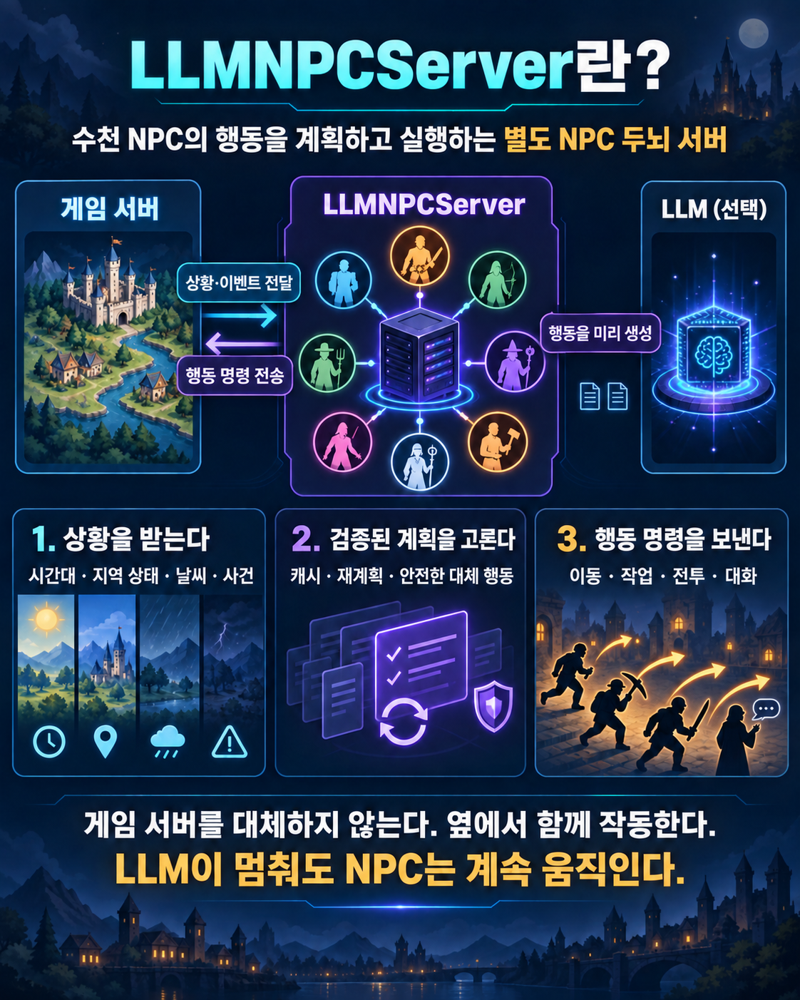
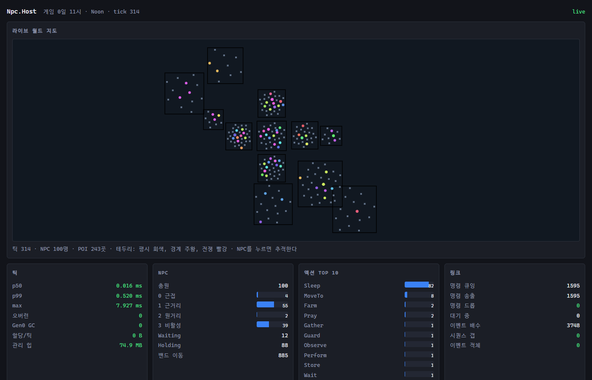

# LlmNpcServer



MMORPG 게임 서버 옆에서 NPC 행동을 결정하는 .NET 10 서버다. 시간대·지역 상태·기후에 맞는 플랜을 미리 저장하고, 게임 서버의 이벤트를 받아 명령을 보낸다. LLM을 끄거나 외부 연결이 끊겨도 기본 행동으로 계속 실행한다.

## 우리 게임에 맞는가

| 맞는 경우 | 맞지 않는 경우 |
|---|---|
| NPC가 수백~수천 명이고, 같은 상황의 행동을 재사용할 수 있다 | NPC마다 사람이 지정한 장면을 정확히 재생해야 한다 |
| 게임 서버가 위치·시간·행동 결과를 이벤트로 보낼 수 있다 | 별도 프로세스와 이벤트 연동을 허용할 수 없다 |
| 콘텐츠 팀이 직업·장소·아이템·폴백을 데이터로 관리한다 | NPC 이동 경로·충돌·전투 판정까지 이 서버에 맡겨야 한다 |

게임 서버가 이동·인벤토리·전투의 최종 상태를 소유한다. 이 서버는 행동을 결정하고 명령 결과를 기다린다. [도입 판단과 역할별 절차](docs/ADOPTION.md)에 연결 순서가 있다.
기능별 설명은 [구현 기능 개요](docs/feature_overview.md)에 있다.

| 구성 요소 | 지원 플랫폼 |
|---|---|
| 서버·CLI·Studio·적합성 검사·테스트 게임 서버 | Windows·Linux, macOS는 빌드 가능하나 실행 미검증 |
| WinForms 테스트 뷰어 | Windows 전용 |

## 실측 한눈에

| 항목 | 확인된 값 |
|---|---|
| NPC 5,000명 틱 처리 | p99 0.291ms, 틱당 할당 0B (2026-09-24 재측정) |
| LLM 연결 전면 차단 | 기본 행동으로 회차 완주 |
| 상황 플랜 2,880건 생성 | $5.12 실측, 도달 집합만 약 $0.37 |

측정 조건과 미측정 항목은 [성능·한계 레퍼런스](docs/reference_metrics.html)에 있다. 비용은 해당 회차의 값이며 다른 세계에 그대로 적용되지 않는다.

## 5분 체험

.NET 10 SDK를 설치하고 저장소 루트에서 실행한다. 첫 명령은 서버와 도구를 빌드한다. 두 번째 명령은 데이터·파생물·키·포트를 진단한다. 세 번째는 게임 서버 대역을 내부에서 돌리며 NPC 100명의 게임 속 하루를 약 2분 24초에 실행한다. 외부 LLM 비용은 발생하지 않는다.

```powershell
dotnet build -c Release
dotnet run -c Release --project src/Npc.Host -- doctor
dotnet run -c Release --project src/Npc.Host -- --loopback --npcs 100 --time-scale 600 --days 1 --no-llm
```

실행 중 [대시보드](http://127.0.0.1:5080/dashboard)의 지도에서 NPC 점을 누르면 상태와 추적을 볼 수 있다.



콘텐츠 편집 화면은 `dotnet run --project tools/Npc.Studio`로 연다. 전체 옵션은 [호스트 옵션 표](docs/host_options.md), 명령은 `dotnet run --project tools/Npc.Cli -- --help`에서 확인한다.

## 내 게임으로 옮기는 경로

| 담당 | 시작 명령 또는 예제 | 다음 문서 |
|---|---|---|
| 콘텐츠 | `dotnet run --project tools/Npc.Cli -- init <새 폴더>` | [Studio 설명서](docs/npc_studio_manual.html), [마스터데이터](docs/reference_masterdata.html) |
| 게임 서버 | `npc export link-bundle --npcs 300 --out bundle.json` | [파이썬 게임 서버](samples/python_gs/README.md), [연동 계약](docs/reference_link.html) |
| LLM | OpenAI 키·Ollama·LM Studio 중 하나 선택 | [엔진 연결](docs/llm/README.md), [시크릿](docs/security/secrets.md) |
| 운영 | `deploy/compose.yaml` 또는 `deploy/k8s/` | [도입 가이드](docs/ADOPTION.md), [관측·한계](docs/reference_metrics.html) |

`npc init`은 존 2개·POI 12개·NPC 60명의 독립된 세계를 만든다. 게임 서버 연동 번들에는 계약 해시·로스터·POI·명령별 응답 규약이 들어 있다. 런타임 LLM과 개발 에이전트의 설정은 [LLM 안내](docs/llm/README.md)에서 구분한다.

## 현재 상태와 한계

기술 검증 구현체다. 게임 서버 대역과 파이썬 최소 서버를 통한 연결·적합성 검사는 가능하다. 실제 게임 서버의 경로 탐색, 플레이어 근접 판정, 전투 판정은 게임 쪽 구현이 필요하다. 법무 검토, 샤딩 2단계, 블라인드 품질 평가는 완료되지 않았다. 미측정 성능은 통과로 표기하지 않는다. 전체 목록은 [레퍼런스 §14](docs/reference_metrics.html)에 있다.

## 문서 지도

| 읽는 사람 | 문서 |
|---|---|
| 처음 보는 사람 | [도입 가이드](docs/ADOPTION.md), [FAQ](docs/FAQ.html) |
| 콘텐츠 담당 | [Studio 설명서](docs/npc_studio_manual.html), [실습서](docs/tutorial/index.html) |
| 게임 서버 담당 | [연동 계약](docs/reference_link.html), [파이썬 예제](samples/python_gs/README.md) |
| LLM 담당 | [엔진 연결](docs/llm/README.md), [플랜 검증](docs/llm/VALIDATION.md) |
| 운영 담당 | [문서 허브](docs/index.html), [보안](docs/security/secrets.md) |
| 코드 기여자 | [CONTRIBUTING](CONTRIBUTING.md), [CODEMAP](CODEMAP.md) |

## 라이선스

저장소의 라이선스 결정이 확정되기 전이다. 재배포·상용 사용 조건은 소유자에게 확인해야 한다.
